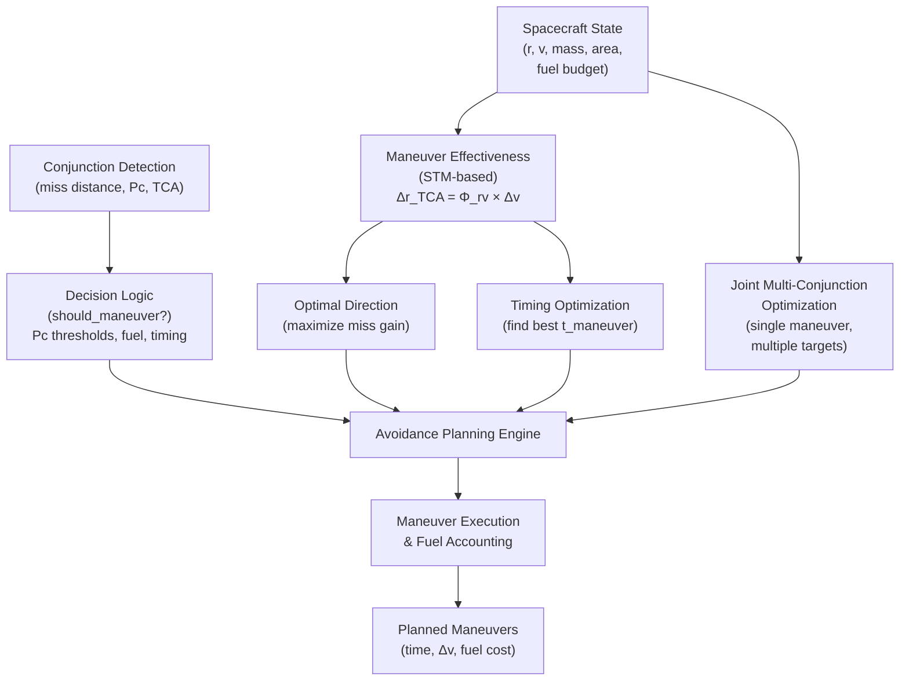

# Design Document: Avoidance Maneuver Planning

## Overview

The **Avoidance Maneuver Planning** module implements optimal collision avoidance maneuver design for satellite constellations. Given a detected conjunction (close approach between two objects), this module computes the best velocity change (Δv) to maximize miss distance while minimizing fuel cost. The design handles single conjunctions, multi-conjunction joint optimization, and fuel-constrained planning with reserve margins for future unknowns. All computations use State Transition Matrix (STM) analysis to precisely map how velocity impulses propagate to position changes at the time of closest approach (TCA).

---

## High-Level Architecture

### System Context Diagram



### Key Concepts

**State Transition Matrix (STM)**: Linearized sensitivity of position change at TCA to velocity change at maneuver time.
- **Φ_rv**: 3×3 matrix mapping Δv at maneuver time to Δr at TCA
- Computed by integrating the state dynamics including perturbations (J2, drag, SRP)

**Optimal Maneuver Direction**: The unit Δv direction that maximizes miss distance gain per unit fuel expended.
- Computed as: direction = Φ_rv^T · miss_hat
- Maximizes the component of Φ_rv aligned with the miss vector

**Maneuver Timing**: Earlier maneuvers are more effective (more propagation time for trajectory divergence).
- Effectiveness varies due to orbital geometry
- Optimization samples multiple times within the planning window

**Multi-Conjunction Joint Optimization**: Single well-timed maneuver can resolve multiple sequential conjunctions.
- Uses numerical optimization (Nelder-Mead) to find Δv that minimizes total risk across all conjunctions
- Respects fuel budgets and applies reserve margins for future unknowns

---

## Components and Interfaces

### 1. Maneuver Effectiveness Analysis (STM-Based)

**Purpose**: Compute the sensitivity matrix showing how velocity changes map to position changes at TCA.

**Key Functions**:

```python
def maneuver_effectiveness_matrix(
    state: StateVector, 
    tca: float,
    t_maneuver: float,
    area_mass_ratio: float = 0.01
) -> np.ndarray  # Shape (3, 3)
```

**Responsibility**:
- Propagate spacecraft state to maneuver time using numerical integration
- Propagate from maneuver time to TCA using full STM integration
- Extract Φ_rv (upper-right 3×3 block of STM)
- Account for perturbations: J2 oblateness, atmospheric drag, solar radiation pressure

**Algorithm**:
1. `state_at_maneuver = propagate_state(state, t_maneuver)`
2. `(state_at_tca, stm_matrix) = propagate_with_stm(state_at_maneuver, dt_to_tca)`
3. `phi_rv = stm_matrix[:3, 3:]`
4. Return `phi_rv`

---

### 2. Optimal Direction Computation

**Purpose**: Find the unit Δv direction that maximizes miss distance gain.

**Key Function**:

```python
def optimal_maneuver_direction(
    phi_rv: np.ndarray,  # (3, 3)
    miss_vector_3d: np.ndarray  # (3,)
) -> np.ndarray  # Shape (3,)
```

**Algorithm**:
```
miss_hat ← miss_vector / |miss_vector|
optimal ← Φ_rv^T · miss_hat
return optimal / |optimal|
```

**Correctness Property**:
- For any feasible maneuver magnitude, this direction minimizes fuel cost to achieve target miss distance
- Maximizes |Φ_rv · direction| in the miss-distance-increasing direction

---

### 3. Maneuver Timing Optimization

**Purpose**: Find the maneuver time that yields maximum effectiveness.

**Key Function**:

```python
def optimal_maneuver_time(
    state: StateVector,
    tca: float,
    earliest: float = 0.0,
    area_mass_ratio: float = 0.01,
    n_samples: int = 20
) -> float
```

**Algorithm**:
1. Define feasible time window: `[earliest, tca - 300s]` (need time for effect)
2. Sample effectiveness at `n_samples` points: `max_singular_value(Φ_rv)` for each
3. Return time of maximum effectiveness

**Constraint**: `t_maneuver ≥ 300 seconds before TCA` (minimum propagation time)

---

### 4. Single-Conjunction Avoidance Maneuver Design

**Purpose**: Design an optimal maneuver to resolve one specific conjunction.

**Key Function**:

```python
def design_avoidance_maneuver(
    spacecraft: Spacecraft,
    other: Spacecraft,
    conjunction: Conjunction,
    target_miss_km: float = 1.0,
    max_delta_v_ms: Optional[float] = None,
    maneuver_time: Optional[float] = None
) -> Optional[Maneuver]
```

**Workflow**:
1. Determine maneuver time (optimize if not forced)
2. Compute Φ_rv at that time
3. Project miss vector at TCA
4. Compute optimal direction
5. Calculate required Δv magnitude: `|Δv| = required_miss_change / effectiveness`
6. Check against fuel budget
7. Convert from ECI to RTN frame
8. Construct and return Maneuver object

**Feasibility Conditions**:
- `|Δv| ≤ remaining_fuel_budget`
- `t_maneuver ≥ 60s from now`
- `t_maneuver ≤ tca - 300s`
- `effectiveness > 1e-6` (meaningful matrix condition)

---

### 5. Multi-Conjunction Joint Optimization

**Purpose**: Find a single (or small sequence of) maneuver(s) that resolves multiple conjunctions affecting one spacecraft.

**Key Function**:

```python
def joint_avoidance_optimization(
    spacecraft: Spacecraft,
    others: List[Spacecraft],
    conjunctions: List[Conjunction],
    fuel_reserve_fraction: float = 0.3
) -> List[Maneuver]
```

**Algorithm**:
1. Sort conjunctions by TCA
2. Select maneuver time: `t_man = min(earliest_tca * 0.5, earliest_tca - 3600s)`
3. Set up optimization objective:
   ```
   minimize: Σ_j exp(-miss_j / 0.5) + 0.1 · (|Δv| / available_budget)²
   subject to: |Δv| ≤ available_budget * (1 - reserve_fraction)
   ```
4. Use Nelder-Mead to find optimal Δv vector
5. Return maneuver list (typically 1 maneuver)

**Key Insight**: Fuel reserve (`reserve_fraction`) keeps budget for future, unknown conjunctions.

---

### 6. Maneuver Execution and Fuel Accounting

**Purpose**: Apply a planned maneuver to a spacecraft and update its state and fuel.

**Key Function**:

```python
def apply_maneuver(
    spacecraft: Spacecraft, 
    maneuver: Maneuver
) -> Spacecraft
```

**Workflow**:
1. Propagate to maneuver time
2. Convert Δv from RTN to ECI frame
3. Apply: `v_new = v_old + Δv_eci`
4. Increase covariance (maneuver execution error ~1% of Δv)
5. Deduct fuel: `fuel_used = |Δv| in m/s`
6. Return updated Spacecraft

---

### 7. Decision Logic

**Purpose**: Determine whether to maneuver based on risk, fuel, and timing.

**Key Function**:

```python
def should_maneuver(
    conjunction: Conjunction,
    spacecraft: Spacecraft,
    time_to_tca: float
) -> str  # 'MANEUVER', 'CONSIDER', 'MONITOR', 'ACCEPT'
```

**Decision Thresholds**:
| Decision | Pc Threshold | Fuel Requirement | Timing |
|----------|-------------|------------------|--------|
| MANEUVER | ≥ 1e-4 | Any available | Any |
| CONSIDER | 1e-5 to 1e-4 | ≥ 10 m/s | > 5 min to TCA |
| MONITOR | 1e-6 to 1e-5 | N/A | N/A |
| ACCEPT | < 1e-6 | N/A | N/A |

**Special Cases**:
- If `fuel_remaining < 5 m/s` AND `Pc > 1e-3`: Force MANEUVER (emergency)
- If `time_to_tca < 300s` AND `Pc > 1e-3`: MANEUVER (no time for refinement)
- If maneuverable = False: Always ACCEPT

---

### 8. Conjunction Prioritization

**Purpose**: Rank conjunctions by risk and urgency for planning sequencing.

**Key Function**:

```python
def prioritize_conjunctions(
    conjunctions: List[Conjunction],
    spacecraft_dict: dict
) -> List[Conjunction]
```

**Priority Score**:
```
score = risk_score × urgency_multiplier × maneuverability_factor

where:
  urgency_multiplier = 2^((24 - hours_to_tca) / 6)  # Doubles every 6 hours
  maneuverability_factor = 0.1 if both objects unmaneuverable, else 1.0
```

---

## Data Models

### Conjunction

```python
@dataclass
class Conjunction:
    obj1_id: str                      # Spacecraft identifier
    obj2_id: str                      # Spacecraft identifier
    tca: float                        # Time of closest approach [seconds]
    miss_distance: float              # Minimum distance [km]
    relative_velocity: float          # Speed at TCA [km/s]
    probability_of_collision: float   # Pc (0 to 1)
    combined_covariance_2d: Optional[np.ndarray]  # 2×2 in encounter plane
    risk_score: float                 # Composite risk metric
```

**Validation Rules**:
- `0 ≤ probability_of_collision ≤ 1`
- `tca > 0` (future)
- `miss_distance ≥ 0`
- `relative_velocity ≥ 0`

### Maneuver

```python
@dataclass
class Maneuver:
    spacecraft_id: str                # Which spacecraft executes
    time: float                       # Execution time [seconds from epoch]
    delta_v: np.ndarray               # Δv vector in RTN frame [km/s]
    target_conjunction_id: Optional[str]  # Primary conjunction target
    fuel_cost: float                  # |Δv| in m/s (computed)
```

**Invariant**:
```
fuel_cost = |delta_v| * 1000  # (km/s → m/s)
```

### Spacecraft

```python
@dataclass
class Spacecraft:
    id: str
    state: StateVector                # (r, v) in ECI
    covariance: np.ndarray            # 6×6 state covariance
    mass: float                       # kg
    area: float                       # Cross-section [m²]
    cd: float                         # Drag coefficient (default 2.2)
    cr: float                         # Reflectivity (default 1.5)
    delta_v_budget: float             # Total available [m/s]
    delta_v_used: float               # Expended so far [m/s]
    maneuverable: bool                # Can execute maneuvers?
    name: str                         # Optional identifier
```

**Invariant**:
```
0 ≤ delta_v_used ≤ delta_v_budget
delta_v_remaining = delta_v_budget - delta_v_used
```

---

## Algorithmic Pseudocode

### Main Algorithm: Plan Avoidance Campaign

```pascal
ALGORITHM planAvoidanceCampaign(spacecraftList, conjunctions, planningHorizon)
INPUT: 
  spacecraftList: List of all spacecraft
  conjunctions: List of active conjunctions
  planningHorizon: Planning window [seconds]
OUTPUT: plannedManeuvers: List of maneuvers in execution order

BEGIN
  // Step 1: Build lookup and prioritize
  scDict ← buildLookup(spacecraftList)
  prioritized ← prioritizeConjunctions(conjunctions, scDict)
  
  plannedManeuvers ← []
  modifiedSpacecraft ← {}  // Track maneuver assignments
  
  // Step 2: Greedy assignment (process by priority)
  FOR EACH conjunction IN prioritized DO
    obj1 ← scDict[conjunction.obj1_id]
    obj2 ← scDict[conjunction.obj2_id]
    
    IF obj1 = NULL OR obj2 = NULL THEN
      CONTINUE
    END IF
    
    // Use modified state if already assigned a maneuver
    IF conjunction.obj1_id IN modifiedSpacecraft THEN
      obj1 ← modifiedSpacecraft[conjunction.obj1_id]
    END IF
    IF conjunction.obj2_id IN modifiedSpacecraft THEN
      obj2 ← modifiedSpacecraft[conjunction.obj2_id]
    END IF
    
    // Step 3: Determine maneuverer (prefer one with more fuel)
    maneuverer, target ← selectManeuverer(obj1, obj2)
    
    IF maneuverer = NULL THEN
      CONTINUE  // Neither can maneuver
    END IF
    
    // Step 4: Decision logic
    decision ← shouldManeuver(conjunction, maneuverer, conjunction.tca)
    
    IF decision IN {'MANEUVER', 'CONSIDER'} THEN
      maneuver ← designAvoidanceManeuver(
        maneuverer, target, conjunction,
        target_miss_km = 1.0
      )
      
      IF maneuver ≠ NULL THEN
        plannedManeuvers.append(maneuver)
        modifiedSpacecraft[maneuverer.id] ← applyManeuver(maneuverer, maneuver)
      END IF
    END IF
  END FOR
  
  // Step 5: Sort by execution time
  SORT plannedManeuvers BY time ASCENDING
  
  RETURN plannedManeuvers
END
```

### Subalgorithm: Design Single Maneuver

```pascal
ALGORITHM designAvoidanceManeuver(
  spacecraft, other, conjunction,
  targetMiss_km, maxDeltaV_ms, maneuverTime
)
INPUT:
  spacecraft: Maneuvering spacecraft
  other: Target (non-maneuvering) spacecraft
  conjunction: Conjunction to resolve
  targetMiss_km: Desired final miss distance [km] (default 1.0)
  maxDeltaV_ms: Fuel limit [m/s] (default: remaining budget)
  maneuverTime: Forced maneuver time [s] (default: optimized)
OUTPUT: maneuver or NULL

BEGIN
  tca ← conjunction.tca
  am ← spacecraft.area / spacecraft.mass
  
  // Step 1: Determine maneuver time
  IF maneuverTime = NULL THEN
    maneuverTime ← optimalManeuverTime(
      spacecraft.state, tca,
      earliest = 60.0,
      area_mass_ratio = am
    )
  END IF
  
  // Step 2: Compute STM-based effectiveness matrix
  TRY
    phiRv ← maneuverEffectivenessMatrix(
      spacecraft.state, tca, maneuverTime, am
    )
  CATCH
    RETURN NULL
  END TRY
  
  // Step 3: Compute miss vector at TCA
  stateAtTca ← propagateState(spacecraft.state, tca, am)
  otherAtTca ← propagateState(other.state, tca, other.am)
  missVector3d ← stateAtTca.r - otherAtTca.r
  currentMiss ← |missVector3d|
  
  // Step 4: Optimal direction (maximize miss change per Δv)
  dvDirection ← optimalManeuverDirection(phiRv, missVector3d)
  
  // Step 5: Compute required Δv magnitude
  effectiveness ← |phiRv · dvDirection|
  
  IF effectiveness < 1e-6 THEN
    RETURN NULL  // Not effective
  END IF
  
  requiredMissChange ← MAX(0, targetMiss_km - currentMiss)
  IF requiredMissChange ≤ 0 THEN
    requiredMissChange ← targetMiss_km * 0.5  // Add margin
  END IF
  
  dvMagnitude ← requiredMissChange / effectiveness  // [km/s]
  
  // Step 6: Apply fuel constraint
  maxDvKms ← maxDeltaV_ms / 1000.0
  IF dvMagnitude > maxDvKms THEN
    dvMagnitude ← maxDvKms  // Use maximum available
  END IF
  
  // Step 7: Convert to RTN frame
  deltaV_eci ← dvDirection × dvMagnitude  // [km/s]
  stateAtMan ← propagateState(
    spacecraft.state, maneuverTime, am
  )
  rtnMatrix ← eci_to_rtn(stateAtMan.r, stateAtMan.v)
  deltaV_rtn ← rtnMatrix · deltaV_eci
  
  // Step 8: Construct maneuver
  maneuver ← Maneuver(
    spacecraft_id = spacecraft.id,
    time = maneuverTime,
    delta_v = deltaV_rtn,
    target_conjunction_id = conjunction.id
  )
  
  RETURN maneuver
END
```

### Subalgorithm: Joint Multi-Conjunction Optimization

```pascal
ALGORITHM jointAvoidanceOptimization(
  spacecraft, others, conjunctions, fuelReserveFraction
)
INPUT:
  spacecraft: Maneuvering spacecraft
  others: List of other spacecraft (one per conjunction)
  conjunctions: List of conjunctions affecting spacecraft
  fuelReserveFraction: Reserve margin (default 0.3)
OUTPUT: List of planned maneuvers (usually 1)

BEGIN
  IF conjunctions = EMPTY THEN
    RETURN []
  END IF
  
  am ← spacecraft.area / spacecraft.mass
  availableDv ← (spacecraft.delta_v_budget - spacecraft.delta_v_used)
                × (1 - fuelReserveFraction)
  availableDv_kms ← availableDv / 1000.0
  
  // Sort by TCA
  sortedConjs ← SORT(conjunctions, KEY=tca)
  earliestTca ← sortedConjs[0].tca
  
  // Select maneuver time: early enough to affect all
  tMan ← MIN(earliestTca × 0.5, earliestTca - 3600.0)
  tMan ← MAX(tMan, 60.0)
  
  // Define optimization objective
  FUNCTION objective(dvFlat) RETURNS float
    dvEci ← dvFlat  // ECI frame
    dvMag ← |dvEci|
    
    IF dvMag > availableDv_kms THEN
      RETURN 1e10  // Infeasible
    END IF
    
    stateAtMan ← propagateState(spacecraft.state, tMan, am)
    newState ← StateVector(
      r = stateAtMan.r,
      v = stateAtMan.v + dvEci
    )
    
    totalRisk ← 0.0
    FOR EACH (conj, other) IN ZIP(sortedConjs, others) DO
      dt ← conj.tca - tMan
      TRY
        newStateTca ← propagateState(newState, dt, am)
        otherTca ← propagateState(
          other.state, conj.tca,
          am_other = other.area / other.mass
        )
        miss ← |newStateTca.r - otherTca.r|
        
        // Penalize small miss distances exponentially
        totalRisk ← totalRisk + EXP(-miss / 0.5)
      CATCH
        totalRisk ← totalRisk + 1.0
      END TRY
    END FOR
    
    // Fuel penalty
    fuelPenalty ← 0.1 × (dvMag / availableDv_kms)²
    
    RETURN totalRisk + fuelPenalty
  END FUNCTION
  
  // Initial guess: direction for highest-risk conjunction
  TRY
    phiRv ← maneuverEffectivenessMatrix(
      spacecraft.state, sortedConjs[0].tca, tMan, am
    )
    stateTca ← propagateState(
      spacecraft.state, sortedConjs[0].tca, am
    )
    otherTca ← propagateState(
      others[0].state, sortedConjs[0].tca,
      others[0].area / others[0].mass
    )
    miss3d ← stateTca.r - otherTca.r
    direction ← optimalManeuverDirection(phiRv, miss3d)
    x0 ← direction × availableDv_kms × 0.1
  CATCH
    x0 ← [availableDv_kms × 0.01, 0, 0]
  END TRY
  
  // Optimize using Nelder-Mead
  result ← minimize(
    objective, x0,
    method = 'Nelder-Mead',
    options = {maxiter: 500, xatol: 1e-8, fatol: 1e-10}
  )
  
  dvOptimal ← result.x
  dvMag ← |dvOptimal|
  
  IF dvMag < 1e-10 THEN
    RETURN []  // No maneuver needed
  END IF
  
  // Convert to RTN
  stateAtMan ← propagateState(spacecraft.state, tMan, am)
  rtnMatrix ← eci_to_rtn(stateAtMan.r, stateAtMan.v)
  dvRtn ← rtnMatrix · dvOptimal
  
  maneuver ← Maneuver(
    spacecraft_id = spacecraft.id,
    time = tMan,
    delta_v = dvRtn,
    target_conjunction_id = "multi_conjunction"
  )
  
  RETURN [maneuver]
END
```

---

## Example Usage

### Scenario: Single Conjunction Avoidance

```python
# Given a conjunction between two spacecraft
conjunction = Conjunction(
    obj1_id="SAT-001",
    obj2_id="DEBRIS-042",
    tca=7200.0,        # 2 hours from now
    miss_distance=0.85,  # 850 meters (danger!)
    probability_of_collision=1.5e-4,
    relative_velocity=12.3
)

spacecraft_1 = spacecraft_dict["SAT-001"]
spacecraft_2 = spacecraft_dict["DEBRIS-042"]

# Design maneuver
maneuver = design_avoidance_maneuver(
    spacecraft=spacecraft_1,
    other=spacecraft_2,
    conjunction=conjunction,
    target_miss_km=1.0  # Want 1 km miss
)

# Result: Maneuver with optimal time, direction, and magnitude
print(f"Execute at t={maneuver.time:.1f}s")
print(f"Δv = {maneuver.delta_v} km/s (RTN frame)")
print(f"Fuel cost: {maneuver.fuel_cost:.2f} m/s")
```

### Scenario: Multi-Conjunction Joint Optimization

```python
# One satellite faces three sequential conjunctions
conjunctions = [
    Conjunction(..., tca=3600.0, obj2_id="DEBRIS-10"),
    Conjunction(..., tca=5400.0, obj2_id="DEBRIS-11"),
    Conjunction(..., tca=7200.0, obj2_id="DEBRIS-12"),
]

others = [
    spacecraft_dict["DEBRIS-10"],
    spacecraft_dict["DEBRIS-11"],
    spacecraft_dict["DEBRIS-12"],
]

# Single maneuver optimized for all three
maneuvers = joint_avoidance_optimization(
    spacecraft=my_satellite,
    others=others,
    conjunctions=conjunctions,
    fuel_reserve_fraction=0.3
)

# Result: Often 1 maneuver resolving all three
print(f"Found {len(maneuvers)} maneuver(s) resolving 3 conjunctions")
```

### Scenario: Full Campaign Planning

```python
# Plan all maneuvers for the constellation
planned_maneuvers = plan_avoidance_campaign(
    spacecraft_list=all_spacecraft,
    conjunctions=active_conjunctions,
    planning_horizon=86400.0  # 24 hours
)

# Execute in sequence
for maneuver in planned_maneuvers:
    print(f"Execute {maneuver.spacecraft_id} at t={maneuver.time}s")
    spacecraft_dict[maneuver.spacecraft_id] = apply_maneuver(
        spacecraft_dict[maneuver.spacecraft_id],
        maneuver
    )
    # Re-assess remaining conjunctions after each maneuver
```

---

## Correctness Properties

### Property 1: STM Effectiveness Consistency

**Informal**: If no maneuver is executed, the computed miss distance after "maneuver" equals the original miss distance.

**Formal**: 
```
Let Δv_zero = [0, 0, 0]
Let miss_after = evaluateManeuver(spacecraft, other, maneuver_with_zero_dv, tca)
Then: miss_after ≈ original_miss_distance (within numerical precision)
```

### Property 2: Monotonic Miss Distance

**Informal**: Increasing maneuver magnitude in the optimal direction should increase miss distance (monotonically, until saturation).

**Formal**:
```
For Δv_1 = α · direction and Δv_2 = β · direction
where 0 < α < β ≤ max_available:
  miss_distance(Δv_1) ≤ miss_distance(Δv_2)
```

### Property 3: Fuel Budget Preservation

**Informal**: Fuel consumed equals the magnitude of the Δv applied.

**Formal**:
```
fuel_remaining_after = fuel_remaining_before - |maneuver.delta_v| × 1000
where:
  |maneuver.delta_v| is in km/s
  fuel is tracked in m/s
```

### Property 4: Early Maneuvers More Effective

**Informal**: For the same miss gain, an earlier maneuver requires less fuel.

**Formal**:
```
Let t_1 < t_2 (both before TCA - 300s)
For target miss_gain = Δr_target:
  |Δv(t_1)| < |Δv(t_2)|
  (earlier maneuver requires smaller magnitude)
```

### Property 5: Joint Optimization Feasibility

**Informal**: If a single maneuver resolves all conjunctions in joint optimization, then none of them should have Pc > decision threshold afterward.

**Formal**:
```
After executing maneuver from joint_avoidance_optimization:
  ∀ conjunction j in input_conjunctions:
    new_Pc_j ≤ PC_MONITOR  (below action threshold)
  OR
    |Δv| = available_budget  (fuel-limited, best effort)
```

### Property 6: Covariance Growth on Maneuver

**Informal**: Maneuver execution introduces uncertainty (1% of Δv magnitude as 1-sigma velocity error).

**Formal**:
```
covariance_after = covariance_before + diag([0, 0, 0, σ², σ², σ²])
where:
  σ = 0.01 × |Δv_rtn| [in km/s]
  (1% of maneuver magnitude as execution error)
```

---

## Error Handling

### Error Scenario 1: Inadequate Maneuver Effectiveness

**Condition**: Computed effectiveness matrix is singular or ill-conditioned.

**Response**: Return `None` from design function; treat conjunction as non-avoidable via maneuver.

**Recovery**: Escalate to damage minimization protocol.

### Error Scenario 2: Fuel Depletion

**Condition**: Remaining fuel insufficient for target miss distance.

**Response**: Apply maximum available Δv in optimal direction.

**Recovery**: Accept residual risk; monitor for late tracking refinements.

### Error Scenario 3: Time Criticality (TCA < 5 minutes)

**Condition**: Time to TCA is less than 300 seconds.

**Response**: If Pc > 1e-3, force immediate maneuver; otherwise accept.

**Recovery**: Future conjunctions must be detected earlier.

### Error Scenario 4: Covariance Propagation Failure

**Condition**: Numerical integration diverges during STM propagation.

**Response**: Catch exception; fall back to conservative estimate (no maneuver).

**Recovery**: Log error; retry with coarser time step or shorter horizon.

---

## Testing Strategy

### Unit Testing

**Test Case 1.1: STM Computation**
- Input: Spacecraft state, TCA, maneuver time
- Verify: Φ_rv has rank 3 and reasonable magnitude
- Assertion: 1 km/s Δv → ~100 m miss distance change (typical LEO)

**Test Case 1.2: Optimal Direction**
- Input: Φ_rv matrix, miss vector
- Verify: Direction is unit vector
- Verify: Direction maximizes |Φ_rv · direction|

**Test Case 1.3: Maneuver Timing**
- Input: State, TCA, search window
- Verify: Returned time is in feasible range
- Verify: Effectiveness at returned time ≥ effectiveness at other sampled times

**Test Case 2.1: Single Maneuver Design (Feasible Case)**
- Input: Conjunction with Pc=1e-4, fuel=30 m/s available
- Verify: Returned maneuver is non-null
- Verify: Fuel cost ≤ 30 m/s
- Verify: Time in feasible range

**Test Case 2.2: Single Maneuver Design (Fuel Limited)**
- Input: Conjunction with Pc=1e-4, fuel=0.5 m/s available
- Verify: Maneuver uses full budget
- Verify: Final miss distance > current miss distance (partial improvement)

**Test Case 2.3: Maneuver Evaluation**
- Input: Pre-maneuver state + maneuver
- Verify: After-maneuver miss distance ≥ before-maneuver miss distance

**Test Case 3.1: Multi-Conjunction Optimization**
- Input: Three sequential conjunctions, 50 m/s budget
- Verify: Returned maneuver list has 1 element
- Verify: All three conjunctions have reduced Pc post-maneuver
- Verify: Fuel cost respects reserve margin

### Property-Based Testing

**Property Test 1: Monotonicity of Miss Distance in Δv Magnitude**
- Input: Random conjunction, random maneuver direction
- Generate: Sequence of Δv magnitudes [0.1, 0.2, ..., 0.9] × max_available
- Verify: Miss distance is monotonically non-decreasing
- Shrink: On failure, minimize magnitude and magnitude

**Property Test 2: STM Sensitivity Bounds**
- Input: Random state, random TCA, random maneuver time
- Generate: Effectiveness = |Φ_rv|_max
- Verify: 0.01 ≤ Effectiveness ≤ 100 (reasonable range in m miss per m/s)
- Shrink: On violation, minimize time difference or state values

**Property Test 3: Fuel Budget Conservation**
- Input: Random conjunction list, random fuel budget
- Execute: plan_avoidance_campaign
- For each spacecraft, verify: Σ maneuver_fuel_costs ≤ remaining_budget

**Property Test 4: Covariance Symmetry and Positive Definiteness**
- After each apply_maneuver, verify:
  - Covariance matrix is symmetric
  - All eigenvalues are positive

### Integration Testing

**Test Case 4.1: Single Conjunction End-to-End**
- Given: Detected conjunction, spacecraft state
- Execute: design_avoidance_maneuver → apply_maneuver
- Verify: Updated spacecraft has higher miss distance at TCA
- Verify: Updated fuel budget is reduced

**Test Case 4.2: Campaign Planning and Sequencing**
- Given: 10 spacecraft, 5 active conjunctions
- Execute: plan_avoidance_campaign
- Verify: Maneuvers execute in correct time order
- Verify: No spacecraft executes two maneuvers simultaneously
- Verify: Total fuel cost does not exceed budgets

---

## Performance Considerations

### Computational Complexity

| Operation | Complexity | Notes |
|-----------|-----------|-------|
| STM computation | O(N_steps) | N_steps = propagation steps |
| Optimal direction | O(1) | Matrix-vector operations |
| Maneuver timing (sampling) | O(n_samples × N_steps) | Typically 20 samples |
| Single maneuver design | O(n_samples × N_steps) | Dominated by timing opt |
| Joint optimization | O(iterations × n_conj × N_steps) | 500 iterations, 3-5 conjunctions typical |
| Full campaign | O(n_conj × single_design) | Greedy, processes by priority |

### Optimization Opportunities

1. **Cached STM**: If two conjunctions have similar TCA/spacecraft, cache Φ_rv
2. **Vectorization**: Propagate multiple time points in single call
3. **Early termination**: Stop joint optimization if Pc drops below threshold

---

## Security Considerations

1. **Input Validation**: All spacecraft IDs and orbital elements checked for validity
2. **Fuel Budget Enforcement**: Never allow negative fuel or overspend
3. **Numerics**: Handle NaN/Inf gracefully; fallback to conservative (no maneuver)
4. **Covariance**: Ensure positive definiteness; reject if propagation corrupts

---

## Dependencies

- **orbital_mechanics.py**: `propagate_state`, `propagate_with_stm`, `propagate_covariance`
- **conjunction.py**: `compute_encounter_plane`, `project_covariance_to_encounter_plane`, `probability_of_collision_2d`
- **utils.py**: `StateVector`, `Spacecraft`, `Conjunction`, `Maneuver`, `eci_to_rtn`, `state_to_coe`
- **scipy**: `minimize`, `minimize_scalar` (optimization)
- **numpy**: Matrix and vector operations
