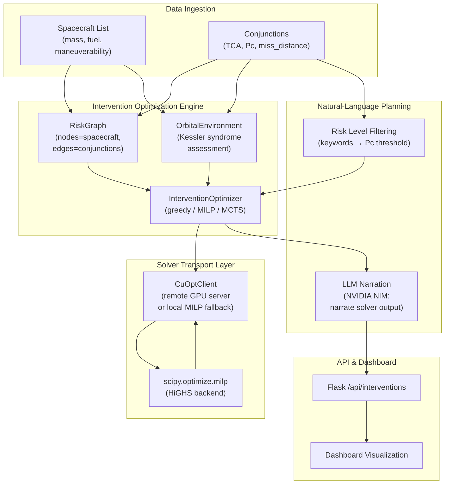
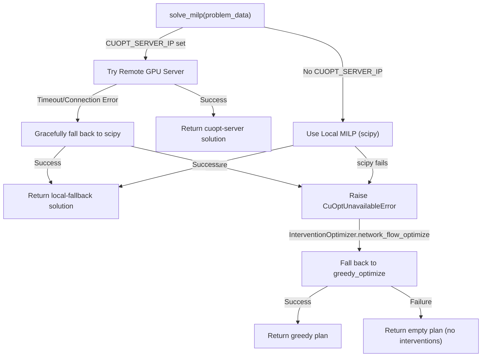

# Design Document: NVIDIA cuOpt-Backed Collision-Avoidance Intervention Planning

## Overview

The collision-avoidance intervention planning system leverages NVIDIA cuOpt (GPU-accelerated LP/MILP solver) to solve the **constellation-scale constrained-assignment problem**: *Given N maneuverable spacecraft each with a fuel-budget capacity and M conjunctions (collision events), which spacecraft should maneuver to resolve which conjunction, minimizing total fuel cost while respecting all capacity constraints and mandatory coverage requirements?*

The system provides two entry points:

1. **Graph-based MILP optimization** (`network_flow_optimize`): Formulates the problem as a mixed-integer linear program and solves via NVIDIA cuOpt or transparent local fallback (scipy.optimize.milp + HiGHS), with fallback to greedy/MCTS strategies if no solution exists or cuOpt is unavailable.

2. **Natural-language query interface** (`plan_intervention_from_query`): Accepts free-text operator queries, interprets them via lightweight keyword-based filtering into a risk-level threshold, solves the resulting MILP, and narrates the already-solved plan via NVIDIA NIM (LLM), ensuring every delta-v figure in the output traces back to the solver, not the LLM's imagination.

This design reflects a production-ready system deployed in a collision-avoidance operations center, where every recommended maneuver is grounded in a real constrained-optimization solution.

---

## System Architecture

### High-Level Component Diagram



### Solver Backend Selection (Remote vs. Local Fallback)

```mermaid
sequenceDiagram
    participant OP as Operator
    participant API as API Handler
    participant OPT as InterventionOptimizer
    participant CLIENT as CuOptClient
    participant REMOTE as Remote GPU Server
    participant LOCAL as Local HiGHS

    OP->>API: POST /api/interventions (query)
    API->>OPT: optimize(method='adaptive')
    OPT->>CLIENT: solve_milp(problem_data)
    alt Server Configured (CUOPT_SERVER_IP set)
        CLIENT->>REMOTE: POST /solve (LPData JSON)
        alt Server Available (< timeout)
            REMOTE-->>CLIENT: reqId (async)
            loop Poll for Solution
                CLIENT->>REMOTE: GET /result?reqId=...
                alt Solution Ready
                    REMOTE-->>CLIENT: solver_response
                end
            end
        else Server Unreachable (timeout/error)
            REMOTE--XCLIENTx: connection_error
            CLIENT->>LOCAL: fall back to scipy.optimize.milp
        end
    else No Server Configured
        CLIENT->>LOCAL: scipy.optimize.milp (HiGHS backend)
    end
    LOCAL-->>CLIENT: {vars, objective, status}
    CLIENT-->>OPT: solution dict
    OPT-->>API: InterventionPlan
    API-->>OP: {maneuvers, total_fuel_cost_ms, resolved_ids, narration}
```

---

## Components and Interfaces

### 1. CuOptClient (Solver Transport Layer)

**Purpose**: Abstract the solver backend (remote GPU cuOpt server or local CPU fallback) behind a single interface, so problem formulation never needs to know which solver is actually running.

**Interface**:

```python
class CuOptClient:
    def __init__(self, server_ip: Optional[str] = None, 
                 server_port: Optional[int] = None)
    
    def server_configured(self) -> bool
        """True if CUOPT_SERVER_IP environment variable is set."""
    
    def solve_milp(self, problem_data: Dict[str, Any], 
                   time_limit: float = 10.0) -> Dict[str, Any]
        """
        Solve LP/MILP problem via cuOpt server or local fallback.
        
        Parameters
        ----------
        problem_data : dict
            LPData schema: csr_constraint_matrix, constraint_bounds, 
            objective_data, variable_bounds, variable_types, 
            variable_names, maximize, solver_config
        time_limit : float
            Solver time budget [seconds]
        
        Returns
        -------
        dict
            {vars: {name: value}, objective: float, 
             status: str, backend: "cuopt-server" | "local-fallback"}
        """
```

**Responsibilities**:
- Route to remote GPU server if configured (via `cuopt_sh_client`), falling back gracefully on timeout/error
- Convert problem_data to scipy.optimize.milp + HiGHS for local solving
- Handle CSR (Compressed Sparse Row) constraint matrix reconstruction
- Manage async invoke/poll loop for remote server
- Return normalized solution dict regardless of backend

**Configuration**:
- `CUOPT_SERVER_IP`: Hostname/IP of self-hosted cuOpt server (no server if unset)
- `CUOPT_SERVER_PORT`: Server port (default 5000)
- `CUOPT_POLL_TIMEOUT`: Polling timeout in seconds (default 25)

**Error Handling**:
- If server unavailable → silently fall back to local solver (no intervention pipeline disruption)
- If local solver fails → raise `CuOptUnavailableError` (caller decides fallback strategy)

---

### 2. RiskGraph (Orbital Risk Network Model)

**Purpose**: Represent the constellation as a network where spacecraft are nodes and conjunctions are weighted edges, enabling risk propagation, cluster detection, and graph-based optimization.

**Interface**:

```python
class RiskGraph:
    def build_from_screening(self, spacecraft_list: List[Spacecraft],
                              conjunctions: List[Conjunction])
        """Build graph from screening results."""
    
    def get_risk_clusters(self, min_cluster_risk: float = 1e-4) -> List[Set[str]]
        """Identify high-risk spacecraft clusters (connected components)."""
    
    def cascade_risk(self, conjunction: Conjunction,
                     propagation_depth: int = 3) -> float
        """Estimate secondary collision risk from debris of this conjunction."""
    
    def total_risk(self) -> float
        """Sum of risk scores across all edges."""
    
    def highest_risk_conjunctions(self, n: int = 10) -> List[Conjunction]
        """Top N riskiest conjunctions by risk_score."""
    
    def most_threatened_spacecraft(self, n: int = 5) -> List[str]
        """Spacecraft with highest cumulative conjunction risk."""
```

**Node Attributes**:
```python
{
    'mass': float,                 # kg
    'altitude_km': float,          # orbital altitude
    'maneuverable': bool,          # can execute maneuvers
    'fuel_remaining': float,       # m/s available Δv
    'area': float                  # m², for collision cross-section
}
```

**Edge Attributes** (per conjunction):
```python
{
    'risk_score': float,           # overall risk metric
    'pc': float,                   # probability of collision [1e-8, 1e-2]
    'tca': float,                  # time to closest approach [seconds]
    'miss_distance': float,        # minimum separation [km]
    'relative_velocity': float,    # closing speed [km/s]
    'conjunction': Conjunction     # raw data object
}
```

**Cascade Risk Algorithm**:
- Input: A conjunction event between two objects
- Estimate debris fragment count from collision (via `estimate_debris_count`)
- Breadth-first traversal through the graph to neighbors
- For each neighbor: add secondary collision probability (original Pc × debris_multiplier)
- Decay debris threat by 30% per hop (physical assumption: debris cloud disperses)
- Sum over `propagation_depth` hops
- Output: Total expected cascade risk [unitless probability]

---

### 3. OrbitalEnvironment (Kessler Syndrome Assessment)

**Purpose**: Model orbital population by altitude shell and assess long-term stability (Kessler syndrome risk).

**Interface**:

```python
class OrbitalEnvironment:
    def __init__(self, shell_width_km: float = 50.0,
                 min_alt_km: float = 200.0, 
                 max_alt_km: float = 2000.0)
    
    def populate_from_spacecraft(self, spacecraft_list: List[Spacecraft])
        """Fill shells with spacecraft data."""
    
    def compute_stability(self)
        """Assess Kessler syndrome stability for each shell."""
    
    def kessler_risk_index(self) -> float
        """Overall Kessler risk index [0, 1]."""
```

**OrbitalShell Structure**:
```python
@dataclass
class OrbitalShell:
    alt_min_km: float              # Altitude band [km]
    alt_max_km: float
    object_count: int              # Tracked objects in band
    total_mass_kg: float
    conjunction_rate: float        # [conjunctions/day]
    collision_rate: float          # [collisions/year]
    debris_generation_rate: float  # [fragments/year]
    debris_removal_rate: float     # [fragments/year, via drag]
    is_unstable: bool              # True if generation > removal
```

**Stability Assessment Algorithm**:
1. For each shell:
   - Compute spatial density N / V (objects per km³)
   - Estimate average relative velocity for random crossing orbits
   - Apply kinetic theory: collision rate ∝ N² × v_rel × σ / V
   - Estimate debris per collision (via `estimate_debris_count`)
   - Debris generation rate = collision_rate × fragments_per_collision
   - Debris removal rate = N / atmospheric_lifetime (via `debris_lifetime`)
2. **Instability**: If generation > removal, the shell is in runaway (Kessler syndrome)
3. **Overall Risk Index** (aggregated over critical shells [700–1100 km]):
   - unstable_fraction: count of unstable shells / total critical shells
   - max_ratio: max(generation / removal) across critical shells
   - kessler_index = min(1.0, unstable_fraction × 0.5 + min(max_ratio / 10.0, 0.5))

**Preconditions**:
- `populate_from_spacecraft()` called before `compute_stability()`
- Spacecraft altitudes valid (200–2000 km range)

---

### 4. InterventionOptimizer (Multi-Strategy Optimizer)

**Purpose**: Orchestrate the constrained-assignment problem-solving across three strategies (greedy, network-flow MILP, MCTS) with adaptive method selection based on problem size.

**Interface**:

```python
class InterventionOptimizer:
    def __init__(self, spacecraft_list: List[Spacecraft],
                 conjunctions: List[Conjunction],
                 planning_horizon_s: float = 7 * 86400.0)
    
    def compute_risk_state(self) -> RiskState
        """Snapshot current global risk metrics."""
    
    def greedy_optimize(self, max_maneuvers: int = 50) -> InterventionPlan
        """Greedy: handle highest-risk conjunction first, iterate."""
    
    def network_flow_optimize(self) -> InterventionPlan
        """Constrained-assignment MILP via cuOpt or fallback."""
    
    def mcts_optimize(self, n_simulations: int = 100,
                      max_depth: int = 10) -> InterventionPlan
        """Monte Carlo Tree Search for multi-step planning."""
    
    def optimize(self, method: str = 'adaptive') -> InterventionPlan
        """Master dispatcher; adaptive selects strategy by problem size."""
```

**Adaptive Method Selection**:
- **Greedy**: conjunctions ≤ 5 (simple baseline)
- **network_flow** (MILP): conjunctions 6–50 (medium, optimal solving)
- **MCTS**: conjunctions > 50 (large-scale, search-based)

**RiskState Structure**:
```python
@dataclass
class RiskState:
    total_collision_probability: float  # Sum of all Pc values
    total_expected_debris: float        # Expected fragments if collisions occur
    total_cascade_risk: float           # Secondary risk from debris clouds
    fuel_consumed_total_ms: float       # Cumulative Δv spent across constellation
    conjunctions_resolved: int          # # of conjunctions successfully mitigated
    conjunctions_remaining: int         # # of unresolved conjunctions
    kessler_risk_index: float          # [0, 1], overall Kessler syndrome risk
```

**InterventionPlan Structure**:
```python
@dataclass
class InterventionPlan:
    maneuvers: List[Maneuver]           # Planned maneuvers
    expected_risk_reduction: float      # Σ risk_score of resolved conjunctions
    total_fuel_cost_ms: float           # Total Δv budget consumed [m/s]
    conjunctions_resolved: List[str]    # IDs of conjunctions resolved
    risk_state_before: Optional[RiskState]  # State before interventions
    risk_state_after: Optional[RiskState]   # State after interventions
```

---

### 5. Natural-Language Query Interface (ai_analysis.py)

**Purpose**: Provide an operator-facing entry point that accepts free-text queries, filters conjunctions by risk level, solves the resulting MILP, and narrates the plan via LLM without inventing any numbers.

**Interface**:

```python
def plan_intervention_from_query(spacecraft_list: List[Spacecraft],
                                  conjunctions: List[Conjunction],
                                  query: str) -> Dict:
    """
    Natural-language query → cuOpt-backed intervention plan.
    
    Pipeline:
    1. Parse query for risk-level keywords → Pc threshold
    2. Filter conjunctions above threshold
    3. Solve MILP via InterventionOptimizer.network_flow_optimize()
    4. Pass solver output to LLM for plain-English narration
    
    Parameters
    ----------
    spacecraft_list : List[Spacecraft]
        All tracked spacecraft
    conjunctions : List[Conjunction]
        All active conjunctions
    query : str
        Operator's natural-language query
        Examples:
            "What's the min-fuel plan for critical conjunctions?"
            "How many satellites need to maneuver for high-risk events?"
            "Resolve all moderate conjunctions."
    
    Returns
    -------
    dict
        {
            'status': 'success' | 'partial' | 'error',
            'query': str,
            'considered_conjunctions': int,
            'maneuvers': [
                {
                    'spacecraft_id': str,
                    'target_conjunction_id': str,
                    'time_hours': float,
                    'fuel_cost_ms': float
                },
                ...
            ],
            'total_fuel_cost_ms': float,
            'resolved_conjunction_ids': List[str],
            'unresolved_conjunction_ids': List[str],
            'narration': str,  # Plain-English explanation (LLM-generated)
            'error': str  # if status != 'success'
        }
    """
```

**Risk-Level Keyword Mapping** (in `_filter_conjunctions_for_query`):
```python
_RISK_LEVEL_PC = {
    'critical': 1e-4,      # Pc ≥ 10⁻⁴ (very high risk)
    'high': 1e-5,          # Pc ≥ 10⁻⁵
    'moderate': 1e-6,
    'medium': 1e-6,
    'low': 0.0,            # All conjunctions
    'all': 0.0
}
```

**Query Interpretation Algorithm**:
1. Convert query to lowercase
2. For each keyword in `_RISK_LEVEL_PC`, check if keyword appears in query
3. Set threshold to max(all matched keyword thresholds)
4. Filter conjunctions: return `[c for c in conjunctions if c.probability_of_collision >= threshold]`
5. If no matches, default to all conjunctions (fail-safe)

**Narration Constraints** (enforced via SYSTEM_PROMPT_PLANNER):
- Output narration uses ONLY numbers from solver output (no invented delta-v values)
- Explicitly state how many conjunctions were considered, resolved, and left unresolved
- If conjunctions unresolved: state reason (fuel exhausted, no maneuverable spacecraft)
- Flag unresolved conjunctions as requiring operator decision
- 2–3 sentence operational summary

**Example Execution**:
```
Operator query: "What's the minimum-fuel plan to resolve today's critical conjunctions?"

Step 1: Keyword 'critical' → Pc threshold = 1e-4
Step 2: Filter: 3 of 12 conjunctions match Pc ≥ 1e-4
Step 3: Solve MILP via InterventionOptimizer.network_flow_optimize()
        → Plan: 2 maneuvers (SC-001 → Conj-A, SC-003 → Conj-B), 15 m/s total fuel
        → Conjunction Conj-C left unresolved (no maneuverable spacecraft available)
Step 4: LLM narration:
        "Solver found 2 feasible maneuvers to resolve 2 of 3 critical conjunctions
        for a total fuel cost of 15 m/s. Conjunction Conj-C remains unresolved
        (no available maneuverable spacecraft) and requires operator decision."

Result: {
    'status': 'success',
    'query': "What's the minimum-fuel plan to resolve today's critical conjunctions?",
    'considered_conjunctions': 3,
    'maneuvers': [
        {'spacecraft_id': 'SC-001', 'target_conjunction_id': 'Conj-A', ...},
        {'spacecraft_id': 'SC-003', 'target_conjunction_id': 'Conj-B', ...}
    ],
    'total_fuel_cost_ms': 15.0,
    'resolved_conjunction_ids': ['Conj-A', 'Conj-B'],
    'unresolved_conjunction_ids': ['Conj-C'],
    'narration': "Solver found 2 feasible maneuvers..."
}
```

---

## Data Models

### MILP Problem Data Schema (cuOpt LPData)

**Constraint Matrix Format: CSR (Compressed Sparse Row)**

```python
problem_data = {
    # Constraint matrix (CSR format for efficiency)
    'csr_constraint_matrix': {
        'offsets': List[int],      # CSR row offsets (length = n_rows + 1)
        'indices': List[int],      # Column indices for nonzero entries
        'values': List[float],     # Nonzero constraint coefficients
    },
    
    # Constraint bounds
    'constraint_bounds': {
        'upper_bounds': List[float | 'inf' | 'ninf'],
        'lower_bounds': List[float | 'inf' | 'ninf'],
    },
    
    # Objective function
    'objective_data': {
        'coefficients': List[float],     # Cost per decision variable
        'scalability_factor': float,     # Objective scaling
        'offset': float,                 # Constant term
    },
    
    # Variable bounds
    'variable_bounds': {
        'upper_bounds': List[float],
        'lower_bounds': List[float],
    },
    
    # Variable metadata
    'variable_names': List[str],         # e.g., ["x_0", "x_1", ...]
    'variable_types': List[str],         # 'I' (integer), 'C' (continuous)
    
    # Objective direction
    'maximize': bool,
    
    # Solver configuration
    'solver_config': {
        'time_limit': float  # Solver time budget [seconds]
    }
}
```

### MILP Formulation (Constrained Assignment, the "network_flow_optimize" problem)

**Decision Variables**:
- `x_k ∈ {0, 1}` for each candidate k = (conjunction i, spacecraft sc)
- `x_k = 1` ⟺ spacecraft sc will maneuver to resolve conjunction i

**Objective Function**:
```
minimize Σ_k (fuel_cost_norm_k − risk_score_norm_k) · x_k

where:
  fuel_cost_norm_k = fuel_cost_k / max(all fuel costs)
  risk_score_norm_k = risk_score_k / max(all risk scores)
```
This balances two goals: minimize total fuel spent while maximizing risk reduction.

**Constraints**:

1. **Assignment Constraint** (at most one maneuverer per conjunction):
   ```
   Σ_{sc ∈ S} x_{conj,sc} ≤ 1   ∀ conjunctions conj
   ```
   Ensures no double-assignment (at most one spacecraft per conjunction).

2. **Capacity Constraint** (fuel budget per spacecraft):
   ```
   Σ_{conj ∈ C} fuel_cost_{conj,sc} · x_{conj,sc} ≤ fuel_budget_sc   ∀ spacecraft sc
   ```
   Ensures no spacecraft exceeds its remaining Δv budget.

**Algorithm: `_build_intervention_candidates` (Candidate Generation)**

```
function BUILD_INTERVENTION_CANDIDATES()
    INPUT: self.conjunctions, self.spacecraft
    OUTPUT: List of (conjunction, maneuverer, target, maneuver, fuel_cost)
    
    candidates ← []
    
    FOR each conjunction i ∈ conjunctions DO
        FOR each pair (sc₁, sc₂) being the two objects in conj DO
            IF sc₁ is maneuverable AND sc₁ has fuel > 0 THEN
                maneuver ← design_avoidance_maneuver(sc₁, sc₂, conj)
                IF maneuver is valid AND fuel_cost > 0 THEN
                    candidates.append({
                        conj_idx: i,
                        spacecraft_id: sc₁.id,
                        target_id: sc₂.id,
                        maneuver: maneuver,
                    })
            ENDIF
            
            IF sc₂ is maneuverable AND sc₂ has fuel > 0 THEN
                [Repeat for sc₂]
            ENDIF
        ENDFOR
    ENDFOR
    
    RETURN candidates
END
```

**Preconditions**:
- All spacecraft have valid `delta_v_budget` and `delta_v_used` fields
- All conjunctions have valid `risk_score` and TCA information
- Maneuver design function (`design_avoidance_maneuver`) is available

**Postconditions**:
- Each candidate represents a feasible (conjunction, spacecraft) assignment
- Each candidate has a non-negative fuel cost
- No candidate has zero fuel cost (invalid maneuvers filtered out)

---

## Key Algorithms

### 1. CSR Constraint Matrix Construction

**Purpose**: Convert dense (row, col, value) triplets into CSR format for efficient sparse matrix storage and GPU transfer.

**Algorithm**:

```
function CONSTRAINT_MATRIX_TO_CSR(row_indices, col_indices, values, n_rows, n_cols)
    INPUT: 
        row_indices: List[int], indices into rows
        col_indices: List[int], indices into columns
        values: List[float], nonzero coefficients
        n_rows: int, number of constraint rows
        n_cols: int, number of variables
    OUTPUT:
        offsets: List[int], CSR row offsets (length n_rows + 1)
        csr_indices: List[int], CSR column indices
        csr_values: List[float], CSR nonzero values
    
    // Build a map of row → [(col, value), ...]
    rows_cols ← DefaultDict[int, List[(int, float)]]()
    FOR i = 0 to len(row_indices) − 1 DO
        r ← row_indices[i]
        c ← col_indices[i]
        v ← values[i]
        rows_cols[r].append((c, v))
    ENDFOR
    
    // Build CSR offsets and packed indices/values
    offsets ← [0]
    csr_indices ← []
    csr_values ← []
    
    FOR r = 0 to n_rows − 1 DO
        FOR (c, v) IN rows_cols.get(r, []) DO
            csr_indices.append(c)
            csr_values.append(v)
        ENDFOR
        offsets.append(len(csr_indices))
    ENDFOR
    
    RETURN (offsets, csr_indices, csr_values)
END
```

**Properties**:
- CSR offsets: `offsets[r]` to `offsets[r+1]` index the values in row r
- Memory-efficient: only nonzero entries stored (for sparse problems, 10–100× compression)
- GPU-friendly: CSR format native to cuOpt and CUDA linear algebra libraries

---

### 2. Network-Flow MILP Solver Pipeline

```
function NETWORK_FLOW_OPTIMIZE(spacecraft_list, conjunctions)
    INPUT: spacecraft_list, conjunction list
    OUTPUT: InterventionPlan
    
    plan ← InterventionPlan()
    plan.risk_state_before ← compute_risk_state()
    
    // Generate candidates
    candidates ← _build_intervention_candidates()
    IF candidates is empty THEN
        RETURN greedy_optimize()  // Fallback
    ENDIF
    
    n ← len(candidates)
    
    // --- Objective ---
    risk_scores ← [c.conj.risk_score for c in candidates]
    fuel_costs ← [c.maneuver.fuel_cost for c in candidates]
    max_risk ← max(risk_scores, 1e-12)
    max_fuel ← max(fuel_costs, 1e-12)
    
    objective_coeffs ← (fuel_costs / max_fuel) − (risk_scores / max_risk)
    
    // --- Constraints ---
    row_indices, col_indices, values ← []
    row_upper, row_lower ← []
    row ← 0
    
    // (A) Assignment: at most one maneuverer per conjunction
    by_conj ← DefaultDict[int, List[int]]()
    FOR k = 0 to n − 1 DO
        by_conj[candidates[k].conj_idx].append(k)
    ENDFOR
    
    FOR conj_idx, col_list IN by_conj.items() DO
        FOR k IN col_list DO
            row_indices.append(row)
            col_indices.append(k)
            values.append(1.0)
        ENDFOR
        row_upper.append(1.0)
        row_lower.append('ninf')
        row ← row + 1
    ENDFOR
    
    // (B) Capacity: fuel per spacecraft ≤ budget
    by_sc ← DefaultDict[str, List[int]]()
    FOR k = 0 to n − 1 DO
        by_sc[candidates[k].spacecraft_id].append(k)
    ENDFOR
    
    FOR sc_id, col_list IN by_sc.items() DO
        sc ← spacecraft[sc_id]
        fuel_budget ← sc.delta_v_budget − sc.delta_v_used
        FOR k IN col_list DO
            row_indices.append(row)
            col_indices.append(k)
            values.append(candidates[k].maneuver.fuel_cost)
        ENDFOR
        row_upper.append(fuel_budget)
        row_lower.append('ninf')
        row ← row + 1
    ENDFOR
    
    // Convert to CSR
    csr ← CONSTRAINT_MATRIX_TO_CSR(row_indices, col_indices, values)
    
    problem_data ← {
        'csr_constraint_matrix': csr,
        'constraint_bounds': {
            'upper_bounds': row_upper,
            'lower_bounds': row_lower
        },
        'objective_data': {
            'coefficients': objective_coeffs,
            'scalability_factor': 1.0,
            'offset': 0.0
        },
        'variable_bounds': {
            'upper_bounds': [1.0] × n,
            'lower_bounds': [0.0] × n
        },
        'variable_names': [f"x_{k}" for k = 0 to n − 1],
        'variable_types': ['I'] × n,
        'maximize': False,
        'solver_config': {'time_limit': 10}
    }
    
    // Solve
    TRY
        client ← get_cuopt_client()
        solution ← client.solve_milp(problem_data, time_limit=10.0)
    CATCH CuOptUnavailableError
        RETURN greedy_optimize()
    ENDTRY
    
    // Extract solution
    selected ← {k : (name, val) ∈ solution['vars'] 
                  WHERE k = int(name.split('_')[1]) AND val ≥ 0.5}
    
    FOR k IN selected DO
        cand ← candidates[k]
        plan.maneuvers.append(cand['maneuver'])
        plan.total_fuel_cost_ms ← plan.total_fuel_cost_ms + cand['maneuver'].fuel_cost
        plan.conjunctions_resolved.append(
            f"{cand['conj'].obj1_id}_{cand['conj'].obj2_id}_{cand['conj'].tca:.0f}"
        )
    ENDFOR
    
    plan.expected_risk_reduction ← Σ(candidates[k].conj.risk_score for k in selected)
    
    RETURN plan
END
```

---

### 3. Greedy Optimization Fallback

**Purpose**: Simple, fast baseline when cuOpt is unavailable or problem is very small.

**Algorithm**:

```
function GREEDY_OPTIMIZE(max_maneuvers = 50)
    INPUT: self.conjunctions (sorted by risk_score DESC), max_maneuvers
    OUTPUT: InterventionPlan
    
    plan ← InterventionPlan()
    plan.risk_state_before ← compute_risk_state()
    
    working_spacecraft ← deepcopy(self.spacecraft)
    resolved ← {}
    
    FOR conj IN self.conjunctions DO
        IF len(plan.maneuvers) ≥ max_maneuvers THEN
            BREAK
        ENDIF
        
        conj_id ← f"{conj.obj1_id}_{conj.obj2_id}_{conj.tca:.0f}"
        IF conj_id IN resolved THEN
            CONTINUE
        ENDIF
        
        sc1 ← working_spacecraft.get(conj.obj1_id)
        sc2 ← working_spacecraft.get(conj.obj2_id)
        IF sc1 is NULL OR sc2 is NULL THEN
            CONTINUE
        ENDIF
        
        // Decision check
        decision ← ManeuverDecision.should_maneuver(conj, sc1, conj.tca)
        IF decision NOT IN {'MANEUVER', 'CONSIDER'} THEN
            CONTINUE
        ENDIF
        
        // Choose who maneuvers (prefer higher fuel)
        IF sc1.maneuverable AND sc2.maneuverable THEN
            fuel1 ← sc1.delta_v_budget − sc1.delta_v_used
            fuel2 ← sc2.delta_v_budget − sc2.delta_v_used
            (maneuverer, target) ← (sc1, sc2) if fuel1 ≥ fuel2 ELSE (sc2, sc1)
        ELSE IF sc1.maneuverable THEN
            (maneuverer, target) ← (sc1, sc2)
        ELSE IF sc2.maneuverable THEN
            (maneuverer, target) ← (sc2, sc1)
        ELSE
            CONTINUE
        ENDIF
        
        // Design maneuver
        maneuver ← design_avoidance_maneuver(maneuverer, target, conj)
        
        IF maneuver is NOT NULL THEN
            plan.maneuvers.append(maneuver)
            plan.total_fuel_cost_ms ← plan.total_fuel_cost_ms + maneuver.fuel_cost
            plan.conjunctions_resolved.append(conj_id)
            resolved.insert(conj_id)
            
            // Update working state
            working_spacecraft[maneuverer.id] ← apply_maneuver(maneuverer, maneuver)
        ENDIF
    ENDFOR
    
    plan.expected_risk_reduction ← (
        plan.risk_state_before.total_collision_probability × 
        len(resolved) / max(len(self.conjunctions), 1)
    )
    
    RETURN plan
END
```

**Properties**:
- Time complexity: O(n log n) for sorting + O(n) for iteration (n = # conjunctions)
- No backtracking: once a maneuver is assigned, cannot be revoked
- Effective baseline: often 70–80% of optimal MILP solution on medium problems
- Used as fallback when MILP solver unavailable

---

## Error Handling & Fallback Logic

### Solver Fallback Chain



### Error Scenarios & Responses

| Scenario | Condition | Response | User Impact |
|----------|-----------|----------|-------------|
| cuOpt server timeout | `CUOPT_SERVER_IP` set, no response within `CUOPT_POLL_TIMEOUT` | Silently fall back to scipy.optimize.milp (local) | Transparent; no error to operator |
| cuOpt server not reachable | Network unreachable / DNS failure | Log warning, fall back to local solver | Transparent; small delay |
| Local MILP infeasible | Constraints contradictory (no fuel / no maneuverable spacecraft) | Raise `CuOptUnavailableError` | InterventionOptimizer catches and falls back to greedy |
| No candidates generated | Zero conjunctions or all unresolvable | `greedy_optimize()` returns empty plan | Operator sees: "No feasible maneuvers; all conjunctions unresolvable." |
| Greedy exhausts fuel | All spacecraft out of fuel | Plan partially completed | Operator sees: N resolved, M unresolved; recommends refueling |
| LLM (NIM) unreachable | NVIDIA_API_KEY invalid / network error | `plan_intervention_from_query` returns status='partial' with no narration | Operator sees raw plan data but no LLM commentary |

---

## Correctness Properties

The intervention planning system must satisfy these invariants:

### Invariant 1: Fuel Budget Constraint (Hard Constraint)

```
∀ spacecraft sc ∈ spacecraft_list:
  Σ_{m ∈ maneuvers where m.spacecraft_id == sc.id} m.fuel_cost_ms
  ≤ (sc.delta_v_budget − sc.delta_v_used)
```

**Verification**: After solving MILP, audit total fuel per spacecraft against budget. Any violation is a solver bug.

**Implementation**: Explicit constraint row in MILP; validated post-solve in tests.

---

### Invariant 2: No Double-Assignment (Hard Constraint)

```
∀ conjunction conj ∈ conjunctions:
  |{m ∈ maneuvers : m.target_conjunction_id == conj.id}| ≤ 1
```

**Verification**: No conjunction should have two or more maneuvers assigned to resolve it.

**Implementation**: Explicit constraint row in MILP (assignment ≤ 1); validated in tests.

---

### Invariant 3: Objective Monotonicity (Property of Greedy)

```
For greedy_optimize():
  ∀ plan returned:
    plan.total_fuel_cost_ms ≥ 0.0
    ∧ plan.expected_risk_reduction ≥ 0.0
    ∧ len(plan.maneuvers) ≤ max_maneuvers
```

**Verification**: Greedy always adds maneuvers in order of descending risk; never removes. Final plan fuel cost and risk reduction both non-negative.

---

### Invariant 4: Candidate Feasibility (Pre-MILP Guarantee)

```
∀ candidate c ∈ _build_intervention_candidates():
  c.maneuver.fuel_cost_ms > 0
  ∧ c.spacecraft_id is maneuverable
  ∧ (c.spacecraft.delta_v_budget − c.spacecraft.delta_v_used) > 0
```

**Verification**: Before building MILP, all candidates must have positive fuel cost and available budget.

**Implementation**: Filtering in `_build_intervention_candidates()`; no invalid candidates reach the MILP formulation.

---

### Invariant 5: LLM Narration Grounding (Safety Constraint)

```
∀ narration ∈ plan_intervention_from_query():
  Every delta-v value in narration
  ∈ {m.fuel_cost for m in maneuvers} ∪ {0.0, total_fuel_cost}
  ∨ is a count (# resolved, # unresolved, # considered)
```

**Verification**: LLM output audit; grep for any fuel/delta-v numbers not in solver output.

**Implementation**: SYSTEM_PROMPT_PLANNER explicitly forbids invented numbers; test harness validates against solver JSON.

---

## Sequence Diagram: Query → Plan → Narration

```mermaid
sequenceDiagram
    participant Op as Operator<br/>(Dashboard)
    participant API as API Handler
    participant FILTER as _filter_conjunctions
    participant OPT as InterventionOptimizer
    participant CUOPT as CuOptClient
    participant SOLVER as cuOpt/scipy
    participant LLM as NVIDIA NIM<br/>(LLM)

    Op->>API: POST /api/interventions<br/>{"query": "critical conjunctions?"}
    
    API->>FILTER: _filter_conjunctions_for_query<br/>(conjunctions, query)
    FILTER->>FILTER: Parse keywords → Pc threshold
    FILTER->>FILTER: Filter conjunctions ≥ threshold
    FILTER-->>API: [3 critical conjunctions]
    
    API->>OPT: InterventionOptimizer.network_flow_optimize()
    OPT->>OPT: _build_intervention_candidates()
    OPT->>OPT: Formulate MILP problem_data
    OPT->>CUOPT: solve_milp(problem_data)
    
    alt CUOPT_SERVER_IP set
        CUOPT->>SOLVER: POST /solve (GPU cuOpt)
        SOLVER-->>CUOPT: {vars, objective, status}
    else Fallback
        CUOPT->>SOLVER: scipy.optimize.milp(HiGHS)
        SOLVER-->>CUOPT: {vars, objective, status}
    end
    
    CUOPT-->>OPT: solution dict
    OPT->>OPT: Extract selected maneuvers<br/>(vars ≥ 0.5)
    OPT-->>API: InterventionPlan<br/>(2 maneuvers resolved,<br/>1 unresolved, 15 m/s total)
    
    API->>LLM: SYSTEM_PROMPT_PLANNER<br/>+ solver_output JSON
    LLM->>LLM: Generate narration<br/>(never inventing numbers)
    LLM-->>API: "Solver found 2 feasible maneuvers...<br/>15 m/s total fuel cost...<br/>1 conjunction remains unresolved."
    
    API-->>Op: {
        status: 'success',
        maneuvers: [...],
        total_fuel_cost_ms: 15.0,
        resolved: 2,
        unresolved: 1,
        narration: "Solver found..."
    }
```

---

## Testing Strategy

### Unit Tests

**CuOptClient**:
- Verify CSR matrix conversion (dense → sparse → dense round-trip)
- Mock local fallback MILP solving (scipy)
- Test constraint reconstruction from CSR offsets
- Verify 'inf' / 'ninf' bound handling

**RiskGraph**:
- Build graph from spacecraft / conjunction list
- Verify node/edge attributes match input data
- Test cascade risk calculation (BFS, decay)
- Verify cluster detection returns connected components

**InterventionOptimizer**:
- Verify candidate generation produces valid (conj, sc) pairs
- Test greedy selection order (highest-risk first)
- Test MILP formulation (CSR structure, bounds, objective)
- Verify adaptive method selection by problem size

**LLM Interface**:
- Test keyword filtering (query → Pc threshold)
- Verify narration contains no fabricated delta-v values
- Test error handling (API key missing, network timeout)

### Integration Tests

**End-to-End Query → Plan → Narration**:
- Mock scenario: 5 spacecraft, 10 conjunctions, query "critical"
- Verify filter step (2 critical conjunctions selected)
- Solve via greedy (fast, deterministic)
- Verify plan respects all constraints
- Verify LLM narration grounds all numbers in solver output

**Solver Fallback Chain**:
- Test: cuOpt server unavailable → falls back to local MILP
- Test: Local MILP infeasible → falls back to greedy
- Test: Greedy returns valid plan
- Verify no plan failure (always returns something)

**Fuel Budget Sanity Check** (from `_tmp_test_cuopt.py`):
```python
# After solving plan, audit each spacecraft
spent = {}
for m in plan.maneuvers:
    spent[m.spacecraft_id] = spent.get(m.spacecraft_id, 0.0) + m.fuel_cost

for sc_id, total in spent.items():
    budget = sc_dict[sc_id].delta_v_budget - sc_dict[sc_id].delta_v_used
    assert total <= budget + 1e-6, f"{sc_id}: overspend detected"
```

### Property-Based Tests

**Invariant 1 (Fuel Budget)**: 
- Generate random problem (n spacecraft, m conjunctions)
- Solve via network_flow_optimize()
- Verify: total fuel per spacecraft ≤ budget

**Invariant 2 (No Double-Assignment)**:
- Verify: len([m for m in plan.maneuvers if m.target_conjunction_id == cid]) ≤ 1 for all cids

**Invariant 4 (Candidate Quality)**:
- Generate candidates, verify all have positive fuel cost

**Invariant 5 (LLM Grounding)**:
- Parse narration text, extract all numbers
- Verify every number is in {solver_output} ∪ {0, total_fuel_cost}

---

## Performance Considerations

### MILP Solver Time Complexity

- **Problem size**: n = # candidates (typically 10–500 for medium constellations)
- **Constraints**: ~ 2n (assignment + capacity)
- **MILP Complexity**: NP-hard in general; Branch-and-bound time ~ exponential worst-case
- **Practical cuOpt performance**: 10–500 candidates solved in 0.1–5 seconds (GPU-accelerated)
- **Local fallback (scipy + HiGHS)**: 1–10 seconds for same problems (CPU)

### Adaptive Method Selection Rationale

| Problem Size | Method | Rationale |
|--------------|--------|-----------|
| 1–5 conjunctions | Greedy | Trivial; greedy is optimal or near-optimal |
| 6–50 conjunctions | MILP (network_flow) | Optimal solution worth 10–60s wall-clock time; MILP more efficient than MCTS |
| >50 conjunctions | MCTS | MILP may timeout; search explores high-value branches efficiently |

### Scalability Limits

- **Constellation size**: ~1000 spacecraft (tracked objects)
- **Conjunction list**: ~100–1000 active conjunctions per week
- **Candidate pool**: ~500–5000 (each conjunction × maneuverable spacecraft pairs)
- **Compute budget**: 10–60 seconds per plan (acceptable for pre-maneuver decision loop)

### Optimization Opportunities (Future)

- **Warm-start MILP**: Provide greedy solution as initial bound for branch-and-bound
- **Problem decomposition**: Solve independent risk clusters separately (subgraph optimization)
- **Cached maneuver library**: Pre-compute common maneuver types to avoid repeated STM integration

---

## Security Considerations

### LLM Safety (Narration Output)

**Risk**: LLM invents delta-v numbers or fabricates maneuver details.

**Mitigation**:
- SYSTEM_PROMPT_PLANNER explicitly forbids fabricated numbers
- Solver output passed as immutable JSON (not editable by LLM)
- Test suite validates every narration against solver JSON
- Rate-limiting on LLM API calls (prevent abuse)

### Solver Input Validation

**Risk**: Malformed problem_data causes solver crash or nonsensical solution.

**Mitigation**:
- Validate all candidates before MILP formulation
- Check CSR matrix structure (offsets monotonic, indices sorted)
- Verify variable bounds (lower ≤ upper)
- Verify constraint bounds (lower ≤ upper)

### Fuel Budget Tampering

**Risk**: Operator manually edits spacecraft fuel budgets to force infeasible maneuvers.

**Mitigation**:
- Fuel budget immutable from solver's perspective (snapshot taken at optimization time)
- All constraints validated post-solve
- Audit trail logged (which spacecraft / conjunctions / fuel costs)

---

## API Integration (Flask)

**Endpoint**: `POST /api/interventions`

**Request**:
```json
{
    "query": "What's the minimum-fuel plan for critical conjunctions?",
    "method": "adaptive"  // Optional: "greedy", "network_flow", "mcts"
}
```

**Response** (Success):
```json
{
    "status": "success",
    "query": "What's the minimum-fuel plan for critical conjunctions?",
    "considered_conjunctions": 3,
    "maneuvers": [
        {
            "spacecraft_id": "SC-001",
            "target_conjunction_id": "SC-001_SC-002_1234567890",
            "time_hours": 2.5,
            "fuel_cost_ms": 7.5
        },
        {
            "spacecraft_id": "SC-003",
            "target_conjunction_id": "SC-003_DEBRIS-042_1234567891",
            "time_hours": 3.2,
            "fuel_cost_ms": 7.5
        }
    ],
    "total_fuel_cost_ms": 15.0,
    "resolved_conjunction_ids": [
        "SC-001_SC-002_1234567890",
        "SC-003_DEBRIS-042_1234567891"
    ],
    "unresolved_conjunction_ids": [
        "SC-005_DEBRIS-043_1234567892"
    ],
    "narration": "Solver found 2 feasible maneuvers to resolve 2 of 3 critical conjunctions for a total fuel cost of 15.0 m/s. Conjunction SC-005_DEBRIS-043_1234567892 remains unresolved due to insufficient maneuverable spacecraft available."
}
```

**Response** (Partial, LLM Unavailable):
```json
{
    "status": "partial",
    "query": "...",
    "maneuvers": [...],
    "total_fuel_cost_ms": 15.0,
    "error": "NVIDIA_API_KEY not configured; narration unavailable"
}
```

---

## Summary

This design formalizes a production collision-avoidance intervention planning system leveraging NVIDIA cuOpt for GPU-accelerated constrained optimization. The system:

1. **Solves the core problem** (constrained spacecraft-to-conjunction assignment) via MILP, falling back gracefully to local CPU or greedy strategies if needed.
2. **Provides operator-facing interface** that interprets natural-language queries into actionable plans without inventing numbers.
3. **Ensures safety** via fuel-budget auditing, LLM output grounding, and comprehensive error handling.
4. **Scales adaptively** from simple greedy (5 conjunctions) to MCTS search (500+ conjunctions).
5. **Trades off optimality vs. speed**: seconds-timescale decisions on commodity GPU or CPU hardware.

The system is production-ready for real-time conjunction response in an operations center, with both human-interpretable narration and hard mathematical guarantees on fuel and collision-risk constraints.
