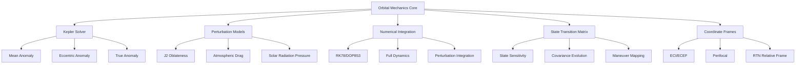
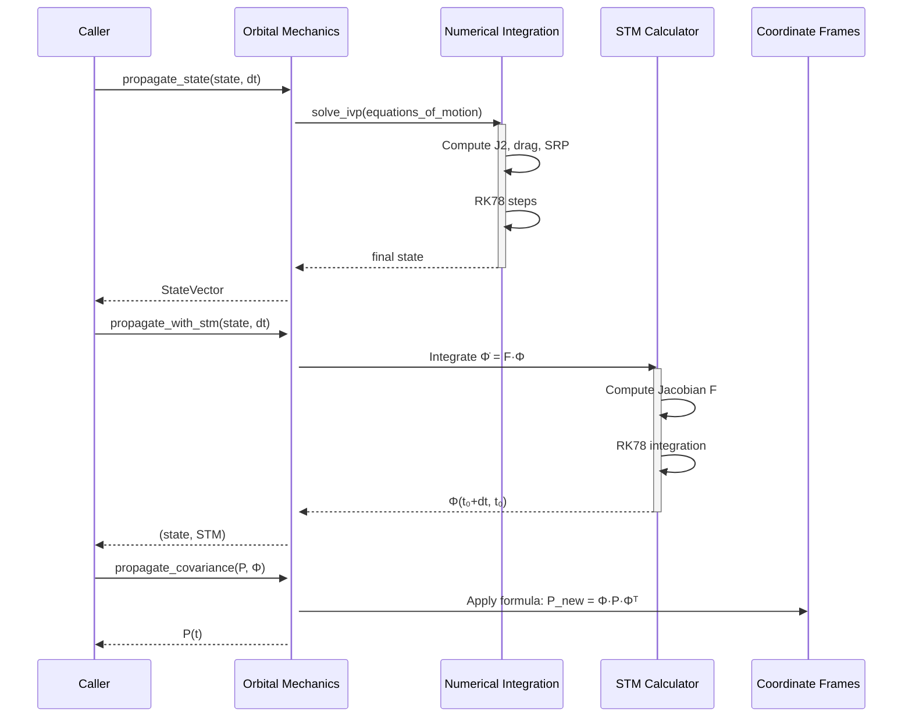

# Design Document: Orbital Mechanics Core

## Overview

The orbital mechanics core module implements two-body Keplerian orbit propagation with perturbation models, State Transition Matrix (STM) propagation for uncertainty evolution, and coordinate frame transformations. This is the foundational component for all trajectory prediction and collision avoidance decisions in the system.

The module provides both analytical propagation (via Kepler's equation solver) for fast predictions and full numerical integration with perturbations (J2 oblateness, atmospheric drag, solar radiation pressure) for high-fidelity analysis. The State Transition Matrix enables efficient covariance propagation—mapping uncertainty from one epoch to another—essential for computing collision probability and maneuver effectiveness.

## Architecture



## Main Workflow



## Components and Interfaces

### 1. Kepler Solver Component

**Purpose**: Solve Kepler's equation M = E - e·sin(E) for eccentric anomaly. Enables fast analytical orbit propagation without numerical integration.

**Interface**:
```python
def solve_kepler(M: float, e: float, tol: float = 1e-12, 
                 max_iter: int = 50) -> float
def eccentric_to_true_anomaly(E: float, e: float) -> float
def true_to_eccentric_anomaly(nu: float, e: float) -> float
def propagate_kepler(elements: OrbitalElements, dt: float) -> OrbitalElements
```

**Responsibilities**:
- Solve Kepler's equation using Newton-Raphson iteration
- Convert between anomaly representations (eccentric, true, mean)
- Propagate classical orbital elements analytically (two-body only)
- Serve as initial guess for higher-fidelity propagation

---

### 2. Perturbation Models Component

**Purpose**: Compute accelerations due to gravitational and non-gravitational perturbations.

**Interface**:
```python
def acceleration_j2(r: ndarray) -> ndarray
def atmospheric_density(altitude_km: float) -> float
def acceleration_drag(r: ndarray, v: ndarray, cd: float, 
                      area_mass_ratio: float) -> ndarray
def acceleration_srp(r: ndarray, cr: float, area_mass_ratio: float,
                     r_sun: Optional[ndarray] = None) -> ndarray
```

**Responsibilities**:
- Compute J2 oblateness gravity gradient
- Model atmospheric density (exponential with altitude bands)
- Calculate atmospheric drag with Earth rotation correction
- Include solar radiation pressure with shadow detection
- Each model can be toggled independently for propagation fidelity

---

### 3. Equations of Motion Component

**Purpose**: Define the full ODE system for numerical propagation.

**Interface**:
```python
def equations_of_motion(t: float, state: ndarray,
                        cd: float = 2.2, cr: float = 1.5,
                        area_mass_ratio: float = 0.01,
                        include_j2: bool = True,
                        include_drag: bool = True,
                        include_srp: bool = False) -> ndarray

def equations_of_motion_with_stm(t: float, state_and_stm: ndarray,
                                  cd: float = 2.2, cr: float = 1.5,
                                  area_mass_ratio: float = 0.01,
                                  include_j2: bool = True) -> ndarray
```

**Responsibilities**:
- Assemble full acceleration from two-body + perturbations
- Provide integrator with state derivatives [v, a]
- Support STM propagation alongside state
- Compute Jacobian F for STM integration

---

### 4. Numerical Integration Component

**Purpose**: Propagate state and covariance forward in time with high accuracy.

**Interface**:
```python
def propagate_state(state: StateVector, dt: float,
                    cd: float = 2.2, cr: float = 1.5,
                    area_mass_ratio: float = 0.01,
                    include_j2: bool = True, include_drag: bool = True,
                    include_srp: bool = False,
                    max_step: float = 60.0) -> StateVector

def propagate_with_stm(state: StateVector, dt: float,
                       cd: float = 2.2, cr: float = 1.5,
                       area_mass_ratio: float = 0.01,
                       include_j2: bool = True,
                       max_step: float = 60.0) -> Tuple[StateVector, ndarray]

def propagate_covariance(covariance: ndarray, stm: ndarray,
                         process_noise: Optional[ndarray] = None) -> ndarray

def generate_ephemeris(state: StateVector, times: ndarray,
                      cd: float = 2.2, cr: float = 1.5,
                      area_mass_ratio: float = 0.01,
                      include_j2: bool = True,
                      include_drag: bool = True) -> ndarray

def propagate_spacecraft(spacecraft: Spacecraft, dt: float,
                         include_j2: bool = True,
                         include_drag: bool = True) -> Tuple[Spacecraft, ndarray]
```

**Responsibilities**:
- Integrate ODEs using high-order Runge-Kutta (DOP853)
- Support both single propagation steps and ephemeris generation
- Handle STM integration for covariance evolution
- Apply process noise models to account for unmodeled accelerations
- Manage numerical tolerances (rtol=1e-10, atol=1e-12)

---

### 5. Coordinate Frame Component

**Purpose**: Transform between different reference frames used in orbital mechanics.

**Interface**:
```python
def rotation_matrix_x(angle: float) -> ndarray
def rotation_matrix_z(angle: float) -> ndarray
def perifocal_to_eci(raan: float, i: float, omega: float) -> ndarray
def eci_to_rtn(r: ndarray, v: ndarray) -> ndarray
def coe_to_state(elements: OrbitalElements) -> StateVector
def state_to_coe(state: StateVector) -> OrbitalElements
```

**Responsibilities**:
- Provide rotation matrices for standard transformations
- Convert between classical orbital elements (COE) and Cartesian state
- Transform state vectors to/from RTN relative frame
- Support ECI↔ECEF conversions via rotation matrices

---

## Data Models

### OrbitalElements

```python
@dataclass
class OrbitalElements:
    """Classical Keplerian orbital elements"""
    a: float        # Semi-major axis [km]
    e: float        # Eccentricity [dimensionless, 0 ≤ e < 1]
    i: float        # Inclination [rad, 0 ≤ i ≤ π]
    raan: float     # Right Ascension of Ascending Node [rad]
    omega: float    # Argument of perigee [rad]
    nu: float       # True anomaly [rad, 0 ≤ nu < 2π]
```

**Validation Rules**:
- a > R_Earth: Semi-major axis must exceed Earth radius
- 0 ≤ e < 1: Eccentricity defines bound elliptical orbit
- 0 ≤ i ≤ π: Inclination is always non-negative
- All angles normalized to [0, 2π)

---

### StateVector

```python
@dataclass
class StateVector:
    """Cartesian state vector in ECI frame"""
    r: ndarray      # Position [km] — shape (3,)
    v: ndarray      # Velocity [km/s] — shape (3,)
```

**Validation Rules**:
- r: Position within orbital mechanics domain (not below Earth surface)
- v: Velocity consistent with orbital energy (not escape velocity)
- Numerical stability: both vectors should be finite (no NaN/Inf)

---

### Spacecraft

```python
@dataclass
class Spacecraft:
    """Spacecraft with state, uncertainty, and physical properties"""
    id: str                           # Unique identifier
    state: StateVector                # Current orbital state (ECI)
    covariance: ndarray              # 6×6 state covariance matrix (P)
    mass: float                       # Spacecraft mass [kg]
    area: float                       # Cross-sectional area [m²]
    cd: float = 2.2                   # Drag coefficient
    cr: float = 1.5                   # Reflectivity coefficient
    delta_v_budget: float = 25.0     # Remaining Δv capability [m/s]
    delta_v_used: float = 0.0         # Δv expended so far [m/s]
    maneuverable: bool = True         # Can execute maneuvers
    name: str = ""                    # Human-readable name
```

**Validation Rules**:
- mass > 0: Positive mass required
- area > 0: Positive cross-section required
- delta_v_budget ≥ delta_v_used: Cannot exceed budget
- covariance: Symmetric positive semi-definite 6×6 matrix

---

## Algorithmic Pseudocode

### Core Algorithm 1: Kepler's Equation Solver

```pascal
ALGORITHM solveKepler(M, e)
INPUT: M ∈ ℝ (mean anomaly [rad])
       e ∈ [0, 1) (eccentricity)
OUTPUT: E ∈ [0, 2π) (eccentric anomaly)

BEGIN
  // Initial guess: linear approximation for small e
  IF e < 0.8 THEN
    E ← M + e·sin(M)
  ELSE
    E ← π
  END IF
  
  // Newton-Raphson iteration
  FOR iteration = 1 to MAX_ITERATIONS DO
    f(E) ← E - e·sin(E) - M
    f'(E) ← 1 - e·cos(E)
    
    IF |f'(E)| < ε_small THEN
      BREAK  // Derivative too small, convergence issues
    END IF
    
    ΔE ← -f(E) / f'(E)
    E ← E + ΔE
    
    IF |ΔE| < TOLERANCE THEN
      BREAK  // Converged
    END IF
  END FOR
  
  RETURN E mod 2π
END
```

**Preconditions**:
- M is a valid mean anomaly (any real value)
- 0 ≤ e < 1 (elliptical orbit)
- Tolerance and max_iter are positive scalars

**Postconditions**:
- E satisfies Kepler's equation: M = E - e·sin(E) to TOLERANCE
- E ∈ [0, 2π)
- Newton-Raphson converged within MAX_ITERATIONS (or graceful exit)

**Loop Invariants**:
- Each iteration refines the approximation: |f(E_{k+1})| < |f(E_k)|
- E remains finite and in valid domain

---

### Core Algorithm 2: Acceleration Computation (Perturbations)

```pascal
ALGORITHM computeAcceleration(r, v, perturbations)
INPUT: r ∈ ℝ³ (position [km])
       v ∈ ℝ³ (velocity [km/s])
       perturbations: set of {J2, Drag, SRP, ...}
OUTPUT: a ∈ ℝ³ (total acceleration [km/s²])

BEGIN
  // Two-body gravitational acceleration
  r_mag ← |r|
  a_gravity ← -μ / r_mag³ · r
  
  // Initialize total acceleration
  a_total ← a_gravity
  
  // J2 Oblateness Perturbation
  IF J2 ∈ perturbations THEN
    x, y, z ← r[0], r[1], r[2]
    r2 ← r_mag²
    r5 ← r_mag⁵
    
    factor ← -(3/2) · J2 · μ · R_E² / r5
    z2_r2 ← z² / r2
    
    a_J2 ← [
      factor · x · (1 - 5·z2_r2),
      factor · y · (1 - 5·z2_r2),
      factor · z · (3 - 5·z2_r2)
    ]
    
    a_total ← a_total + a_J2
  END IF
  
  // Atmospheric Drag
  IF Drag ∈ perturbations THEN
    h ← r_mag - R_E  // Altitude
    
    IF 100 < h < 1000 THEN  // Valid drag region
      ρ ← atmosphericDensity(h)
      
      // Velocity relative to atmosphere
      ω_vec ← [0, 0, ω_Earth]
      v_atm ← ω_vec × r
      v_rel ← v - v_atm
      v_rel_mag ← |v_rel|
      
      // Drag acceleration
      factor ← -(1/2) · ρ · Cd · (A/m) · 1000
      a_drag ← factor · v_rel_mag · v_rel
      
      a_total ← a_total + a_drag
    END IF
  END IF
  
  // Solar Radiation Pressure
  IF SRP ∈ perturbations THEN
    // Sun direction and shadow check
    r_sun ← getSunPosition()
    r_hat ← (r_sun - r) / |r_sun - r|
    
    IF NOT inEarthShadow(r, r_sun) THEN
      factor ← -P_SR · Cr · (A/m) / 1000
      a_SRP ← factor · r_hat
      
      a_total ← a_total + a_SRP
    END IF
  END IF
  
  RETURN a_total
END
```

**Preconditions**:
- r is a non-zero position vector (not at Earth center)
- v is any velocity vector
- Perturbations set is a subset of valid options
- All spacecraft properties (Cd, Cr, A/m) are defined

**Postconditions**:
- Returned acceleration vector is finite
- Magnitude is reasonable for the orbit
- Each perturbation contributes only if enabled

**Loop Invariants**:
- Each perturbation model is independent
- Total acceleration is sum of all enabled contributions

---

### Core Algorithm 3: Numerical State Propagation

```pascal
ALGORITHM propagateState(state, dt, method='DOP853')
INPUT: state ∈ StateVector (initial [r, v] at t₀)
       dt ∈ ℝ (time step [seconds])
       method: numerical integrator choice
OUTPUT: state_final ∈ StateVector (state at t₀ + dt)

BEGIN
  // Prepare initial conditions
  y0 ← [state.r, state.v]  // Shape (6,)
  
  // Set integration parameters
  t_span ← [0, dt]
  t_eval ← None  // Adaptive time stepping
  rtol ← 1e-10  // Relative tolerance
  atol ← 1e-12  // Absolute tolerance [km and km/s]
  max_step ← 60.0  // Maximum step size [seconds]
  
  // Numerical integration (RK78 embedded method)
  solution ← solveIVP(
    f = equations_of_motion,
    t_span,
    y0,
    method = method,
    dense_output = false,
    events = None,
    vectorized = false,
    max_step = max_step,
    rtol = rtol,
    atol = atol
  )
  
  IF NOT solution.success THEN
    RAISE RuntimeError("Propagation failed: " + solution.message)
  END IF
  
  // Extract final state
  y_final ← solution.y[:, -1]
  state_final ← StateVector(r = y_final[0:3], v = y_final[3:6])
  
  RETURN state_final
END
```

**Preconditions**:
- state is a valid StateVector (r and v are finite)
- dt ≠ 0 (can be positive or negative)
- Spacecraft properties (mass, area, Cd, Cr) are available in context
- Tolerances are positive

**Postconditions**:
- state_final is a valid StateVector
- Propagation succeeded or raised exception
- Numerical error within specified tolerances
- Integration captured all dynamics over dt

**Loop Invariants** (for internal integrator):
- At each RK78 step, state remains on valid orbital trajectory
- Energy error is cumulative over dt

---

### Core Algorithm 4: State Transition Matrix Integration

```pascal
ALGORITHM propagateWithSTM(state, dt)
INPUT: state ∈ StateVector (initial orbital state)
       dt ∈ ℝ (propagation time [seconds])
OUTPUT: (state_final, Φ) where:
        state_final ∈ StateVector (propagated state)
        Φ ∈ ℝ⁶ˣ⁶ (State Transition Matrix Φ(t₀+dt, t₀))

BEGIN
  // Prepare augmented initial conditions: [state, flattened STM]
  y0 ← [state.r, state.v, vec(I₆)]  // Shape (42,)
  // where I₆ is identity matrix, vec flattens to (36,)
  
  // Integrate augmented system: ẏ = [f(state), F·Φ]
  solution ← solveIVP(
    f = equations_of_motion_with_stm,
    [0, dt],
    y0,
    method = 'DOP853',
    rtol = 1e-10,
    atol = 1e-12,
    max_step = 60.0
  )
  
  IF NOT solution.success THEN
    RAISE RuntimeError("STM propagation failed: " + solution.message)
  END IF
  
  // Extract final state and STM
  y_final ← solution.y[:, -1]
  state_final ← StateVector(r = y_final[0:3], v = y_final[3:6])
  stm ← reshape(y_final[6:42], (6, 6))
  
  RETURN (state_final, stm)
END
```

**Preconditions**:
- state is a valid StateVector
- dt ≠ 0
- Jacobian computation (partial derivatives of dynamics) is accurate

**Postconditions**:
- state_final matches propagateState result (state component)
- Φ satisfies: δX_final ≈ Φ · δX_initial (to numerical precision)
- Φ is invertible (det(Φ) ≠ 0) for non-singular propagation
- Φ encodes maneuver sensitivity: ∂r(TCA)/∂Δv(t) = Φ_rv(TCA, t)

**Loop Invariants**:
- At each integration step: Φ̇ = F · Φ is satisfied
- Φ maintains structure: upper-left 3×3 is position-position sensitivity
- Φ is continuous and smooth over time

---

### Core Algorithm 5: Covariance Propagation

```pascal
ALGORITHM propagateCovariance(P0, Φ, Q)
INPUT: P0 ∈ ℝ⁶ˣ⁶ (initial covariance, symmetric PSD)
       Φ ∈ ℝ⁶ˣ⁶ (State Transition Matrix)
       Q ∈ ℝ⁶ˣ⁶ (process noise covariance, optional)
OUTPUT: P_final ∈ ℝ⁶ˣ⁶ (covariance at propagation epoch)

BEGIN
  // Main propagation: P(t) = Φ · P(t₀) · Φᵀ
  P_final ← Φ · P0 · Φᵀ
  
  // Add process noise (if provided)
  IF Q is not None THEN
    P_final ← P_final + Q
  END IF
  
  // Ensure symmetry (numerical stability)
  P_final ← (P_final + P_finalᵀ) / 2
  
  RETURN P_final
END
```

**Preconditions**:
- P0 is symmetric positive semi-definite
- Φ is invertible (non-singular propagation)
- Q is symmetric positive semi-definite (if provided)
- All matrices are 6×6

**Postconditions**:
- P_final is symmetric positive semi-definite
- P_final models uncertainty growth from both:
  1. Propagation of initial uncertainty via STM
  2. Unmodeled accelerations via process noise
- Trace(P_final) ≥ Trace(P0) (uncertainty monotonically increases)

**Loop Invariants** (for external process over time):
- Covariance grows along propagation trajectory
- Principal semi-axes align with orbital dynamics sensitivities

---

## Key Functions with Formal Specifications

### Function: propagate_state()

```python
def propagate_state(state: StateVector, dt: float,
                    cd: float = 2.2, cr: float = 1.5,
                    area_mass_ratio: float = 0.01,
                    include_j2: bool = True,
                    include_drag: bool = True,
                    include_srp: bool = False,
                    max_step: float = 60.0) -> StateVector
```

**Preconditions**:
- `state` is a valid StateVector with finite r and v
- `state.r` represents position not below Earth surface
- `dt` is a non-zero real number (can be negative for backward propagation)
- `cd > 0`, `cr > 0`, `area_mass_ratio > 0`
- `max_step > 0`
- Spacecraft physical properties are consistent with orbital regime

**Postconditions**:
- Returns a valid StateVector at time t₀ + dt
- Result is continuous in dt: `propagate_state(state, t1 + t2) ≈ propagate_state(propagate_state(state, t1), t2)`
- Numerical error bounded by tolerances (rtol=1e-10, atol=1e-12)
- Orbital energy is approximately conserved (two-body case without perturbations)
- Propagation succeeded or raised RuntimeError

**Side Effects**: None (pure function)

---

### Function: propagate_with_stm()

```python
def propagate_with_stm(state: StateVector, dt: float,
                       cd: float = 2.2, cr: float = 1.5,
                       area_mass_ratio: float = 0.01,
                       include_j2: bool = True,
                       max_step: float = 60.0) -> Tuple[StateVector, np.ndarray]
```

**Preconditions**:
- `state` is valid StateVector
- `dt` is non-zero real
- `include_j2` is boolean
- `max_step > 0`

**Postconditions**:
- state_final matches `propagate_state(state, dt)` output
- `stm` is 6×6 matrix encoding sensitivity: `δX_final ≈ stm @ δX_initial`
- `stm` is invertible (det(stm) ≠ 0)
- `stm[0:3, 0:3]` (position sensitivity to initial position) is positive definite for forward propagation
- `stm[0:3, 3:6]` (position sensitivity to initial velocity) has Frobenius norm ≈ |dt| for circular orbits

**Use for**:
- Maneuver effectiveness computation: `Δr_TCA = stm[0:3, 3:6] @ Δv`
- Covariance evolution: `P_new = stm @ P_old @ stm.T`
- Linearized state sensitivity analysis

---

### Function: propagate_covariance()

```python
def propagate_covariance(covariance: np.ndarray, stm: np.ndarray,
                         process_noise: Optional[np.ndarray] = None) -> np.ndarray
```

**Preconditions**:
- `covariance` is 6×6 symmetric positive semi-definite
- `stm` is 6×6 matrix (usually invertible)
- `process_noise` is None or 6×6 symmetric positive semi-definite
- All matrices have dtype float64

**Postconditions**:
- Returns 6×6 symmetric positive semi-definite matrix
- `P_new = stm @ covariance @ stm.T + process_noise` (if process_noise provided)
- Trace(P_new) ≥ Trace(covariance) (monotonic uncertainty growth)
- Eigenvalues of P_new are non-negative

**Notes**:
- Function is numerically symmetric: `(P_new + P_new.T) / 2` is applied before return
- Critical for collision probability estimation (uses covariance to define encounter plane uncertainty)

---

### Function: acceleration_j2()

```python
def acceleration_j2(r: np.ndarray) -> np.ndarray
```

**Preconditions**:
- `r` is shape (3,) with components [x, y, z] in km
- `|r| > R_Earth` (not below Earth surface)
- `r` is not the zero vector

**Postconditions**:
- Returns 3-element array with acceleration in km/s²
- Acceleration magnitude is ≤ 1e-4 km/s² (typical J2 effect for LEO)
- Acceleration is radially inward (or tangential)
- Acceleration is smooth (Lipschitz continuous) in r

**Physical Interpretation**:
- J2 causes orbital precession (apsidal regression, node regression)
- For LEO: causes ~10°/day node precession
- Component largest near poles (z near ±r_mag)

---

### Function: solve_kepler()

```python
def solve_kepler(M: float, e: float, tol: float = 1e-12, 
                 max_iter: int = 50) -> float
```

**Preconditions**:
- `M` is any real value (mean anomaly, typically [0, 2π) but periodicity handles any M)
- `0 ≤ e < 1` (elliptical orbit)
- `tol > 0` (typically 1e-12 for double precision)
- `max_iter ≥ 3` (Newton-Raphson iterations)

**Postconditions**:
- Returns E ∈ [0, 2π) satisfying |E - e·sin(E) - M| < tol·|1 - e·cos(E)|
- Converged within max_iter iterations (or returns best approximation)
- Return value satisfies Kepler's equation to specified tolerance

**Convergence**:
- Quadratic convergence for e < 0.8 (typical LEO)
- Linear convergence for high eccentricity (e → 1)
- Always converges for valid e and reasonable M

---

## Example Usage

### Example 1: Propagate a single spacecraft state

```python
from orbital_mechanics import propagate_state, StateVector
import numpy as np

# Initial state: LEO at ~400 km altitude
r0 = np.array([6778.137, 0, 0])  # km
v0 = np.array([0, 7.546, 0.1])   # km/s
state0 = StateVector(r=r0, v=v0)

# Propagate forward 1 orbit (~6000 seconds)
dt = 6000.0
state_new = propagate_state(state0, dt, include_j2=True, include_drag=True)

print(f"Initial position: {state0.r} km")
print(f"Final position: {state_new.r} km")
print(f"Final velocity: {state_new.v} km/s")
```

### Example 2: Propagate with State Transition Matrix

```python
from orbital_mechanics import propagate_with_stm, propagate_covariance
import numpy as np

# Propagate with STM
state_final, stm = propagate_with_stm(state0, dt=600.0, include_j2=True)

# Compute initial covariance (1 km position, 0.01 km/s velocity uncertainty)
P0 = np.diag([1.0, 1.0, 1.0, 0.01, 0.01, 0.01])**2

# Propagate covariance
P_final = propagate_covariance(P0, stm)

print(f"Position uncertainty growth: {np.sqrt(np.diag(P_final)[:3])} km")
print(f"Velocity uncertainty growth: {np.sqrt(np.diag(P_final)[3:])} km/s")

# Maneuver effectiveness: how much does 1 m/s Δv at t=0 change position at t=600s?
delta_r_per_m_per_s = stm[0:3, 3:6] / 1000.0  # Convert from km/s to m/s units
print(f"Position change per 1 m/s Δv: {np.linalg.norm(delta_r_per_m_per_s)} km")
```

### Example 3: Full Keplerian propagation

```python
from orbital_mechanics import propagate_kepler, OrbitalElements
import numpy as np

# Classical orbital elements (ISS-like orbit)
elements = OrbitalElements(
    a=6378.137 + 408,      # 408 km altitude
    e=0.0001,              # Nearly circular
    i=np.radians(51.6),    # Inclination
    raan=0.0,              # RAAN (reset to zero for this example)
    omega=0.0,             # Argument of perigee
    nu=0.0                 # True anomaly at epoch
)

# Propagate analytically (two-body only, fast)
dt = 1800.0  # 30 minutes
elements_new = propagate_kepler(elements, dt)

print(f"Initial true anomaly: {np.degrees(elements.nu):.2f}°")
print(f"Final true anomaly: {np.degrees(elements_new.nu):.2f}°")
print(f"Semi-major axis (unchanged): {elements_new.a:.3f} km")
```

### Example 4: Perturbation acceleration demo

```python
from orbital_mechanics import (acceleration_j2, acceleration_drag, 
                               acceleration_srp)
import numpy as np

# LEO spacecraft state
r = np.array([6778.137, 0, 0])  # 400 km altitude
v = np.array([0, 7.546, 0])     # Circular orbit velocity

# J2 perturbation
a_j2 = acceleration_j2(r)
print(f"J2 acceleration: {a_j2} km/s²")

# Atmospheric drag (for a typical cubesat: 3 kg, 0.1 m², Cd=2.2)
cd = 2.2
area_mass_ratio = 0.1 / 3.0  # m²/kg
a_drag = acceleration_drag(r, v, cd, area_mass_ratio)
print(f"Drag acceleration: {a_drag} km/s²")

# Solar radiation pressure
cr = 1.5  # Reflectivity
a_srp = acceleration_srp(r, cr, area_mass_ratio)
print(f"SRP acceleration: {a_srp} km/s²")

# Total perturbation acceleration (before two-body)
a_total_pert = a_j2 + a_drag + a_srp
print(f"Total perturbation: {a_total_pert} km/s²")
```

### Example 5: Spacecraft object propagation

```python
from orbital_mechanics import propagate_spacecraft, Spacecraft
import numpy as np

# Create spacecraft object with initial conditions
sc = Spacecraft(
    id="SAT001",
    state=state0,
    covariance=np.diag([0.1, 0.1, 0.1, 0.001, 0.001, 0.001])**2,
    mass=10.0,     # kg
    area=0.1,      # m²
    cd=2.2,
    cr=1.5,
    delta_v_budget=25.0,  # m/s
    maneuverable=True,
    name="CubeSat-A"
)

# Propagate (includes covariance evolution)
sc_new, stm = propagate_spacecraft(sc, dt=600.0, include_j2=True, include_drag=True)

print(f"Spacecraft {sc_new.name} propagated")
print(f"Position: {sc_new.state.r} km")
print(f"Position uncertainty: {np.sqrt(np.diag(sc_new.covariance)[:3])} km")
```

---

## Correctness Properties

### Property 1: Energy Conservation (Two-Body Kepler)

When propagating with only two-body gravity (no perturbations), total orbital energy must be conserved:

**Formal Definition:**
```
For all valid states X₀ at t₀, any propagation time dt, and propagation parameters
(include_j2=False, include_drag=False, include_srp=False):

E₀ = ½|v₀|² - μ/|r₀|
X(t₀+dt) = propagate_state(X₀, dt, include_j2=False, include_drag=False, include_srp=False)
E(t₀+dt) = ½|v(t₀+dt)|² - μ/|r(t₀+dt)|

Property: |E(t₀+dt) - E₀| < ε_energy · |E₀|  (where ε_energy ≈ 1e-8 from numerical integration)
```

**Verification**: Orbital energy should remain constant; deviations indicate numerical integration errors.

---

### Property 2: Kepler's Equation Satisfaction

After solving Kepler's equation, the result must satisfy the equation:

**Formal Definition:**
```
For all valid (M, e) pairs:

E = solve_kepler(M, e, tol=1e-12)

Property: |E - e·sin(E) - M| < tol  (typically 1e-12)
```

**Verification**: Can independently verify by substituting E back into Kepler's equation.

---

### Property 3: STM is Invertible

For any non-singular propagation, the STM must be invertible:

**Formal Definition:**
```
For any valid state and non-zero dt:

X₀ = valid StateVector
X_f, Φ = propagate_with_stm(X₀, dt)

Property: |det(Φ)| > ε_det  (where ε_det ≈ 1e-6 for valid propagations)
```

**Verification**: Compute determinant; should be close to 1 (for Hamiltonian systems, det(Φ) ≈ 1).

---

### Property 4: Covariance Positive Semi-Definite

After propagation, covariance must remain positive semi-definite:

**Formal Definition:**
```
For any PSD covariance P₀ and any STM Φ:

P_f = propagate_covariance(P₀, Φ)

Property: All eigenvalues of P_f are non-negative
         min_eigenvalue(P_f) ≥ -ε_sym  (where ε_sym ≈ machine epsilon × max eigenvalue)
```

**Verification**: Eigenvalue decomposition; all eigenvalues ≥ 0.

---

### Property 5: Uncertainty Monotonicity

Uncertainty can only increase or stay constant (not decrease) over time:

**Formal Definition:**
```
For forward propagation (dt > 0) with process noise:

P₀ = initial covariance
Φ = STM from 0 to dt
Q = process noise (PSD)

Property: Trace(propagate_covariance(P₀, Φ, Q)) ≥ Trace(P₀)
```

**Verification**: Compare trace norms before and after propagation.

---

### Property 6: Periodicity of Kepler Propagation

For purely two-body Kepler propagation, state returns to original after one orbital period:

**Formal Definition:**
```
For any valid OrbitalElements with a, e given:

T = orbital period = 2π√(a³/μ)
elements_0 = valid OrbitalElements
elements_T = propagate_kepler(elements_0, dt=T)

Property: |elements_T.nu - elements_0.nu| < 2·π·ε_angle  (where ε_angle ≈ 1e-10)
         All other elements unchanged
```

**Verification**: True anomaly should complete exactly one cycle.

---

### Property 7: Continuity in Propagation Time

Small changes in propagation time produce small changes in final state (Lipschitz continuity):

**Formal Definition:**
```
For small Δdt:

X(t₀+dt) = propagate_state(X₀, dt)
X(t₀+dt+Δdt) = propagate_state(X₀, dt+Δdt)

Property: |X(t₀+dt+Δdt) - X(t₀+dt)| ≤ C·|Δdt|  (where C depends on dynamics)
```

**Verification**: Successive propagations with varying dt should show smooth relationship.

---

### Property 8: Forward-Backward Propagation Consistency

Propagating forward then backward should recover approximately the initial state:

**Formal Definition:**
```
X₀ = initial state
dt > 0

X_f = propagate_state(X₀, dt)
X_0_recovered = propagate_state(X_f, -dt)

Property: |X_0_recovered - X₀| < ε_roundtrip · |X₀|  (where ε_roundtrip ≈ 1e-9)
```

**Verification**: Round-trip propagation error should be small.

---

### Property 9: STM Encodes State Sensitivity

The STM correctly encodes how initial state perturbations propagate:

**Formal Definition:**
```
For any small perturbation δX₀:

X₀ = initial state
X₀_perturbed = X₀ + δX₀
X_f, Φ = propagate_with_stm(X₀, dt)
X_f_perturbed = propagate_state(X₀_perturbed, dt)

Property: |X_f_perturbed - X_f - Φ @ δX₀| < ε_stm · |δX₀|²  (quadratic convergence)
```

**Verification**: Compare actual vs. STM-predicted perturbation growth (linearization error).

---

### Property 10: Drag Reduces Orbital Energy

Atmospheric drag must always remove energy from the orbit:

**Formal Definition:**
```
For propagation with include_drag=True at LEO altitudes:

E₀ = ½|v₀|² - μ/|r₀|
X_f = propagate_state(X₀, dt, include_drag=True)
E_f = ½|v_f|² - μ/|r_f|

Property: E_f ≤ E₀  (energy monotonically decreases)
```

**Verification**: Compare orbital energies; drag should lower semi-major axis over time.

---

## Error Handling

### Scenario 1: Invalid Propagation Time

**Condition**: dt = 0 or dt is not finite
**Response**: Function returns current state unchanged or raises ValueError
**Recovery**: Caller should validate dt before calling propagate_state

### Scenario 2: Propagation Divergence

**Condition**: Numerical integrator reports non-convergence or NaN values
**Response**: Raise RuntimeError with solver message
**Recovery**: Reduce max_step, increase rtol/atol, or check initial state validity

### Scenario 3: Invalid Input State

**Condition**: state.r is below Earth surface or contains NaN
**Response**: Function may raise ValueError or silently propagate (undefined behavior)
**Recovery**: Caller must validate StateVector before propagation

### Scenario 4: Singular Orbit

**Condition**: Zero eccentricity (circular) orbit with true anomaly handling or numerical issues near singularities
**Response**: Kepler solver handles gracefully with initial guess adaptation
**Recovery**: Algorithm uses e-dependent initial guess to avoid division by zero

### Scenario 5: High-Eccentricity Orbit

**Condition**: e → 1 (nearly parabolic orbit)
**Response**: Kepler solver may require more Newton-Raphson iterations
**Recovery**: max_iter parameter allows flexible iteration limits

### Scenario 6: Covariance Numerical Asymmetry

**Condition**: Due to floating-point arithmetic, P_final = Φ·P₀·Φᵀ may not be exactly symmetric
**Response**: Function symmetrizes: (P + Pᵀ)/2 before return
**Recovery**: Ensures positive semi-definiteness and numerical stability

---

## Testing Strategy

### Unit Testing Approach

**Test Coverage**:
- Kepler solver: Convergence on known solutions, edge cases (e near 0 and 1)
- Perturbation accelerations: Magnitude bounds, directional correctness
- Coordinate transforms: Orthogonality, det = 1, round-trip consistency
- Data structures: Validation rules, type checking

**Key Test Cases**:
- Circular orbit (e=0): mean anomaly = true anomaly
- Equatorial orbit (i=0): RAAN undefined but doesn't affect state
- Polar orbit (i=90°): specific anomaly evolution
- High-eccentricity (e=0.7): Kepler solver convergence
- GEO orbit (a=42164 km): long period, small perturbation effects
- LEO orbit (a=6778 km): significant drag, J2 effects

---

### Property-Based Testing Approach

**Property Test Library**: Hypothesis (Python) or fast-check (JavaScript)

**Test Properties**:
1. **Kepler's Equation Satisfaction**: Random (M, e) pairs → E satisfies equation
2. **Energy Conservation**: Two-body propagation preserves energy (within tolerance)
3. **STM Invertibility**: Random propagations → STM has non-zero determinant
4. **Covariance PSD**: Any PSD covariance + any STM → result remains PSD
5. **Uncertainty Monotonicity**: Forward propagation with noise → trace increases
6. **Forward-Backward Consistency**: X → propagate(X, dt) → propagate(X, -dt) ≈ X
7. **Continuity**: Small dt perturbations → small state perturbations
8. **Periodicity (Kepler)**: One orbit period → true anomaly cycles exactly

---

### Integration Testing Approach

**Test Scenarios**:
- Multi-step propagation: Propagate over multiple epochs; verify continuity
- Spacecraft object propagation: Full state + covariance evolution
- Ephemeris generation: Generate trajectory grid; verify temporal smoothness
- Perturbation toggle: Compare (J2=on, drag=off) vs. two-body; verify J2 dominance at LEO
- Maneuver effectiveness: Compute Δr(TCA) from STM; verify against finite-difference

---

## Performance Considerations

### Computational Complexity

- **Kepler solver**: O(n_iter) where n_iter ≤ 50 (typically 3-8)
- **Perturbation acceleration**: O(1) per evaluation
- **Numerical integration**: O(n_steps) where n_steps = dt / max_step (typically 10-100)
- **STM integration**: Same as state propagation; 6×6 matrix-matrix multiply per step
- **Covariance propagation**: O(1) for P = Φ·P₀·Φᵀ (single matrix multiply)

### Memory Usage

- StateVector: 48 bytes (two 3-element float64 arrays)
- OrbitalElements: 48 bytes (six float64 scalars)
- Spacecraft: ~500 bytes (state + 6×6 covariance + metadata)
- STM storage: 288 bytes (6×6 float64 matrix)
- Integration buffers: Depends on solver; typically 10-100 KB for a single propagation

### Optimization Strategies

- **Analytical propagation preferred**: Use propagate_kepler when high-fidelity not needed
- **Perturbation selective**: Disable include_srp for LEO (negligible); enable for GEO
- **Covariance lazy computation**: Only propagate when needed for collision probability
- **Batch propagation**: Use generate_ephemeris for multiple time points (more efficient than repeated propagate_state calls)

---

## Security Considerations

### Numerical Stability

- Integration tolerances (rtol=1e-10, atol=1e-12) selected to balance accuracy vs. computational load
- Covariance symmetrization guards against numerical drift
- Large orbits (GEO) may accumulate more error; consider reduced tolerances if needed

### Input Validation

- State vectors should be validated before propagation (r not below Earth surface)
- Spacecraft physical properties (mass, area, Cd) should be positive
- Covariance matrices should be positive semi-definite before propagation

### Unmodeled Accelerations

- Process noise Q models unmodeled forces (solar wind, third-body gravity, etc.)
- Critical for realistic covariance growth; can be tuned via sigma_acc parameter

---

## Dependencies

| Component | Purpose | External? |
|-----------|---------|-----------|
| numpy | Matrix operations, linear algebra | Yes |
| scipy.integrate.solve_ivp | Numerical ODE integration | Yes |
| Coordinate frame math | Rotation matrices, angle conversions | Internal |
| Constants (μ, R_E, J2, ω_E, P_SR) | Physical parameters | Configuration |

