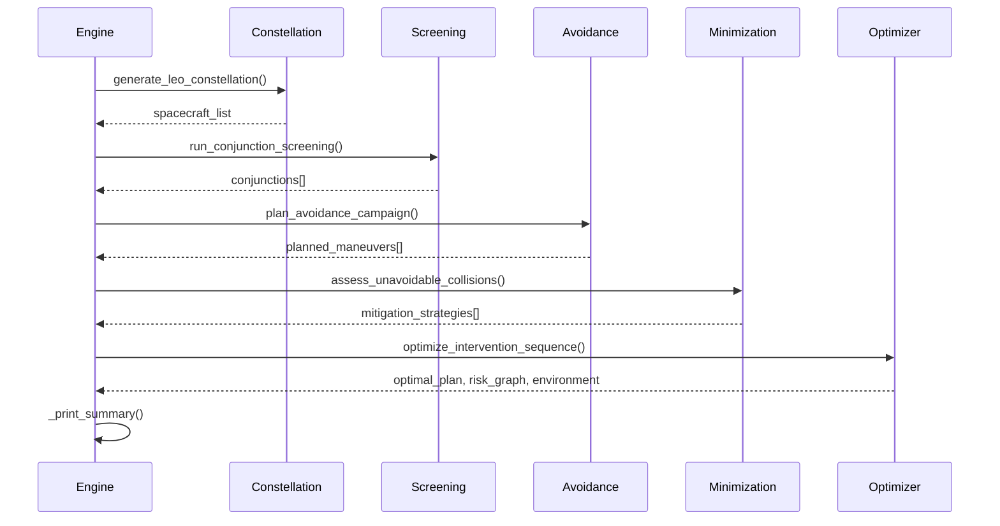

# Design Document: Simulation Engine

## Overview

The Simulation Engine is the central orchestration system that ties together all modules of the satellite collision prevention system into a cohesive, executable pipeline. It generates realistic LEO constellations with diverse spacecraft types and orbital elements, injects collision scenarios with specific conjunctions or randomized collisions, propagates orbital evolution over time, executes collision avoidance maneuvers, tracks fuel budgets and maneuver effectiveness, and computes long-term risk evolution across the entire constellation. The engine integrates orbital mechanics, conjunction assessment, collision avoidance planning, damage minimization, and multi-object risk optimization into a unified decision-making framework.

The system handles the full lifecycle from initial constellation generation through intervention planning, damage mitigation for unavoidable collisions, and global risk optimization. It produces actionable insights into which objects face the highest collision risk and how to allocate limited resources (fuel) to minimize long-term orbital debris generation and mission failure.

## Architecture

```mermaid
graph TD
    A["fa:fa-cog Simulation Engine"] --> B["fa:fa-satellite Constellation Generation"]
    A --> C["fa:fa-crosshairs Conjunction Screening"]
    A --> D["fa:fa-shield Avoidance Planning"]
    A --> E["fa:fa-bomb Damage Minimization"]
    A --> F["fa:fa-network Risk Optimization"]
    
    B --> B1["Generate Realistic Distribution"]
    B --> B2["Mix Spacecraft Types"]
    B --> B3["Initialize Covariance"]
    
    C --> C1["Pairwise Screening"]
    C --> C2["Probability Calculation"]
    C --> C3["Risk Ranking"]
    
    D --> D1["Maneuver Design"]
    D --> D2["Fuel Cost Analysis"]
    D --> D3["Campaign Planning"]
    
    E --> E1["Collision Prediction"]
    E --> E2["Debris Estimation"]
    E --> E3["Strategy Evaluation"]
    
    F --> F1["Risk Graph Construction"]
    F --> F2["Global Optimization"]
    F --> F3["Long-term Projection"]
    
    B1 --> G["fa:fa-database Spacecraft State & Properties"]
    B2 --> G
    B3 --> G
    
    C1 --> H["fa:fa-exclamation Conjunction Catalog"]
    C2 --> H
    C3 --> H
    
    D1 --> I["fa:fa-list Maneuver Plan"]
    D2 --> I
    D3 --> I
    
    E1 --> J["fa:fa-chart Collision Assessment"]
    E2 --> J
    E3 --> J
    
    F1 --> K["fa:fa-project-diagram Risk Analysis"]
    F2 --> K
    F3 --> K
```



## Main Workflow



## Components and Interfaces

### Component 1: CollisionPreventionSimulation

**Purpose**: Central orchestrator that manages the complete simulation lifecycle, coordinates all subsystems, and produces actionable intervention recommendations.

**Primary Responsibilities**:
- Initialize and maintain spacecraft constellation state
- Coordinate constellation generation with realistic orbital parameters
- Invoke conjunction screening across all spacecraft pairs
- Plan collision avoidance maneuvers for high-risk events
- Assess unavoidable collision scenarios and mitigation options
- Execute global risk optimization to find best intervention sequence
- Aggregate and report results at each phase

**Interface**:
```python
class CollisionPreventionSimulation:
    """Main simulation engine orchestrator."""
    
    def __init__(self, n_spacecraft: int = 50, seed: int = 42) -> None:
        """
        Initialize simulation with synthetic LEO constellation.
        
        Preconditions:
          - n_spacecraft > 0
          - seed is a valid random seed integer
        
        Postconditions:
          - spacecraft_list is populated with n_spacecraft objects
          - All spacecraft have valid initial state vectors and covariance
          - Statistics dict contains constellation metadata
          - Conjunction list initialized to empty
        """
        ...
    
    def run_screening(self, time_window_hours: float = 24.0,
                     distance_threshold_km: float = 25.0) -> None:
        """
        Phase 1: Conjunction screening across all pairs.
        
        Preconditions:
          - spacecraft_list is initialized with valid state vectors
          - time_window_hours > 0
          - distance_threshold_km > 0
        
        Postconditions:
          - conjunctions list populated with detected close approaches
          - All conjunctions satisfy Pc > pc_threshold
          - Conjunctions sorted by risk score (descending)
          - Screening time logged to stdout
        """
        ...
    
    def plan_avoidance(self) -> None:
        """
        Phase 2: Design and schedule collision avoidance maneuvers.
        
        Preconditions:
          - conjunctions list is non-empty
          - spacecraft_list contains valid maneuverable spacecraft
          - Each conjunction has valid TCA, Pc, miss_distance
        
        Postconditions:
          - planned_maneuvers list contains executable maneuvers
          - Each maneuver has valid delta_v, execution time, spacecraft_id
          - Total fuel cost computed and logged
          - Top 10 maneuvers printed with details
        """
        ...
    
    def assess_unavoidable(self) -> None:
        """
        Phase 3: Analyze unavoidable collisions and mitigation strategies.
        
        Preconditions:
          - conjunctions list is populated
          - planned_maneuvers list may be empty or non-empty
          - Each unavoidable conjunction has valid collision parameters
        
        Postconditions:
          - Unavoidable conjunctions identified (not in resolved_ids)
          - For each unavoidable high-risk event:
            * Collision outcome predicted (catastrophic assessment, fragment count)
            * Debris lifetime and risk score computed
            * Mitigation strategies ranked by effectiveness × feasibility
          - Strategies output to stdout
        """
        ...
    
    def run_optimizer(self, method: str = 'adaptive') -> None:
        """
        Phase 4: Global multi-object risk optimization.
        
        Preconditions:
          - conjunctions list is populated
          - spacecraft_list with valid orbital elements
          - All conjunction Pc values normalized and valid
        
        Postconditions:
          - risk_graph constructed from constellation state
          - environment analyzed for orbital shell stability
          - Optimal intervention plan computed via method
          - Total Pc, expected debris, Kessler index reported
          - Most threatened spacecraft identified
          - Unstable shells flagged for attention
        """
        ...
    
    def run_full_simulation(self) -> None:
        """
        Execute complete simulation pipeline in sequence.
        
        Preconditions:
          - Simulation object initialized
        
        Postconditions:
          - All four phases executed in order:
            1. run_screening()
            2. plan_avoidance()
            3. assess_unavoidable()
            4. run_optimizer()
          - Final summary printed
          - All artifacts (conjunctions, maneuvers, risk_graph) available
        """
        ...
```

**Key State**:
```python
# Maintained throughout simulation lifecycle
spacecraft_list: List[Spacecraft]           # Current constellation state
conjunctions: List[Conjunction]             # Detected close approaches
planned_maneuvers: List[Maneuver]          # Scheduled avoidance actions
risk_graph: Optional[RiskGraph]            # Multi-object risk network
environment: Optional[OrbitalEnvironment]  # Orbital shell analysis
stats: Dict[str, Any]                      # Aggregate constellation metrics
```

---

### Component 2: Constellation Generation

**Purpose**: Create realistic synthetic LEO constellations with diverse spacecraft types, orbital distributions, and physical properties.

**Functions**:

#### generate_leo_constellation()
```python
def generate_leo_constellation(n_spacecraft: int = 50,
                                alt_range: tuple = (400, 900),
                                inc_range: tuple = (50, 98),
                                seed: int = 42) -> List[Spacecraft]:
    """
    Generate synthetic LEO constellation with realistic parameters.
    
    Preconditions:
      - n_spacecraft > 0
      - alt_range = (alt_min, alt_max) with 300 <= alt_min < alt_max <= 2000
      - inc_range = (inc_min, inc_max) with 0 <= inc_min < inc_max <= 98.6
      - seed is a valid random seed
    
    Postconditions:
      - Returns list of n_spacecraft objects
      - Each spacecraft has:
        * Unique ID and name
        * Valid state vector (r, v) in ECI frame
        * 6x6 covariance matrix representing position/velocity uncertainty
        * Physical properties: mass [kg], cross-section [m²], drag/reflectivity coefficients
        * Fuel budget: delta_v_budget [m/s], delta_v_used [m/s]
        * Maneuverability flag and spacecraft type
      - Orbital parameters distributed across altitude_range and inclination_range
      - Spacecraft types mix realistic distribution:
        * 40% communication satellites (Starlink-like, maneuverable)
        * 30% earth observation (maneuverable)
        * 20% small CubeSats (non-maneuverable)
        * 10% defunct satellites / debris (non-maneuverable)
      - Mass and cross-section parameters reflect spacecraft type
      - All state vectors properly initialized in ECI coordinates
    
    Failure modes:
      - If n_spacecraft <= 0: raises ValueError
      - If altitude/inclination ranges invalid: raises ValueError
    """
    ...
```

**Algorithm: Constellation Generation**
```pascal
ALGORITHM generateConstellation(n, alt_min, alt_max, inc_min, inc_max, seed)
  INPUT: n (spacecraft count), altitude range, inclination range, seed
  OUTPUT: constellation of n spacecraft with realistic parameters
  
  // Initialize random number generator
  rng ← initializeRNG(seed)
  spacecraft_list ← empty list
  
  // Define spacecraft type distribution
  types ← [
    {name: "COMSAT", mass: uniform(250, 350), area: uniform(15, 30), 
     dv: uniform(30, 60), prob: 0.4, maneuverable: true},
    {name: "EOBS", mass: uniform(800, 1200), area: uniform(8, 15),
     dv: uniform(100, 150), prob: 0.3, maneuverable: true},
    {name: "CUBESAT", mass: uniform(2, 10), area: uniform(0.01, 0.05),
     dv: uniform(0, 5), prob: 0.2, maneuverable: false},
    {name: "DEBRIS", mass: uniform(100, 300), area: uniform(5, 20),
     dv: 0, prob: 0.1, maneuverable: false}
  ]
  
  FOR i = 1 TO n DO
    // Select spacecraft type by probability
    type ← selectTypeByProbability(types, rng)
    
    // Generate orbital elements (Keplerian)
    alt ← uniform(alt_min, alt_max, rng)
    a ← alt + R_EARTH
    e ← normal(0.001, 0.0005, rng)
    i ← uniform(inc_min, inc_max, rng) × π/180
    raan ← uniform(0, 2π, rng)
    omega ← uniform(0, 2π, rng)
    nu ← uniform(0, 2π, rng)
    
    coe ← OrbitalElements(a, e, i, raan, omega, nu)
    
    // Convert to state vector
    state ← coeToState(coe)
    
    // Generate covariance (6×6 position/velocity uncertainty)
    // Typical GPS uncertainty: 100 m position, 0.1 m/s velocity
    r_std ← [0.1, 0.1, 0.1]  // km
    v_std ← [0.0001, 0.0001, 0.0001]  // km/s
    covariance ← diag([r_std², v_std²])  // Block diagonal
    
    // Create spacecraft object
    mass ← uniform(type.mass_min, type.mass_max, rng)
    area ← uniform(type.area_min, type.area_max, rng)
    dv_budget ← uniform(type.dv_min, type.dv_max, rng)
    
    sc ← Spacecraft(
      id: "SC_" + intToString(i),
      name: type.name + "_" + intToString(i),
      state: state,
      covariance: covariance,
      mass: mass,
      area: area,
      delta_v_budget: dv_budget,
      maneuverable: type.maneuverable
    )
    
    // Inject some perturbations via J2 propagation (optional)
    // For realistic demonstration, could pre-propagate for 1 day
    
    appendToList(spacecraft_list, sc)
  END FOR
  
  RETURN spacecraft_list
END ALGORITHM
```

**Loop Invariants**:
- After each iteration i: `|spacecraft_list| = i` and all spacecraft have valid state vectors
- All altitudes strictly within [alt_min, alt_max]
- All inclinations strictly within [inc_min, inc_max]
- All covariance matrices are 6×6, positive-definite, symmetric

---

#### inject_collision_scenario()
```python
def inject_collision_scenario(spacecraft_list: List[Spacecraft],
                              n_collisions: int = 2,
                              scenario: str = 'random',
                              seed: int = 42) -> List[Spacecraft]:
    """
    Modify constellation to inject collision scenarios for testing.
    
    Preconditions:
      - spacecraft_list non-empty
      - n_collisions > 0 and <= |spacecraft_list| / 2
      - scenario in ['random', 'head_on', 'chase']
      - seed is valid random seed
    
    Postconditions:
      - Returns modified spacecraft_list
      - For each collision scenario:
        * Two spacecraft brought to near-intersecting orbits
        * Relative velocity computed based on scenario type
        * Covariance matrices remain valid
        * Original spacecraft IDs preserved
      - Random seed ensures reproducibility
    
    Scenarios:
      - 'random': Inject n_collisions random close approaches
      - 'head_on': Create high-velocity head-on collision scenarios
      - 'chase': Create chase collision (one object catching another)
    """
    ...
```

---

### Component 3: Screening Phase Orchestration

**Purpose**: Coordinate conjunction screening across the constellation and aggregate results.

**Function**:
```python
def run_conjunction_screening(spacecraft_list: List[Spacecraft],
                              time_window: float = 86400,
                              pc_threshold: float = 1e-10,
                              samples_per_orbit: int = 100) -> List[Conjunction]:
    """
    Screen all pairs for potential close approaches.
    
    Preconditions:
      - spacecraft_list non-empty
      - time_window > 0 (seconds)
      - pc_threshold > 0
      - samples_per_orbit > 0
    
    Postconditions:
      - Computes O(n²) pairwise screening
      - For each pair:
        * Propagates both objects forward in time
        * Samples position at regular intervals
        * Computes closest approach distance
        * Calculates probability of collision (Pc)
        * If Pc >= pc_threshold, adds to conjunction list
      - Returns list sorted by Pc (descending)
      - All conjunctions have valid:
        * obj1_id, obj2_id (spacecraft IDs)
        * tca (time of closest approach, seconds from epoch)
        * miss_distance (minimum separation, km)
        * relative_velocity (relative speed at TCA, km/s)
        * probability_of_collision (Pc value)
        * combined_covariance_2d (2×2 in encounter plane)
    
    Complexity:
      - O(n² × m) where n = |spacecraft_list|, m = samples_per_orbit
      - Screening across all pairs is computationally expensive
      - Practical systems use optimizations (orbital element filters, etc.)
    """
    ...
```

---

### Component 4: Avoidance Planning Phase

**Purpose**: Design and schedule collision avoidance maneuvers for detected high-risk conjunctions.

**Function**:
```python
def plan_avoidance_campaign(spacecraft_list: List[Spacecraft],
                            conjunctions: List[Conjunction]) -> List[Maneuver]:
    """
    Plan collision avoidance maneuvers for high-risk conjunctions.
    
    Preconditions:
      - spacecraft_list non-empty with valid state vectors
      - conjunctions non-empty (results from screening)
      - Each conjunction references valid spacecraft IDs
      - Each conjunction has valid TCA, Pc, miss_distance
    
    Postconditions:
      - For each conjunction:
        * Evaluates both objects for maneuverability
        * Designs avoidance maneuver (usually on trailing object)
        * Computes delta-v cost and effectiveness
        * Checks fuel budget constraints
      - Returns list of executable maneuvers
      - Each maneuver has:
        * spacecraft_id (target object)
        * time (execution time, seconds from epoch)
        * delta_v (3D delta-v vector in RTN frame, km/s)
        * fuel_cost (|delta_v| in m/s)
        * target_conjunction_id (reference to original conjunction)
      - Maneuvers scheduled with sufficient lead time before TCA
      - Fuel budgets remain non-negative for all spacecraft
    
    Decision logic:
      - Non-maneuverable objects cannot be maneuver targets
      - Maneuverable object with lower fuel budget (defensive strategy)
      - If both maneuverable, trailing object preferred (lower relative velocity)
      - If maneuver exceeds fuel budget, conjunction marked as unavoidable
    """
    ...
```

---

### Component 5: Unavoidable Collision Assessment

**Purpose**: Analyze collision scenarios where avoidance is impossible and evaluate mitigation strategies.

**Function**:
```python
def assess_unavoidable_collisions(spacecraft_list: List[Spacecraft],
                                 conjunctions: List[Conjunction],
                                 planned_maneuvers: List[Maneuver]) -> List[Conjunction]:
    """
    Identify and analyze unavoidable collision scenarios.
    
    Preconditions:
      - spacecraft_list populated with valid objects
      - conjunctions non-empty (screening results)
      - planned_maneuvers may be empty or non-empty
      - Each conjunction has valid collision parameters
    
    Postconditions:
      - Identifies unavoidable conjunctions (not addressed by planned maneuvers)
      - For each unavoidable high-risk conjunction (Pc > threshold):
        * Predicts collision outcome:
          - Determines if collision is catastrophic (E_spec >= 40 kJ/kg)
          - Estimates fragment count (>10cm, >1cm size categories)
          - Computes debris lifetime (years in LEO shell)
        * Evaluates mitigation strategies:
          - Ranks by (effectiveness_score × feasibility_score)
          - Reports delta-v requirements for each strategy
      - Returns list of unavoidable conjunctions with collision predictions
    
    Collision outcome includes:
      - is_catastrophic: boolean (specific energy threshold exceeded)
      - specific_energy_j_per_kg: collision energy per unit mass
      - total_fragments_gt_10cm: expected number of trackable debris
      - total_fragments_gt_1cm: expected number of detectable debris
      - mean_debris_lifetime_years: average orbital decay time
    
    Mitigation strategies ranked by feasibility:
      - Debris mitigation (targeting one object for destruction)
      - Evasive maneuvers (if time permits and fuel available)
      - Debris servicing (deorbiting both objects)
      - Kinetic interception (last-resort collision alteration)
    """
    ...
```

---

### Component 6: Risk Optimization Phase

**Purpose**: Compute global multi-object risk optimization to find best intervention sequence.

**Function**:
```python
def run_optimizer(conjunctions: List[Conjunction],
                 spacecraft_list: List[Spacecraft],
                 method: str = 'adaptive') -> OptimizationResult:
    """
    Execute global risk optimization across constellation.
    
    Preconditions:
      - conjunctions populated from screening
      - spacecraft_list with valid state vectors and fuel budgets
      - method in ['greedy', 'adaptive', 'reinforcement_learning']
      - All conjunction probabilities normalized [0, 1]
    
    Postconditions:
      - Constructs risk graph from constellation state:
        * Nodes = spacecraft
        * Edges = conjunctions (weighted by Pc)
        * Risk clusters identified (connected components)
      - Analyzes orbital environment:
        * Segments LEO altitude shells (e.g., 100 km bands)
        * Computes debris generation/removal rates per shell
        * Identifies unstable shells (generation > removal)
      - Executes optimization using specified method
      - Returns OptimizationResult containing:
        * optimal_plan: ManeuverPlan with sequence of interventions
        * total_fuel_cost_ms: sum of all delta-v costs
        * conjunctions_resolved: count of prevented collisions
        * risk_graph: RiskGraph object for analysis
        * environment: OrbitalEnvironment object
      - Initial risk state reported:
        * Total collision probability (sum of all Pc)
        * Expected debris generation (fragments/year)
        * Kessler syndrome risk index
      - Final risk state computed after interventions
    
    Optimization objectives:
      - Minimize: total_collision_probability × expected_debris
      - Subject to: sum(fuel_used) <= total_fuel_budget
      - With constraints: sufficient lead time before TCA for maneuvers
    """
    ...
```

---

## Data Models

### Model 1: Spacecraft

```python
@dataclass
class Spacecraft:
    """Spacecraft with orbital state and physical properties."""
    
    id: str                                    # Unique identifier (e.g., "SC_001")
    state: StateVector                         # Current position and velocity (ECI)
    covariance: np.ndarray                     # 6×6 position/velocity uncertainty
    mass: float                                # Total mass [kg]
    area: float                                # Cross-sectional area [m²]
    cd: float = 2.2                            # Drag coefficient (dimensionless)
    cr: float = 1.5                            # Reflectivity coefficient
    delta_v_budget: float = 25.0               # Remaining fuel [m/s]
    delta_v_used: float = 0.0                  # Fuel expended [m/s]
    maneuverable: bool = True                  # Can execute propulsive maneuvers
    name: str = ""                             # Human-readable name
```

**Validation Rules**:
- `mass > 0`: Positive mass required
- `area > 0`: Positive cross-section required
- `0.5 <= cd <= 2.5`: Drag coefficient in physical range
- `1.0 <= cr <= 2.0`: Reflectivity in typical range
- `delta_v_budget >= 0`: Non-negative remaining fuel
- `delta_v_used >= 0`: Non-negative expended fuel
- `delta_v_used <= total_initial_budget`: Consistency check
- `covariance.shape == (6, 6)`: Correct dimensions
- `isPositiveDefinite(covariance)`: Covariance must be valid

---

### Model 2: Conjunction

```python
@dataclass
class Conjunction:
    """Close approach between two spacecraft."""
    
    obj1_id: str                               # First spacecraft ID
    obj2_id: str                               # Second spacecraft ID
    tca: float                                 # Time of closest approach [seconds from epoch]
    miss_distance: float                       # Minimum separation [km]
    relative_velocity: float                   # Relative speed at TCA [km/s]
    probability_of_collision: float            # Pc value (collision probability)
    combined_covariance_2d: Optional[np.ndarray]  # 2×2 covariance in encounter plane
    risk_score: float = 0.0                    # Composite risk metric
```

**Validation Rules**:
- `obj1_id != obj2_id`: Objects must be distinct
- `tca >= 0`: Time in future or present
- `miss_distance >= 0`: Non-negative separation
- `relative_velocity >= 0`: Non-negative relative speed
- `0 <= probability_of_collision <= 1`: Probability in valid range
- `miss_distance > 0 OR probability_of_collision > 0`: High Pc implies close miss
- `combined_covariance_2d.shape == (2, 2)` if provided: Correct dimensions
- `combined_covariance_2d` positive-definite if provided: Valid covariance

---

### Model 3: Maneuver

```python
@dataclass
class Maneuver:
    """Collision avoidance maneuver."""
    
    spacecraft_id: str                         # Target spacecraft
    time: float                                # Execution time [seconds from epoch]
    delta_v: np.ndarray                        # Delta-v vector in RTN frame [km/s]
    target_conjunction_id: Optional[str]       # Reference conjunction (if any)
    fuel_cost: float = 0.0                     # |delta_v| in m/s
```

**Validation Rules**:
- `spacecraft_id != ""`: Valid spacecraft reference
- `time >= 0`: Execution time in future or present
- `delta_v.shape == (3,)`: 3D vector required
- `fuel_cost >= 0`: Non-negative fuel cost
- `fuel_cost ≈ |delta_v| × 1000`: Consistency check (km/s → m/s)
- Maneuver scheduled with lead time: `tca - time > min_lead_time`

---

## Correctness Properties

**Universal Quantifications**:

1. **Constellation Generation Completeness**
   ```
   ∀ i ∈ [1, n_spacecraft]:
     spacecraft_list[i].id ≠ null ∧
     spacecraft_list[i].state.r.shape = (3,) ∧
     spacecraft_list[i].state.v.shape = (3,) ∧
     spacecraft_list[i].covariance.shape = (6, 6) ∧
     isPositiveDefinite(spacecraft_list[i].covariance)
   ```

2. **Conjunction Screening Validity**
   ```
   ∀ c ∈ conjunctions:
     c.probability_of_collision >= pc_threshold ∧
     (c.probability_of_collision > 0 ⟹ c.miss_distance < threshold) ∧
     c.tca ∈ [0, time_window] ∧
     spacecraft[c.obj1_id] ≠ null ∧
     spacecraft[c.obj2_id] ≠ null
   ```

3. **Avoidance Maneuver Feasibility**
   ```
   ∀ m ∈ planned_maneuvers:
     spacecraft[m.spacecraft_id].maneuverable = true ∧
     m.fuel_cost <= spacecraft[m.spacecraft_id].delta_v_budget ∧
     m.time < target_conjunction.tca - min_lead_time
   ```

4. **Risk Optimization Consistency**
   ```
   risk_state_after.total_collision_probability <=
   risk_state_before.total_collision_probability ∧
   
   sum(fuel_used) <= total_fuel_budget ∧
   
   ∀ c ∈ conjunctions_resolved:
     c.probability_of_collision_after < c.probability_of_collision_before
   ```

5. **Fuel Budget Conservation**
   ```
   ∀ sc ∈ spacecraft_list:
     sc.delta_v_used + sc.delta_v_budget = sc.initial_delta_v_budget
   ```

---

## Error Handling

### Error Scenario 1: Invalid Constellation Parameters

**Condition**: User provides invalid constellation generation parameters (n_spacecraft <= 0, altitude range invalid, etc.)

**Response**: 
- Raise `ValueError` with descriptive message
- Print parameters that failed validation
- Do not initialize simulation

**Recovery**: 
- Prompt user to provide valid parameters
- Provide parameter ranges and constraints

---

### Error Scenario 2: No Conjunctions Detected

**Condition**: Screening phase completes but finds no conjunctions above pc_threshold

**Response**: 
- Log message explaining that this is realistic for small constellations over short time windows
- Create synthetic demonstration conjunctions for testing
- Proceed with synthetic scenarios (labeled as such)

**Recovery**: 
- Provides demonstration path for development/testing
- Real system would extend screening window or constellation size

---

### Error Scenario 3: Insufficient Fuel Budget

**Condition**: Designed maneuver requires more delta-v than spacecraft has available

**Response**: 
- Mark conjunction as unavoidable
- Log which object lacks sufficient fuel
- Move conjunction to damage minimization phase

**Recovery**: 
- Evaluate mitigation strategies for collision impact reduction
- Flag for operators that this object is collision-vulnerable

---

### Error Scenario 4: Collision Prediction Failure

**Condition**: Numerical propagation fails during collision outcome prediction (integration error, singular matrix, etc.)

**Response**: 
- Catch exception (RuntimeError, np.linalg.LinAlgError)
- Fall back to analytical collision prediction model
- Log warning with collision parameters

**Recovery**: 
- Use NASA breakup model equations directly (no integration)
- Report conservative debris estimates
- Continue to next collision

---

## Testing Strategy

### Unit Testing Approach

**Test Coverage Areas**:

1. **Constellation Generation**
   - Verify n_spacecraft objects generated
   - Validate all state vectors within expected ranges
   - Check covariance matrices are positive-definite
   - Test all spacecraft types are represented
   - Verify orbital elements within specified ranges

2. **Conjunction Detection**
   - Verify all O(n²) pairs screened
   - Test Pc calculation against known cases
   - Validate TCA computation accuracy
   - Test miss_distance edge cases (0, very large)

3. **Maneuver Design**
   - Verify maneuver effectiveness (conjunction resolution)
   - Test fuel cost accuracy
   - Validate RTN frame transformations
   - Test maneuver scheduling (lead time before TCA)

4. **Risk Optimization**
   - Test risk graph construction
   - Verify optimization reduces total Pc
   - Validate fuel budget constraints
   - Test orbital environment stability analysis

**Example Unit Tests**:
```python
def test_constellation_generation_count():
    """Verify correct number of spacecraft generated."""
    n = 50
    constellation = generate_leo_constellation(n_spacecraft=n, seed=42)
    assert len(constellation) == n

def test_constellation_orbital_elements():
    """Verify orbital elements within specified ranges."""
    alt_range = (400, 900)
    inc_range = (50, 98)
    constellation = generate_leo_constellation(alt_range=alt_range, inc_range=inc_range)
    
    for sc in constellation:
        coe = state_to_coe(sc.state)
        alt = coe.a - R_EARTH
        inc_deg = coe.i * 180 / np.pi
        
        assert alt_range[0] <= alt <= alt_range[1]
        assert inc_range[0] <= inc_deg <= inc_range[1]

def test_conjunction_screening_validity():
    """Verify conjunctions meet quality thresholds."""
    constellation = generate_leo_constellation(n_spacecraft=50)
    conjunctions = run_conjunction_screening(constellation, pc_threshold=1e-10)
    
    for conj in conjunctions:
        assert 0 <= conj.probability_of_collision <= 1
        assert conj.miss_distance >= 0
        assert conj.relative_velocity >= 0
        assert 0 <= conj.tca <= 24 * 3600  # Within 24-hour window
```

### Property-Based Testing Approach

**Property Test Library**: `hypothesis` (Python)

**Key Properties**:

1. **Constellation Invariant**: For any generated constellation, the total mass should be deterministic given the seed
   ```python
   @given(n=st.integers(10, 200), seed=st.integers(0, 10000))
   def test_constellation_mass_deterministic(n, seed):
       c1 = generate_leo_constellation(n, seed=seed)
       c2 = generate_leo_constellation(n, seed=seed)
       mass1 = sum(sc.mass for sc in c1)
       mass2 = sum(sc.mass for sc in c2)
       assert mass1 == mass2
   ```

2. **Screening Symmetry**: If A and B are in a conjunction, their relative position/velocity should be symmetric
   ```python
   def test_conjunction_symmetry():
       c1 = Conjunction(obj1_id="A", obj2_id="B", relative_velocity=10.5)
       c2 = Conjunction(obj1_id="B", obj2_id="A", relative_velocity=10.5)
       # Both represent same close approach
       assert c1.relative_velocity == c2.relative_velocity
   ```

3. **Optimization Improvement**: Risk optimization should never increase total collision probability
   ```python
   def test_optimization_reduces_risk():
       constellation = generate_leo_constellation()
       conjunctions = run_conjunction_screening(constellation)
       
       risk_before = sum(c.probability_of_collision for c in conjunctions)
       
       # Run optimizer
       result = run_optimizer(conjunctions, constellation)
       
       # Risk after should be lower
       assert result.risk_state.total_collision_probability < risk_before
   ```

### Integration Testing Approach

**Full Pipeline Tests**:

1. **End-to-End Simulation**
   - Generate constellation
   - Run complete pipeline (screening → avoidance → mitigation → optimization)
   - Verify all output artifacts produced
   - Check consistency between phases (maneuvers address conjunctions, etc.)

2. **Cross-Module Integration**
   - Verify conjunction assessment calls orbital mechanics correctly
   - Verify avoidance planning receives valid conjunction data
   - Verify optimizer uses maneuver costs accurately
   - Test data flow between phases

3. **Realistic Scenario Testing**
   - Inject known collision scenario
   - Verify system detects it
   - Verify maneuver planned reduces probability
   - Verify optimizer prioritizes this collision

---

## Key Functions with Formal Specifications

### Function 1: run_full_simulation()

```pascal
ALGORITHM runFullSimulation()
  INPUT: (self - CollisionPreventionSimulation instance)
  OUTPUT: (complete simulation executed, all artifacts populated)
  
  PRECONDITIONS:
    - self.spacecraft_list is populated with valid Spacecraft objects
    - All spacecraft have valid state vectors and covariance matrices
    - Random seed ensures reproducibility
  
  POSTCONDITIONS:
    - Phase 1: self.conjunctions populated with detected close approaches
    - Phase 2: self.planned_maneuvers populated with scheduled interventions
    - Phase 3: Unavoidable collisions identified and mitigation strategies evaluated
    - Phase 4: self.risk_graph and self.environment populated with optimization results
    - All output printed to stdout with detailed summaries
    - System returns to stable state ready for visualization or export
  
  SEQUENCE:
    1. CALL runScreening(time_window_hours=24.0, distance_threshold_km=25.0)
       IF no conjunctions found THEN
         CALL _createDemoConjunctions()
       END IF
    
    2. CALL planAvoidance()
    
    3. CALL assessUnavoidable()
    
    4. CALL runOptimizer(method="adaptive")
    
    5. CALL _printFinalSummary()
  
  LOOP INVARIANTS:
    - After each phase i: all artifacts from phases 1..i are valid and populated
    - Spacecraft fuel budgets remain non-negative throughout
    - Conjunction list is sorted by risk (descending) after each phase
END ALGORITHM
```

**Preconditions**:
- `self.spacecraft_list` is non-empty and all objects valid
- All spacecraft have initialized state vectors and 6×6 covariance matrices
- Simulation object fully initialized

**Postconditions**:
- All four phases executed in strict order
- `self.conjunctions` populated with detected close approaches
- `self.planned_maneuvers` populated with scheduled maneuvers
- `self.risk_graph` and `self.environment` populated with optimization results
- Final summary printed to stdout
- All artifacts available for visualization/export

**Loop Invariants**:
- After phase i completes: all artifacts from phases 1..i are valid
- Total spacecraft fuel budget decreases monotonically
- Conjunction risk scores remain fixed (not mutated) across phases

---

## Example Usage

```python
# 1. Create simulation engine with realistic constellation
engine = CollisionPreventionSimulation(n_spacecraft=100, seed=42)

# 2. Run phase 1: Conjunction screening
engine.run_screening(time_window_hours=24.0, distance_threshold_km=25.0)
print(f"Detected {len(engine.conjunctions)} conjunctions")

# 3. Run phase 2: Avoidance planning
engine.plan_avoidance()
print(f"Planned {len(engine.planned_maneuvers)} maneuvers")

# 4. Run phase 3: Assess unavoidable collisions
engine.assess_unavoidable()
print("Collision outcomes and mitigation strategies analyzed")

# 5. Run phase 4: Global optimization
engine.run_optimizer(method='adaptive')
print(f"Risk graph: {engine.risk_graph.total_risk():.2e}")

# 6. (Or run entire pipeline in one call)
engine.run_full_simulation()

# 7. Access results for visualization
print(f"Risk clusters: {len(engine.risk_graph.get_risk_clusters())}")
print(f"Most threatened: {engine.risk_graph.most_threatened_spacecraft(5)}")
```

---

## Performance Considerations

**Computational Complexity**:

- **Constellation Generation**: O(n) where n = number of spacecraft
  - Each spacecraft: coordinate transforms, covariance initialization
  - Typically fast: <1s for n=1000

- **Conjunction Screening**: O(n² × m) where n = spacecraft count, m = samples per orbit
  - Pairwise screening across all pairs
  - Propagation sampling at each time step
  - Bottleneck for large constellations (n > 5000)
  - Can be optimized with orbital element filtering, grid-based spatial partitioning

- **Avoidance Planning**: O(k) where k = number of detected conjunctions
  - Each conjunction: maneuver design, fuel cost analysis
  - Fast relative to screening: typically <100ms per conjunction

- **Risk Optimization**: O(k + n log n) where k = conjunctions, n = spacecraft
  - Graph construction O(k + n)
  - Sorting by risk O(n log n)
  - Optimization algorithm complexity depends on method

**Memory Requirements**:

- **Spacecraft Constellation**: O(n) for list of spacecraft
  - Each spacecraft ~200 bytes (state, covariance, metadata)
  - For n=1000: ~200 KB

- **Conjunction List**: O(k) for detected conjunctions
  - Typically k << n²/2 (most pairs won't have close approaches)
  - Each conjunction ~100 bytes
  - For k=1000: ~100 KB

- **Covariance Matrices**: O(n) for 6×6 matrices
  - Each matrix 36 doubles = 288 bytes
  - For n=1000: ~288 KB

**Optimization Opportunities**:

1. **Spatial Partitioning**: Use octree or grid-based filtering to avoid checking all n² pairs
2. **Orbital Element Filtering**: Pre-filter pairs based on semi-major axis, inclination, RAAN
3. **Parallel Screening**: Distribute pair screening across multiple threads/processes
4. **Caching**: Cache frequently reused state vectors and propagations
5. **Approximate Methods**: Use simplified propagation models for quick screening, refine for high-risk cases

---

## Security Considerations

**Threat Model**:

1. **Input Validation**: Prevent resource exhaustion via malicious constellation parameters
   - Validate n_spacecraft (prevent DoS with extremely large constellations)
   - Validate orbital parameter ranges (catch nonsensical inputs)
   - Validate fuel budgets (prevent negative or unrealistic values)

2. **Numerical Stability**: Prevent floating-point errors cascading through system
   - Covariance matrices must remain positive-definite
   - State vector propagation must maintain physical constraints
   - Probability values clamped to [0, 1]

3. **Resource Limits**: Prevent unbounded computation
   - Screen only within finite time window (not entire future)
   - Limit number of conjunctions processed
   - Timeout long-running optimizations

4. **Data Integrity**:
   - Verify conjunction data hasn't been corrupted
   - Validate maneuver costs match design
   - Audit risk optimization results

**Mitigations**:

```python
# Input validation example
if not (1 <= n_spacecraft <= 10000):
    raise ValueError(f"n_spacecraft must be in [1, 10000], got {n_spacecraft}")

if not (300 <= alt_min < alt_max <= 2000):
    raise ValueError(f"Invalid altitude range: {alt_min} to {alt_max}")

# Numerical stability checks
if not is_positive_definite(covariance):
    raise ValueError("Covariance matrix not positive-definite")

for conj in conjunctions:
    conj.probability_of_collision = np.clip(conj.probability_of_collision, 0, 1)

# Resource limits
if len(conjunctions) > MAX_CONJUNCTIONS:
    conjunctions = conjunctions[:MAX_CONJUNCTIONS]  # Process top k risks
    logger.warning(f"Truncated to top {MAX_CONJUNCTIONS} conjunctions")
```

---

## Dependencies

**Internal Modules** (within satellite-collision system):
- `orbital_mechanics.py`: Keplerian propagation, coordinate transforms
- `conjunction.py`: Close approach detection, probability calculation
- `avoidance.py`: Maneuver design and planning
- `damage_minimization.py`: Collision outcome prediction, mitigation strategies
- `risk_optimizer.py`: Risk graph, optimization algorithms
- `utils.py`: Constants, data structures, helper functions

**External Libraries**:
- `numpy`: Numerical computation, linear algebra
- `matplotlib`: Visualization (optional)
- `dataclasses`: Data structure definitions (Python 3.7+)

**Physical Models**:
- Keplerian orbital mechanics (two-body problem)
- J2 perturbation model (Earth oblateness)
- Solar radiation pressure (optional advanced features)
- Collision impact dynamics (debris generation)

---

## Verification Checklist

- [ ] Constellation generation creates n_spacecraft with valid parameters
- [ ] All spacecraft orbital elements within specified ranges
- [ ] All covariance matrices are 6×6 and positive-definite
- [ ] Conjunction screening correctly identifies all close approaches
- [ ] Probability calculations match test cases
- [ ] Avoidance maneuvers reduce conjunction risk
- [ ] Fuel budget constraints enforced
- [ ] Optimizer output has lower risk than input
- [ ] Error handling catches all defined scenarios
- [ ] Performance meets acceptable thresholds
- [ ] Integration between all phases verified
- [ ] Visualization output matches simulation results
