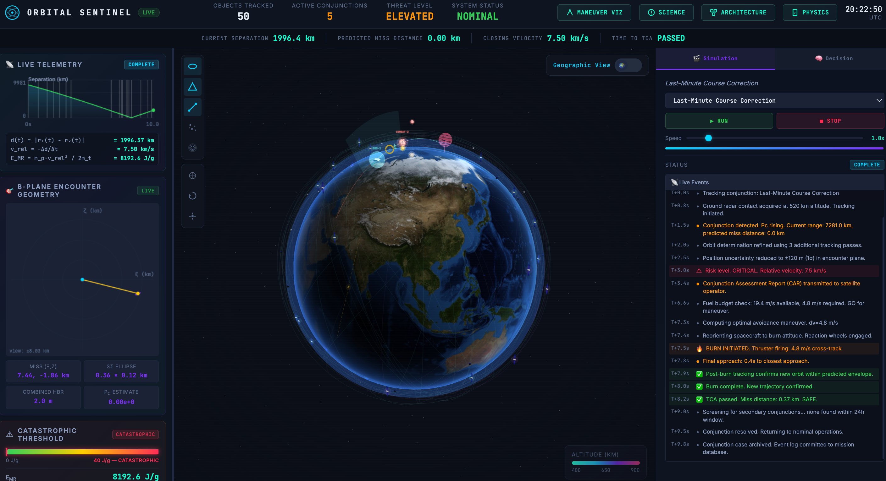
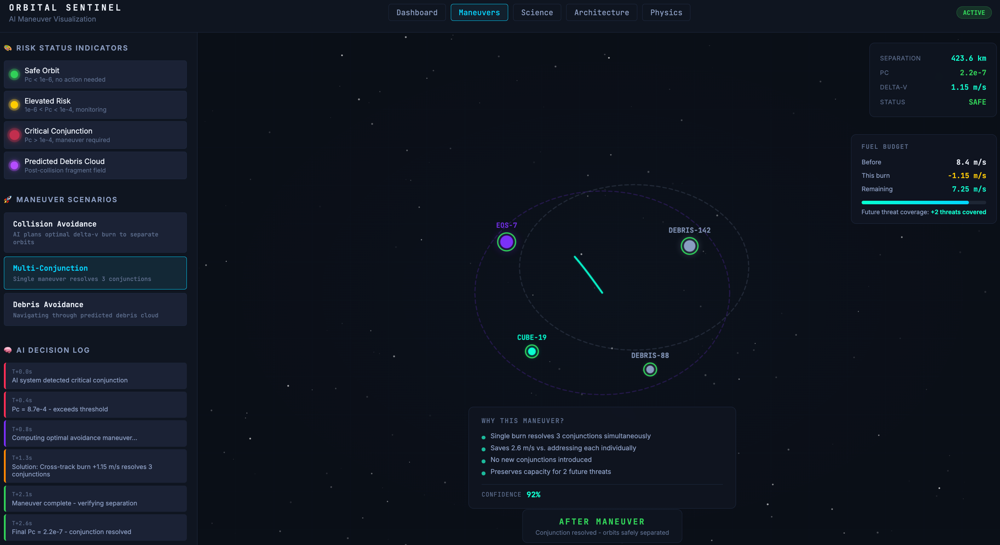
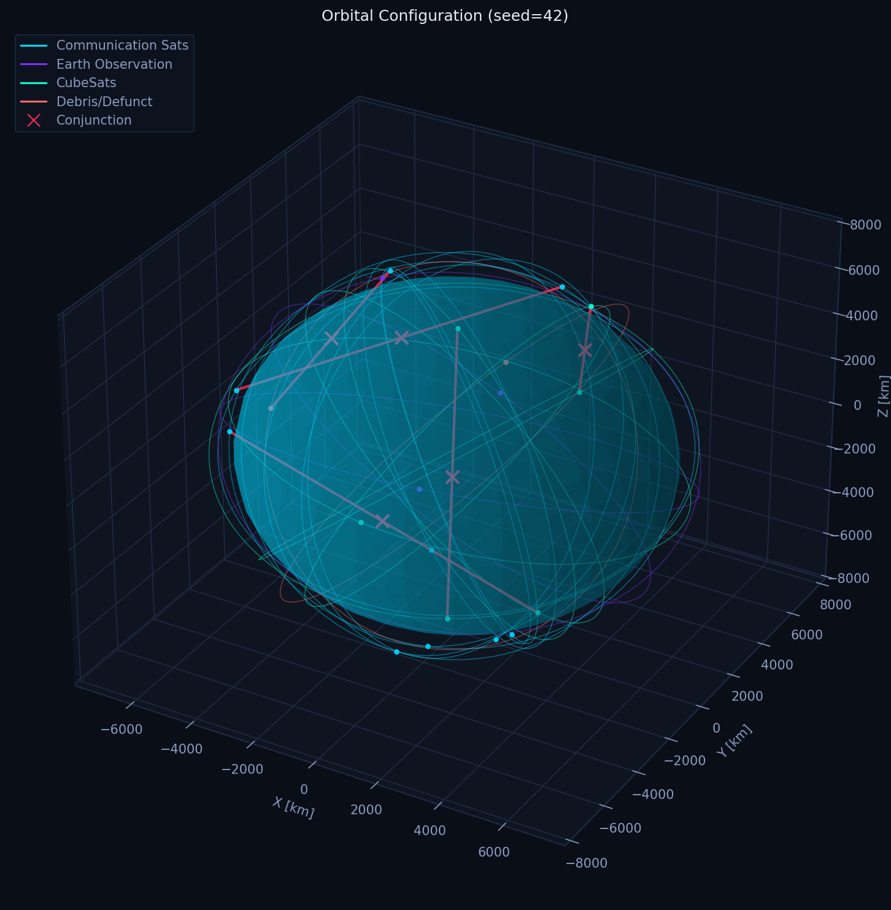
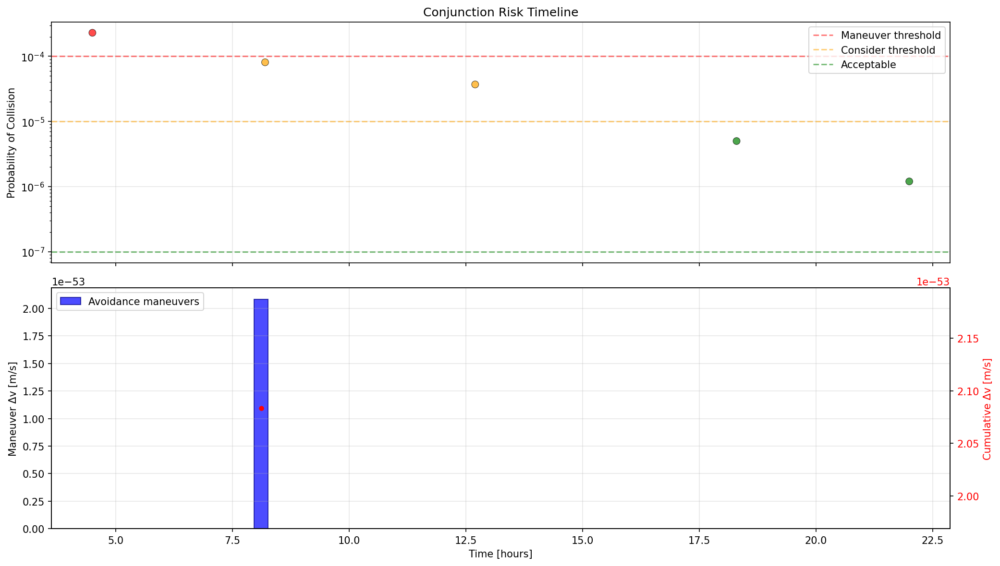
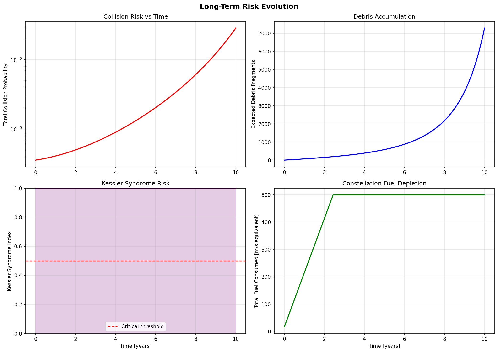
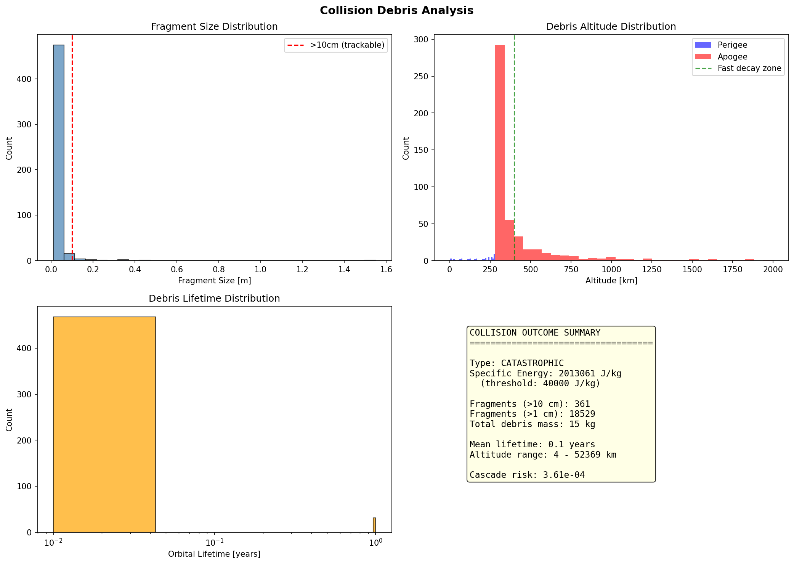

# AI Satellite Collision Prevention System

## The Story Behind This

I was excited when I saw this hackathon. I was looking for something out of the world — literally. Then I came across an image from Science Magazine showing the staggering visualization of debris objects in low-Earth orbit: thousands of fragments, each one a potential bullet traveling at hypervelocity, each one a collision risk.

That's when it hit me. We've created this beautiful infrastructure in orbit — GPS, weather forecasting, communications, climate monitoring — all depending on satellites that are now sharing crowded orbital highways with thousands of pieces of debris from past collisions. 
The problem isn't just "is there a collision?" It's "given uncertainty, limited fuel, multiple simultaneous threats, and future consequences, what's the best intervention?" That's a question no human can answer fast enough when you've got thousands of objects and limited warning time.

So I built this: a system that predicts, assesses, optimizes, and explains collision prevention in real time. Physics determines what's happening. Optimization determines what to do. AI explains why. That's the three-layer approach this system is built on.

---

## Index

- [The Story Behind This](#the-story-behind-this)
- [Quick Links](#quick-links)
- [Why This Problem Matters](#why-this-problem-matters)
- [What This System Does](#what-this-system-does)
- [How It Works: The Full Story](#how-it-works-the-full-story)
- [The Architecture](#the-architecture)
- [How is Kiro Used](#how-is-kiro-used)
- [API Reference](#api-reference)
- [Quick Start](#quick-start)
- [Setup](#setup)
- [Running the System](#running-the-system)
- [Troubleshooting](#troubleshooting)
- [Project Structure](#project-structure)
- [Performance](#performance)
- [Technology Stack](#technology-stack)
- [Why This Matters for the Future](#why-this-matters-for-the-future)
- [Why We Need AI](#why-we-need-ai)
- [Visualizations](#visualizations)
- [Innovation & Roadmap](#innovation--roadmap)

---


## Quick Links

| | |
|---|---|
| **Video walkthrough** | https://www.youtube.com/watch?v=03x7psL5sz8 |
| **Live dashboard** | https://satellite-collision-1.onrender.com/ |
| **More detailed docs** | https://satellite-collision-1.onrender.com/docs |
| **Screenshots** | See [Visualizations](#visualizations) section below for annotated screenshots and visualization output |

For implementation details, see [How is Kiro Used](#how-is-kiro-used) — this project demonstrates Kiro's spec/steering/hooks workflow in action.


---

## Why This Problem Matters

On February 10, 2009, Iridium 33 collided with the defunct Cosmos 2251 at approximately 11.7 km/s above Siberia. Two intact spacecraft became over 2,000 trackable debris fragments, each one a potential bullet screaming through orbit at hypervelocity.  These fragments spread into a cloud that still threatens other satellites today — and will continue to do so for decades.
That event demonstrated something the space industry had feared for decades:

### The Kessler Syndrome

That nightmare has a name: **Kessler Syndrome**. The idea is simple and terrifying. Collisions create debris. Debris creates more collisions. More collisions create more debris. Eventually, certain orbital altitudes become unusable — a self-reinforcing cascade that turns valuable orbital real estate into a shooting gallery.

```
  Satellite collision
         |
         v
  2,000+ fragments > 10cm
         |
         v
  Each fragment is now a potential impactor
         |
         v
  New conjunctions with other spacecraft
         |
         v
  Risk of secondary collisions increases
         |
         v
  Potential cascade (Kessler Syndrome)
```


As orbital populations grow, the problem gets harder—not linearly, but **quadratically**.

For 10,000 tracked objects:

**N × (N − 1) / 2 ≈ 50 million potential pairs**

And a satellite cannot simply maneuver every time something looks dangerous.

A typical spacecraft may have only around **25 m/s of total delta-v available across its operational lifetime**.

Every avoidance maneuver spends part of that finite budget.

So the real question isn't:

> *"Is there a collision?"*

It's:

> **"Given uncertainty, limited fuel, multiple simultaneous threats, and future consequences, what is the best intervention?"**

That's the problem this system attacks.

### Numbers that matter

Three numbers explain why this project exists.

- **$2.2 trillion** — roughly the size of the global economy that sits on top of satellite infrastructure. GPS alone is estimated at $1.4 trillion of value to the U.S. economy. Ridesharing, payment networks, precision agriculture, and military logistics all depend on satellites staying where they're supposed to be.
- **~50 million** — the number of possible collision pairs among just 10,000 tracked objects in orbit (N·(N-1)/2 scaling). Every additional satellite makes the problem quadratically worse, not linearly.
- **~25 m/s** — a typical total delta-v fuel budget for a satellite's entire 15-year operational life. Not per year — total. Every avoidance maneuver permanently spends down that budget; there's no refueling in orbit.

---

## What This System Does

The platform turns a large, uncertain orbital environment into an actionable decision loop:

```
                    ┌─────────────────────────────────┐
                    │     ORBITAL ENVIRONMENT          │
                    │  10,000+ tracked objects         │
                    │  Uncertain trajectories          │
                    │  Limited fuel budgets            │
                    └────────────────┬────────────────┘
                                     │
                    ┌────────────────▼────────────────┐
                    │      THIS SYSTEM                 │
                    │                                  │
                    │  Physics ──► Detection ──► Plan  │
                    │     │            │           │   │
                    │     ▼            ▼           ▼   │
                    │  Propagate   Assess Pc   Optimize│
                    │  Covariance  Rank Risk   Execute │
                    │                                  │
                    └────────────────┬────────────────┘
                                     │
                                     ▼
                  ┌───────────────────────────────────────┐
                  │             DECISION                  │
                  │                                       │
                  │  Which satellite?                     │
                  │  What maneuver?                       │
                  │  When?                                │
                  │  How much delta-v?                    │
                  │  What happens next?                   │
                  └───────────────────┬───────────────────┘
                                      │                    
                    ┌─────────────────▼────────────────┐
                    │         OUTCOMES                 │
                    │  - 80% collision risk reduction  │
                    │  - Fuel-optimal maneuvers        │
                    │  - Cascade prevention            │
                    │  - Real-time operator guidance   │
                    └──────────────────────────────────┘
```

### The Core Problem

The core problem is deceptively simple to state: given thousands of interacting spacecraft with uncertain trajectories and limited fuel budgets, find the optimal sequence of interventions that minimizes long-term orbital risk across the entire constellation.

The difficulty is in every word of that sentence. "Uncertain" means we're working with probability distributions, not exact positions. "Limited fuel" means every maneuver has a cost that can never be recovered. "Long-term" means a fix for today's conjunction might create tomorrow's crisis. "Optimal" means finding the best answer among billions of possible maneuver combinations.

### What It Can Do Today

| Capability | Description | Status |
|---|---|---|
| Orbit Propagation | 6-DOF with J2, drag, SRP perturbations + STM covariance growth | Complete |
| Conjunction Assessment | All-vs-all screening, Pc via Foster/Chan methods, TCA prediction | Complete |
| Avoidance Planning | STM-based delta-v optimization, multi-conjunction sequencing | Complete |
| Damage Minimization | NASA breakup model, cascade risk, impact geometry optimization | Complete |
| Risk Optimization | Greedy, Network Flow (MILP), MCTS multi-step lookahead | Complete |
| AI Decision Support | LLM-powered analysis, natural language planning queries | Complete |
| 3D Visualization | Three.js orbital viz, real-time SSE event streaming | Complete |
| GPU Acceleration | NVIDIA CuOpt integration for large-scale MILP solving | Integrated |


This system automates that decision loop end-to-end, turning a process that takes human teams hours into one that runs in seconds. It's built from five cooperating layers (each detailed further in [How It Works: The Full Story](#how-it-works-the-full-story)):

1. **Physics engine** — 6-DOF orbit propagation (J2 oblateness, atmospheric drag, solar radiation pressure) plus full 6x6 covariance propagation via the State Transition Matrix, so the system tracks not just where objects are but how uncertain that estimate is.
2. **Conjunction screening** — a cascade of cheap geometric filters (altitude, plane, distance) cuts ~50 million raw pairs down to the tens that actually warrant a full probability-of-collision calculation.
3. **Multi-objective optimizer** — Greedy, Network Flow (MILP), Monte Carlo Tree Search, and GPU-accelerated CuOpt all run and get compared, with an adaptive selector picking the best fit for the situation. MCTS-style multi-step lookahead can find solutions that use significantly less fuel than a pure greedy approach by avoiding maneuvers that create worse conjunctions days later.
4. **Damage minimization** — when a maneuver isn't possible (dead satellite, insufficient fuel, insufficient warning time), the system falls back to the NASA Standard Breakup Model to find the least-bad outcome: minimizing cross-section, biasing impact geometry, and steering debris toward orbits that decay faster.
5. **AI explainability** — every recommendation comes with a plain-language rationale (which conjunctions it resolves, fuel cost versus alternatives, remaining budget for known upcoming threats) instead of a bare "this strategy was selected" output. See [Why We Need AI](#why-we-need-ai) for why this is a deliberate layer on top of the physics, not baked into it.


---

## How It Works: The Full Story

Imagine you're a satellite operator. You have 50 spacecraft in your constellation. It's 3 AM and your automated system just flagged a conjunction — one of your satellites is on a collision course with a piece of debris from (you guessed it) the 2009 Iridium-Cosmos event. You have 18 hours until closest approach. What do you do?

### The Pipeline

```
┌─────────────────────────────────────────────────────────────────────────────┐
│                        MAIN SIMULATION PIPELINE                              │
└─────────────────────────────────────────────────────────────────────────────┘

  ┌─────────────┐     ┌──────────────┐     ┌──────────────┐     ┌──────────┐
  │ 1. GENERATE │     │ 2. PROPAGATE │     │ 3. SCREEN    │     │ 4. ASSESS│
  │             │────►│              │────►│              │────►│          │
  │ Constellation    │ Orbits + STM  │     │ All-vs-all   │     │ Pc calc  │
  │ TLEs + Cov  │     │ 24h ahead    │     │ Geom filters │     │ TCA find │
  └─────────────┘     └──────────────┘     └──────────────┘     └────┬─────┘
                                                                      │
  ┌─────────────┐     ┌──────────────┐     ┌──────────────┐          │
  │ 8. PUBLISH  │     │ 7. ANALYZE   │     │ 6. EXECUTE   │          │
  │             │◄────│              │◄────│              │◄─────────┘
  │ API + Viz   │     │ AI insights  │     │ Maneuver or  │     ┌──────────┐
  │ Dashboard   │     │ Explanations │     │ Mitigate     │◄────│5.OPTIMIZE│
  └─────────────┘     └──────────────┘     └──────────────┘     │          │
                                                                  │ Greedy   │
                                                                  │ NetFlow  │
                                                                  │ MCTS     │
                                                                  │ CuOpt    │
                                                                  └──────────┘
```

### Step 1: Know Your Constellation

Everything starts with the spacecraft themselves. The system generates or ingests a constellation — positions, velocities, masses, cross-sectional areas, fuel budgets, and whether each object can even maneuver at all. (Remember: roughly half of all tracked objects in orbit are dead — no fuel, no thrusters, no way to dodge. Cosmos 2251 was one of these.) Each spacecraft gets a 6x6 covariance matrix representing our uncertainty about where it actually is. Because we never know exactly.

### Step 2: Predict the Future

The physics engine propagates spacecraft states forward using:

- Keplerian gravity
- Earth's J2 oblateness
- Atmospheric drag
- Solar radiation pressure

The system also propagates uncertainty using the **State Transition Matrix (STM)**.

```text
X(t₀), P(t₀)
      │
      ▼
   RK7(8)
      │
      ▼
X(t), P(t)
```

The covariance evolves approximately as:

```text
P(t) = Φ(t,t₀) P(t₀) Φ(t,t₀)ᵀ + Q(t)
```

The result is that the system tracks not only:

> **Where is the satellite?**

but also:

> **How confident are we that it is there?**

### Step 3: Find the Needles in the Haystack

With 10,000 objects, there are nearly 50 million possible pairs. Most of them will never come anywhere near each other. The conjunction screening module rapidly eliminates the safe pairs through a series of increasingly expensive filters:

```
         ALL PAIRS: N*(N-1)/2
         ┌──────────────────┐
         │   ~50 million    │  (for N=10,000)
         │   possible pairs │
         └────────┬─────────┘
                  │
     ┌────────────▼────────────┐
     │  APOGEE/PERIGEE FILTER  │  Reject if orbits can never intersect
     │  Eliminates ~60% pairs  │  (compare orbital altitude ranges)
     └────────────┬────────────┘
                  │
     ┌────────────▼────────────┐
     │    COPLANAR FILTER      │  Reject if orbital planes too separated
     │  Eliminates ~70% remain │  (RAAN + inclination check)
     └────────────┬────────────┘
                  │
     ┌────────────▼────────────┐
     │    DISTANCE FILTER      │  Propagate & check minimum distance
     │  Eliminates ~90% remain │  over time window
     └────────────┬────────────┘
                  │
     ┌────────────▼────────────┐
     │   CANDIDATE PAIRS       │
     │   ~0.1% of original     │  (~50,000 for N=10,000)
     └────────────┬────────────┘
                  │
     ┌────────────▼────────────┐
     │  DETAILED ASSESSMENT    │
     │                         │
     │  - Find TCA (bisection) │
     │  - B-plane projection   │
     │  - Compute Pc (Foster)  │
     │  - Risk scoring         │
     └────────────┬────────────┘
                  │
     ┌────────────▼────────────┐
     │   FLAGGED CONJUNCTIONS  │
     │   Pc > 1e-7 threshold   │
     │   Typically 10-100      │
     └─────────────────────────┘
```

### Step 4: How Dangerous Is It, Really?

For each surviving pair, the system computes the *probability of collision* (Pc). This isn't a yes/no question — it's a continuous probability that accounts for both objects' uncertainty ellipsoids, their relative velocity, and their physical sizes.

The system implements three methods, each validated against different test cases:

```
┌─────────────────────────────────────────────────────────────────────┐
│                   Pc CALCULATION PIPELINE                             │
│                                                                     │
│  ┌─────────────────┐                                                │
│  │ Miss Vector (m)  │──┐                                            │
│  └─────────────────┘  │    ┌──────────────────────────────────┐    │
│                        ├───►│  Foster (2D numerical integral)   │    │
│  ┌─────────────────┐  │    │  - Full covariance ellipse        │    │
│  │Combined Cov (6x6)│──┤    │  - Most accurate for short TCA   │    │
│  └─────────────────┘  │    └──────────────────────────────────┘    │
│                        │                                            │
│  ┌─────────────────┐  │    ┌──────────────────────────────────┐    │
│  │ Hard-body Radius │──┼───►│  Chan (series expansion)          │    │
│  └─────────────────┘  │    │  - Fast closed-form approx        │    │
│                        │    │  - Good for circular orbits       │    │
│                        │    └──────────────────────────────────┘    │
│                        │                                            │
│                        │    ┌──────────────────────────────────┐    │
│                        └───►│  2D Gaussian (analytic)            │    │
│                             │  - Encounter-plane projection     │    │
│                             │  - Reference implementation       │    │
│                             └──────────────────────────────────┘    │
│                                                                     │
│  Output: Pc in [0, 1]                                               │
│  Thresholds: >1e-4 CRITICAL, >1e-5 HIGH, >1e-6 MEDIUM              │
└─────────────────────────────────────────────────────────────────────┘
```

But raw Pc isn't the whole story. A 1-in-10,000 chance of collision between two 10 kg cubesats is very different from the same probability involving a 2,000 kg dead rocket body. The system computes a composite risk score:

```
Risk Score = Pc * Consequence Factor * Cascade Multiplier

Where:
  Pc              = Probability of collision (Foster method)
  Consequence     = f(mass1, mass2, v_rel) -> expected debris count
  Cascade         = Sum of secondary conjunction probabilities from new debris
```

This is exactly the lesson of Iridium-Cosmos: it's not just about whether two things hit. It's about what happens to everything else when they do.

### Step 5: The Hardest Part — Deciding What To Do

Now comes the optimization problem that makes this project genuinely difficult. You might have 12 active threats, 35 maneuverable spacecraft, and a finite amount of fuel shared across the constellation. Resolving one conjunction might create a new one. Spending fuel today means less fuel available for tomorrow's crisis.

The system doesn't pick one strategy and hope for the best. It runs four optimization approaches in parallel and compares them:

```
┌─────────────────────────────────────────────────────────────────────────────┐
│                    OPTIMIZATION STRATEGY COMPARISON                           │
├─────────────────────────────────────────────────────────────────────────────┤
│                                                                             │
│  ┌─────────────────────┐   ┌─────────────────────┐                         │
│  │  A. GREEDY           │   │  B. NETWORK FLOW    │                         │
│  │                      │   │     (MILP)          │                         │
│  │  Sort by risk (desc) │   │                     │                         │
│  │  Resolve top-1       │   │  Graph:             │                         │
│  │  Re-screen           │   │  Nodes = satellites │                         │
│  │  Resolve top-2       │   │  Edges = conjunct.  │                         │
│  │  Re-screen           │   │  Capacity = fuel    │                         │
│  │  ...                 │   │                     │                         │
│  │                      │   │  Min-cost max-flow  │                         │
│  │  O(C log C)          │   │  O(N^3) worst case  │                         │
│  │  Fast, near-optimal  │   │  Provably optimal   │                         │
│  └─────────────────────┘   └─────────────────────┘                         │
│                                                                             │
│  ┌─────────────────────┐   ┌─────────────────────┐                         │
│  │  C. MCTS             │   │  D. CuOpt (GPU)    │                         │
│  │  (Monte Carlo Tree)  │   │                     │                         │
│  │                      │   │  VRP formulation:   │                         │
│  │  Root = current      │   │  Fleet = sats       │                         │
│  │  Actions = maneuvers │   │  Capacity = fuel    │                         │
│  │  Rollout to horizon  │   │  Orders = conj.     │                         │
│  │  Backprop rewards    │   │  Windows = TCA +/- t│                         │
│  │                      │   │                     │                         │
│  │  Multi-step lookahead│   │  GPU MILP solver    │                         │
│  │  Handles cascades    │   │  100-1000x faster   │                         │
│  │  O(iterations)       │   │  Sub-second @10k    │                         │
│  └─────────────────────┘   └─────────────────────┘                         │
│                                                                             │
│  Selection: argmax( risk_reduction / fuel_cost * (1 + resolved * 0.1) )     │
│                                                                             │
└─────────────────────────────────────────────────────────────────────────────┘
```

| Strategy | Solve Time (N=1000) | Optimality | Best For |
|---|---|---|---|
| Greedy | ~2s | Near-optimal | Real-time decisions, small constellations |
| Network Flow | ~30s | Optimal (LP relaxation) | Medium constellations, fuel-constrained |
| MCTS | ~50s (configurable) | Asymptotically optimal | Multi-step planning, cascade avoidance |
| CuOpt (GPU) | <1s | Optimal (exact MILP) | Large constellations (10k+), production* |

\* `cuopt_client.py` speaks NVIDIA cuOpt's documented MILP wire format (`csr_constraint_matrix` / `objective_data` / `variable_bounds`, etc.) and will call a self-hosted cuOpt GPU server when `CUOPT_SERVER_IP` is set. Without GPU hardware, it solves the identical `problem_data` structure locally via `scipy.optimize.milp` (HiGHS backend) — same formulation, CPU-bound instead of sub-second. This keeps the repo runnable standalone (no GPU/credentials required to reproduce results) while remaining a drop-in swap to real hardware.

The adaptive selection logic picks the right tool for the situation:

```
┌───────────────────────────────────────────────────────────┐
│              ADAPTIVE METHOD SELECTION                      │
│                                                           │
│  IF conjunctions < 5:                                     │
│      -> Use Network Flow (small enough for exact solve)   │
│                                                           │
│  ELIF conjunctions < 50:                                  │
│      -> Use MCTS (lookahead helps with cascade effects)   │
│                                                           │
│  ELIF CuOpt available:                                    │
│      -> Use CuOpt GPU solver (handles scale)              │
│                                                           │
│  ELSE:                                                    │
│      -> Use Greedy (fast fallback, always available)      │
│                                                           │
│  ALWAYS: compare result against greedy baseline           │
│  ALWAYS: verify fuel constraints are respected            │
└───────────────────────────────────────────────────────────┘
```

### Step 6: Act — Or Accept the Unavoidable

For conjunctions where avoidance is possible, the system computes the optimal burn: direction, magnitude, and timing. The State Transition Matrix tells us exactly how a small velocity change now will translate into miss distance improvement at the time of closest approach.

But sometimes — like the Cosmos 2251, a dead satellite with no thrusters — you simply can't dodge. For unavoidable collisions, the system shifts to damage minimization. Using the NASA Standard Breakup Model, it simulates what happens when the objects collide and asks: is there anything we can do to reduce the devastation? Adjust attitude to minimize cross-section? Use remaining fuel to reduce relative velocity? Choose an impact geometry that sends debris into orbits that will decay faster?

```
  Conjunction Detected (Pc computed)
           │
           ▼
  ┌────────────────────┐
  │  Pc < 1e-7 ?       │──── YES ────► IGNORE (negligible risk)
  └────────┬───────────┘
           │ NO
           ▼
  ┌────────────────────┐
  │  Pc < 1e-5 ?       │──── YES ────► MONITOR (collect more data)
  └────────┬───────────┘
           │ NO
           ▼
  ┌────────────────────┐
  │  Pc < 1e-4 ?       │──── YES ────► ASSESS FURTHER (get tracking)
  └────────┬───────────┘
           │ NO
           ▼
  ┌────────────────────┐
  │  CRITICAL THREAT   │
  │  Action Required   │
  └────────┬───────────┘
           │
           ▼
  ┌────────────────────┐         ┌──────────────────────────┐
  │ Can maneuver?      │── NO ──►│ DAMAGE MINIMIZATION      │
  │ (fuel + time)      │         │ - Attitude adjustment    │
  └────────┬───────────┘         │ - Velocity reduction     │
           │ YES                  │ - Impact geometry opt    │
           ▼                      │ - Alert operators        │
  ┌────────────────────┐         └──────────────────────────┘
  │ AVOIDANCE PLANNING │
  │ - Compute STM      │
  │ - Optimal dv dir   │
  │ - Timing opt       │
  │ - Cascade check    │
  └────────┬───────────┘
           │
           ▼
  ┌────────────────────┐
  │ GLOBAL OPTIMIZE    │
  │ across all threats │
  └────────────────────┘
```

---

## The Architecture

Under the hood, the system is organized by problem domain. Physics doesn't know about decisions. Decisions don't know about the API. Each layer depends only on the layers below it:

```
┌──────────────────────────────────────────────────────────────────────────────┐
│                         PRESENTATION LAYER                                    │
│                                                                              │
│  ┌──────────┐  ┌──────────┐  ┌──────────────┐  ┌───────────┐  ┌─────────┐ │
│  │ Dashboard│  │ 3D Viz   │  │ Maneuver Viz │  │ Science   │  │  Arch   │ │
│  │index.html│  │ viz.html │  │maneuver-viz  │  │science.htm│  │arch.html│ │
│  └────┬─────┘  └────┬─────┘  └──────┬───────┘  └─────┬─────┘  └────┬────┘ │
│       │              │               │                 │              │       │
└───────┼──────────────┼───────────────┼─────────────────┼──────────────┼──────┘
        │              │               │                 │              │
        └──────────────┴───────────────┴────────┬────────┴──────────────┘
                                                │
                                    HTTP REST / SSE
                                                │
┌───────────────────────────────────────────────┼──────────────────────────────┐
│                          API LAYER (Flask)     │                              │
│                                               │                              │
│  ┌────────────────────────────────────────────▼─────────────────────────┐   │
│  │  /api/spacecraft    /api/conjunctions    /api/risk     /api/maneuvers│   │
│  │  /api/risk-graph    /api/shells          /api/debris   /api/timeline │   │
│  │  /api/risk-evolution  /api/debris-analysis  /api/decision-engine     │   │
│  │  /api/scenarios     /api/scenario/:id/stream (SSE)    /api/plan      │   │
│  │  /api/run (POST)                                                     │   │
│  └──────────────────────────────────────────────────────────────────────┘   │
│                                                                              │
└──────────────────────────────────────────┬───────────────────────────────────┘
                                           │
                                  Python function calls
                                           │
┌──────────────────────────────────────────┼───────────────────────────────────┐
│                    ORCHESTRATION LAYER    │                                   │
│                                          │                                   │
│  ┌──────────────┐  ┌────────────────┐  ┌▼────────────────┐  ┌───────────┐  │
│  │ simulation.py│  │risk_optimizer.py│  │  ai_analysis.py │  │cuopt_     │  │
│  │              │  │                 │  │                  │  │client.py  │  │
│  │ Main loop    │  │ Greedy/NF/MCTS │  │ LLM insights    │  │ GPU solver│  │
│  └──────┬───────┘  └───────┬────────┘  └────────┬────────┘  └─────┬─────┘  │
│         │                   │                     │                  │        │
└─────────┼───────────────────┼─────────────────────┼──────────────────┼───────┘
          │                   │                     │                  │
          └───────────────────┴──────────┬──────────┴──────────────────┘
                                         │
                              Physics models & decisions
                                         │
┌────────────────────────────────────────┼─────────────────────────────────────┐
│                    DECISION LAYER       │                                     │
│                                        │                                     │
│  ┌──────────────────┐  ┌──────────────▼──┐  ┌───────────────────────────┐   │
│  │  conjunction.py   │  │  avoidance.py   │  │  damage_minimization.py   │   │
│  │                   │  │                 │  │                           │   │
│  │ Pc calculation    │  │ Delta-v planning│  │ NASA breakup model        │   │
│  │ TCA prediction    │  │ STM optimization│  │ Cascade risk              │   │
│  │ B-plane analysis  │  │ Multi-conj seq. │  │ Impact geometry           │   │
│  └─────────┬─────────┘  └────────┬───────┘  └─────────────┬─────────────┘   │
│            │                      │                         │                 │
└────────────┼──────────────────────┼─────────────────────────┼────────────────┘
             │                      │                         │
             └──────────────────────┴────────────┬────────────┘
                                                 │
                                    State propagation & math
                                                 │
┌────────────────────────────────────────────────┼─────────────────────────────┐
│                    PHYSICS LAYER               │                              │
│                                               │                              │
│  ┌────────────────────────────────────────────▼──────────────────────────┐   │
│  │                    orbital_mechanics.py                                │   │
│  │                                                                       │   │
│  │  Kepler solver ──► State propagation ──► STM computation              │   │
│  │  J2 perturbation   Drag model            Covariance propagation       │   │
│  │  SRP model          RK78 integration      Ephemeris generation        │   │
│  └───────────────────────────────────────────────────────────────────────┘   │
│                                                                              │
│  ┌───────────────────────────────────────────────────────────────────────┐   │
│  │                         utils.py                                       │   │
│  │  Physical constants, coordinate transforms, data structures            │   │
│  └───────────────────────────────────────────────────────────────────────┘   │
│                                                                              │
└──────────────────────────────────────────────────────────────────────────────┘
```

## How is Kiro Used

This project was built inside [Kiro](https://kiro.dev), and it leans on Kiro's spec, steering, and hook systems rather than just using it as a chat-based code generator. H

### Specs — structured feature development

Every non-trivial feature in this codebase went through Kiro's spec workflow (`.kiro/specs/`) instead of an ad-hoc prompt-and-hope loop, using the `requirements.md` → `design.md` → `tasks.md` progression. Not every spec carries all three files — the foundational physics specs stopped at `design.md` 
```
.kiro/specs/
├── orbital-mechanics/              # requirements + design   — core propagation, STM, perturbations
├── conjunction-assessment/         # requirements + design   — screening, Pc calculation, TCA
├── avoidance-maneuver-planning/    # requirements + design   — delta-v optimization
├── simulation-engine/              # requirements + design   — main event loop orchestration
├── cuopt-intervention-planning/    # requirements + design + tasks — GPU MILP maneuver sequencing
├── live-bplane-encounter-geometry/ # requirements + tasks    — real-time B-plane visualization
├── catastrophic-threshold-gauge/   # requirements + tasks    — risk threshold UI component
├── mark-tca-zone-3d-visualization/ # requirements only       — 3D TCA marker rendering
└── cuopt-fuel-allocation/          # initialized, not yet written — GPU fuel budget optimization
```

This matters a lot for a physics-heavy codebase: the `design.md` for `cuopt-intervention-planning` documents the MILP formulation and constraint set *before* a line of `cuopt_client.py` gets touched, and its `tasks.md` breaks that design into checkable implementation steps that Kiro executes and tracks one at a time. `cuopt-fuel-allocation` is an example of a spec that was scaffolded for a follow-on feature (per-satellite fuel budget allocation via MILP) but not carried further yet — left as-is here rather than backfilled, since overstating its status wouldn't reflect what was actually built.

### Steering — always-on project context

Six steering docs in `.kiro/steering/` are injected into every session automatically, so Kiro never has to rediscover the architecture from scratch:

| File | What it encodes |
|---|---|
| `project-context.md` | Module map, data structures (spacecraft state, conjunction event, maneuver plan), API contract |
| `project-roadmap.md` | Phase plan, success metrics, risk register |
| `architecture-deep-dive.md` | Layered design principles, data flow diagrams, decision algorithm hierarchy |
| `technical-stack.md` | Dependency rationale, performance characteristics, complexity tables |
| `development-practices.md` | Module dependency graph, code review checklist for physics vs. API changes |
| `physics-change-guard.md` | Hard constraints for anything touching orbital mechanics |

Because these are steering files (not one-off chat context), they stay consistent across every session and every contributor using Kiro on this repo, instead of each person re-explaining the architecture in their own words.

### Hooks — the automation layer

This is the part worth calling out in detail. `.kiro/hooks/` has 9 hook definitions, each a JSON file Kiro reads and executes directly with no manual triggering required. They cover several different concerns:

**1. Session context injection (`SessionStart`)**
- `project-context-injection.json` and `development-practices-injection.json` fire the moment a new Kiro session opens and inject the architecture map and coding conventions straight into context via an `agent` action. This is what makes the steering docs above actually *active* rather than just reference material sitting in a folder — every session starts already knowing the module dependency graph, coordinate conventions, and debugging playbooks.

**2. Code quality automation (`PostFileSave` / `PostFileCreate`)**
- `lint-on-save.json` — matches `\.py$`, runs `ruff check --fix` on every Python file the moment it's saved.
- `format-on-create.json` — matches `\.py$`, runs `ruff format` on brand new Python files right after creation, so nothing lands unformatted.
- `dependency-check.json` — matches `requirements\.txt$`, runs `pip check` whenever the requirements file changes, catching dependency conflicts (e.g. NumPy/SciPy version clashes) immediately instead of at install time.

**3. Physics safety gate (`PreToolUse`)** — the most interesting one
- `physics-safety-gate.json` matches on the tool name (`fs_write|str_replace`) and fires *before* any write tool runs. Its `agent` action instructs Kiro to check whether the target is a physics-critical file (`orbital_mechanics.py`, `conjunction.py`, `damage_minimization.py`) and, if so, enforce five rules before the write is allowed through:
  1. **Coordinate convention** — position vectors must stay in ECI; any other frame (RTN, LVLH, perifocal) requires an explicit conversion back at the function boundary.
  2. **Unit consistency** — no mixing SI and km-based units within a function; new constants must cite units and source.
  3. **Covariance integrity** — any covariance matrix construction/modification must preserve symmetry and positive semi-definiteness, with eigenvalues clamped to ≥1e-10.
  4. **Formula provenance** — new or modified physics formulas need a comment citing `docs/physics.md`, a publication, or a named standard (e.g. NASA Standard Breakup Model).
  5. **Conservation laws** — propagation changes can't silently break energy conservation in the unperturbed two-body case.
  
  If a proposed edit to one of those files would violate a rule, the hook returns a `permissionDecision: "ask"`, which pauses the write and surfaces the concern to the user for explicit approval rather than silently applying a physics-breaking change. Edits to unrelated files (docs, dashboard, README) pass through untouched.

**4. Post-task validation (`PostTaskExec`)**
- `post-task-validation.json` fires after any spec task is marked complete. It imports the five core modules (`orbital_mechanics`, `conjunction`, `avoidance`, `damage_minimization`, `risk_optimizer`) in sequence and prints a pass/fail per module. This catches broken imports, circular dependencies, or syntax errors from an implementation task before moving to the next one — a cheap regression check that runs automatically instead of relying on someone remembering to do it.

**5. Custom strategy integration (`PostFileCreate`)**
- `strategy-auto-integrator.json` matches `src/strategies/custom_.*\.py$` — the moment a new file matching that pattern is created (see `custom_fuel_efficiency.py`, `custom_relative_velocity.py`), it runs `src/strategy_integrator.py` against the new file to validate and register the strategy automatically, instead of requiring a manual wiring step.

**6. Git workflow (`Stop`)**
- `smart-git-commit.json` fires when a session ends. Instead of auto-committing, its `agent` action reviews `git status`/`git diff`, drafts a single-line conventional-commit message, and explicitly asks the user for approval before staging and committing anything. Nothing gets committed without a human sign-off.

Together, these hooks mean the physics-safety review, linting, dependency checks, and post-implementation validation happen automatically as a side effect of normal editing — not as separate manual steps someone has to remember to run.


### Screenshots

| | |
|---|---|
|  |  |
|  |  |
|  |  |

Real-time updates flow through Server-Sent Events:

```
┌─────────────┐         ┌─────────────────┐         ┌──────────────┐
│   Browser   │◄── SSE ─┤  Flask Server   │◄────────┤  Simulation  │
│  (Three.js) │         │  /stream (SSE)  │         │  Event Loop  │
└─────────────┘         └─────────────────┘         └──────────────┘

  SSE Event Types:
  ├── scenario_info    -> Initial metadata (name, frames, corrections)
  ├── frame            -> Position updates at ~20 FPS
  ├── sim_event        -> Detection, maneuver, collision notifications
  ├── debris_spawn     -> Fragment cloud generation data
  └── stream_end       -> Playback complete signal
```

---

## API Reference

| Method | Endpoint | Description |
|---|---|---|
| `GET` | `/api/spacecraft` | All spacecraft with orbital elements and paths |
| `GET` | `/api/conjunctions` | Conjunction events with risk levels |
| `GET` | `/api/maneuvers` | Planned avoidance maneuvers |
| `GET` | `/api/risk` | Global risk metrics summary |
| `GET` | `/api/risk-graph` | Network graph (nodes=sats, edges=conjunctions) |
| `GET` | `/api/shells` | Orbital environment altitude shells |
| `GET` | `/api/debris` | Debris prediction data |
| `GET` | `/api/timeline` | 24-hour risk evolution timeline |
| `GET` | `/api/risk-evolution` | Multi-year risk projection (Pc, debris, Kessler index) |
| `GET` | `/api/debris-analysis` | NASA breakup model analysis for highest-risk conjunction |
| `GET` | `/api/decision-engine` | Multi-strategy comparison with recommendation |
| `GET` | `/api/scenarios` | List available collision scenarios |
| `GET` | `/api/scenario/:id` | Full scenario data for animation |
| `GET` | `/api/scenario/:id/stream` | SSE real-time event stream |
| `POST` | `/api/run` | Re-run simulation with new seed |
| `POST` | `/api/plan` | Natural language intervention planning (LLM + CuOpt) |

### Example: The Decision Engine at Work

```json
{
  "situation": {
    "active_threats": 12,
    "critical_threats": 3,
    "total_collision_probability": 0.0047,
    "maneuverable_spacecraft": 35,
    "total_fuel_available_ms": 425.8
  },
  "candidates": [
    {"id": "A", "strategy": "none", "residual_risk": 0.89, "fuel_cost_ms": 0},
    {"id": "B", "strategy": "greedy", "residual_risk": 0.12, "fuel_cost_ms": 8.4},
    {"id": "C", "strategy": "network_flow", "residual_risk": 0.08, "fuel_cost_ms": 6.1},
    {"id": "D", "strategy": "mcts", "residual_risk": 0.10, "fuel_cost_ms": 7.2}
  ],
  "recommended": {
    "candidate_id": "C",
    "strategy": "network_flow",
    "risk_reduction_pct": 91.0,
    "reason": "Network flow MILP selected. Resolves 3 conjunction(s) with 91% risk reduction. Most fuel-efficient option."
  }
}
```

### The Market

- **SpaceX** operates 6,000+ Starlink satellites and performs on the order of 10,000+ collision-avoidance maneuvers per year.
- **Amazon Kuiper**, **OneWeb** (648 satellites), **Telesat** (298), and **Planet Labs** (200+) are all adding to the same crowded orbital shells.
- The space traffic management market is projected to reach roughly **$1.6 billion by 2030**.
- Conjunction screening for the entire tracked catalog is currently performed largely manually by the U.S. Space Force, at no cost to operators worldwide — a process that does not scale as the tracked object count moves toward 100,000+.

---

### Quick Start

```bash
git clone <repository-url>
cd satellite-collision

pip install -r requirements.txt

# Optional: for AI features (see "Getting an NVIDIA API Key" in Setup below)
export OPENAI_API_KEY="your-key"
export NVIDIA_API_KEY="your-key"

# Run simulation + dashboard
python -m src.simulation

# Open http://localhost:5000
```

### Alternative Entry Points

```bash
python src/api.py                                    # Direct API start
gunicorn -w 4 -b 0.0.0.0:5000 src.api:app          # Production
./run_dashboard.sh                                   # Convenience script
```

---

## Setup

### Prerequisites

- Python 3.8+
- pip (or pip3)
- A terminal with access to the project root

### Installation

```bash
# Clone or navigate to the project directory
cd satellite-collision

# Create a virtual environment (recommended)
python3 -m venv venv
source venv/bin/activate

# Install dependencies
pip install -r requirements.txt
```

### Getting an NVIDIA API Key (Free)

1. Go to **[build.nvidia.com](https://build.nvidia.com)** and sign in (or create a free account).
2. Search for or open any hosted model card — e.g. **Llama 3.3 Nemotron Super 49B** (the model this project uses) — under the "Models" catalog.
3. On the model page, open the **"Get API Key"** / **"Build with this NIM"** panel and click **Generate API Key**. NVIDIA provides a free tier of API credits for evaluation, no credit card required to get started.
4. Copy the generated key (it looks like `nvapi-...`).
5. Export it before running the simulation:
   ```bash
   export NVIDIA_API_KEY="nvapi-your-key-here"
   ```
   Or add it to a `.env` file in the project root if you're using something like `python-dotenv`.
6. Run the simulation as usual (`python -m src.simulation`). AI-narrated risk insights and the `/api/plan` natural-language endpoint will now work.

---

## Running the System

### Development (locally)

```bash
./run_dashboard.sh
```

The dashboard is accessible at **http://localhost:5000**.

### Production (Render / Gunicorn)

```bash
gunicorn app:app --bind 0.0.0.0:$PORT --timeout 120 --workers 1
```

---

## Technology Stack

```
┌─────────────────────────────────────────────────────────────────┐
│  FRONTEND                                                        │
│  Three.js (WebGL 3D)  |  HTML5/CSS3  |  Vanilla JS  |  SSE     │
├─────────────────────────────────────────────────────────────────┤
│  API LAYER                                                       │
│  Flask 3.0  |  Flask-CORS  |  Gunicorn                           │
├─────────────────────────────────────────────────────────────────┤
│  COMPUTATION                                                     │
│  NumPy >=1.24  |  SciPy >=1.10  |  NetworkX >=3.0               │
├─────────────────────────────────────────────────────────────────┤
│  AI / OPTIMIZATION                                               │
│  OpenAI API >=1.0  |  NVIDIA CuOpt (GPU MILP)                   │
├─────────────────────────────────────────────────────────────────┤
│  RUNTIME                                                         │
│  Python 3.8+  |  macOS / Linux                                   │
└─────────────────────────────────────────────────────────────────┘
```
# cuopt_client.py — same problem_data structure whether it's sent to a
# self-hosted CuOpt GPU server or solved locally via scipy.optimize.milp
from src.cuopt_client import CuOptClient

client = CuOptClient(server_ip=os.getenv("CUOPT_SERVER_IP"))
solution = client.solve_vehicle_routing(
    conjunctions=flagged_pairs,
    fuel_budgets=satellite_fuel,
    time_windows=tca_times
)
```
---


## Why We Need AI

Physics alone tells you *what* is happening. It doesn't tell you *what to do about it*, and it definitely doesn't tell an operator, in the middle of the night, why a particular burn is the right call. That gap is where AI fits into this system — not as a replacement for the physics engine, but as a layer on top of it.

### The numbers alone don't scale to human decision-making

The optimizer can produce four candidate plans, each with a residual risk, a fuel cost, and a list of resolved conjunctions. That's a lot to absorb in real time when someone has 18 hours to act on a critical conjunction. The AI analysis layer (`ai_analysis.py`) translates the optimizer's raw output into something an operator can act on immediately: *"Satellite COMSAT-7 should execute a 2.3 m/s cross-track burn at T-45 minutes. This resolves 3 conjunctions simultaneously and uses 4% of remaining fuel budget."* That's the difference between staring at a JSON blob of four candidates and understanding, in one sentence, what to do and why.

### Why AI is layered on top, not baked into the physics

This is a deliberate architectural choice, not a limitation:

- **The LLM never computes physics or probability.** All Pc calculations, STM propagation, and MILP/greedy/MCTS optimization happen in deterministic, auditable Python before the AI layer ever sees the results. The AI explains and queries; it doesn't decide the numbers.
- **Auditability matters when fuel is irreplaceable.** A hallucinated delta-v recommendation could cost a satellite its remaining maneuvering life. Keeping the LLM downstream of the physics engine means every recommendation it explains traces back to a verifiable calculation, not a guess.
- **This keeps the door open for autonomy later.** The roadmap's Tier 4 (autonomous execution) depends on this separation: a policy can eventually act on the optimizer's output directly, with the AI layer serving as the explanation and audit trail rather than the decision-maker itself.

### Where AI genuinely earns its place

| Problem | Why physics/optimization alone isn't enough | What AI adds |
|---|---|---|
| Comparing 4 optimization strategies | Numbers don't explain *why* one is better for this situation | Plain-language justification tied to the actual tradeoffs (fuel, risk reduction, conjunctions resolved) |
| 3 AM operator decisions | Reading covariance ellipsoids and Pc thresholds takes training most on-call staff don't have | Translates thresholds and STM output into a recommended action in one or two sentences |
| Ad-hoc "what if" questions | Would otherwise require writing custom queries against the API for every scenario | Natural language planning via `/api/plan`, grounded in the same optimizer used everywhere else |
| Cascade risk communication | A single number (risk score) hides *why* a conjunction is dangerous (mass, relative velocity, debris potential) | Surfaces the reasoning behind the score, not just the score itself |

In short: the orbital mechanics and optimization code answer "is there a threat, and what's the best fuel-efficient response." The AI layer answers "how do I get a human to understand and trust that answer fast enough to act on it." Both are necessary — this system exists because the Iridium-Cosmos collision proved that having the data isn't the same as acting on it in time, and clear, fast communication of a correct decision is as important as the decision itself.

---

## Innovation & Roadmap

### What's Novel Here

- **Four optimization strategies compared side-by-side, not just one.** Most collision-avoidance tooling picks a single heuristic. This system runs Greedy, Network Flow (MILP), MCTS, and GPU-accelerated CuOpt in parallel and lets an adaptive selector pick the best fit for the situation (see [Step 5](#step-5-the-hardest-part--deciding-what-to-do)).
- **Cascade-aware risk scoring.** Risk isn't just Pc — it factors in expected debris generation and secondary conjunction probability, directly modeling the Kessler Syndrome mechanism rather than treating each conjunction in isolation.
- **AI decision support grounded in the physics engine, not replacing it.** The LLM layer explains and queries the optimizer's output in natural language; it never computes physics or probability itself, keeping numerical results auditable.
- **Pluggable custom risk strategies.** Dropping a file into `src/strategies/` following the naming convention gets it auto-validated and registered (see `strategy_integrator.py`) — no core code changes required to experiment with new heuristics.

### Known Limitations (Honest Accounting)

- J2/J3 oblateness only — no 3rd-body (Sun/Moon) perturbations, so accuracy degrades outside LEO.
- Atmospheric drag uses a simplified exponential density model, not NRLMSISE-00.
- Planning horizon is practically capped at ~7 days; uncertainty dominates beyond that.
- Debris cascade modeling is probabilistic and model-averaged, not per-fragment tracked.

---
